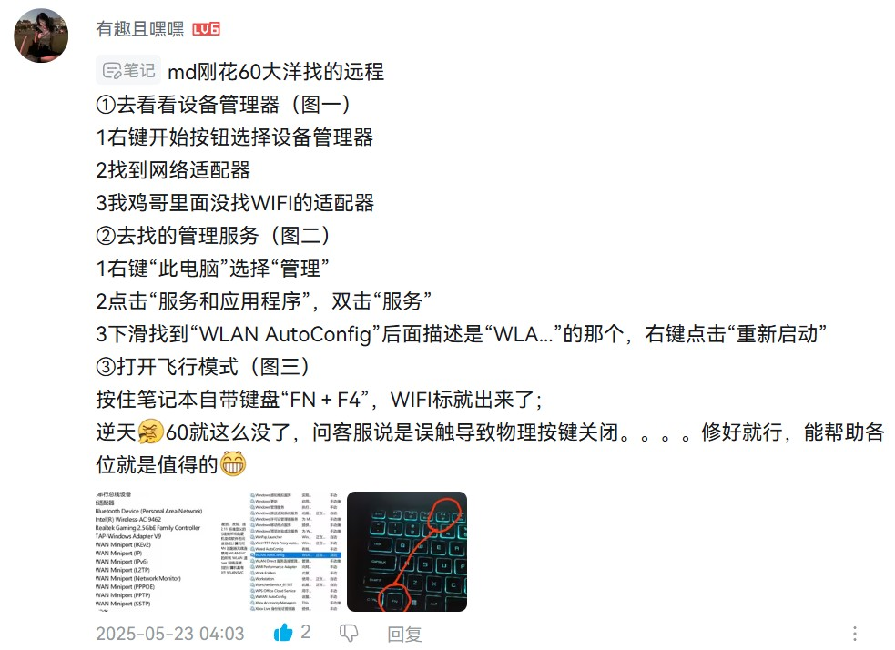
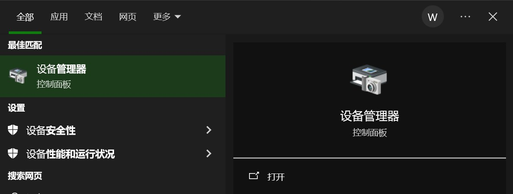
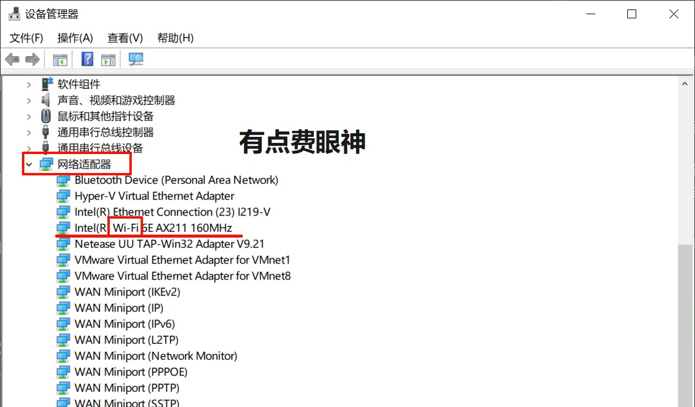
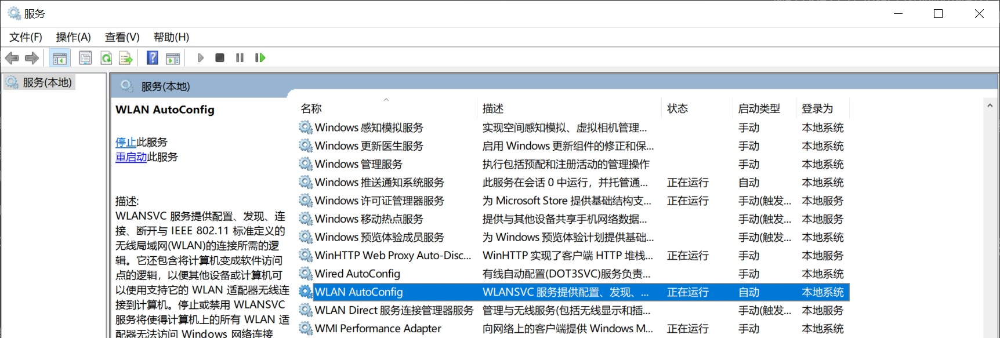

# 序

由于我更喜欢 Win10 的界面风格（直角窗口和磁贴重度依赖患者），遂把本人的暗影骑士擎从默认的 Win11 强行刷至 Win10。
刚刷完系统发现无限网络无法使用，美美从劈里啪啦（bilibili）下载了一个驱动大礼包安装。除了无限网络偶尔抽风，重启一下就解决了之外，一切都是岁月静好的。
直到刚才，重启都无法像往常一样解决无线网络的抽风了。


询问 ai 陷入死循环，最后还是上劈里啪啦，在[这个视频](https://www.bilibili.com/video/BV1GT4y127jb/?spm_id_from=333.337.search-card.all.click&vd_source=b19220b8f372f3a81aa8463fde694a63)的评论区里找到了一位大佬的方法，问题才得以解决。



> 还有可能是自己的魔法上网工具没关，记得排查一下。

我美丽的周日上午就这么被毁掉了 T_T
在此记录总结一下经验，给健忘的自己用，要是能帮到其他人类就更好了，把这份精神传递下去！

# 设备无线网卡是否正常

首先，检查电脑有没有无线网络的驱动。

> 驱动程序也是一种程序~~(废话)~~
> 与浏览器这类程序不同，驱动程序是与硬件沟通的桥梁。

打开 "设备管理器" 就能查看或更新设备以及驱动。
要打开 "设备管理器" 的方式有很多种，我更喜欢直接在系统的搜索栏中搜索一切：



在 "设备管理器" 找到我们需要排查问题的 "网络适配器"，点击下拉菜单，找到无线网卡（一般名字里会有"Wireless"或"Wi-Fi"）



先假设如图最完美的情况，在网络适配器中有无限网卡的驱动，那么无线网卡硬件至少没完全寄。继续下一步。

### 没有无限网卡/运行异常

**没有无限网卡**
多半是驱动压根没装上或被禁用了。
先点菜单栏的【查看】→ 选中"显示隐藏设备"，看看有没有灰色显示的无线设备。
如果这都找不到只能重新下载安装驱动了。

**运行异常**
如果有黄色的感叹号或代码 43/10 之类，说明驱动可能损坏或与系统不兼容。
此时应**右键**卸载设备，并勾选"**删除此设备的驱动程序软件**"，除非你驱动本身没问题，只想重装驱动。否则系统下次重启时可能仍会自动加载旧的、出错的驱动，问题复发。

以上两个问题，都要**下载并安装正确版本的无线网卡驱动**。一般来说，搜索自己电脑的型号，在官网就会有驱动下载方式。
我的电脑由于强行降到 Win10 ，官网却只提供 Win11 的驱动程序，这时只能靠信息检索各凭本事去搜索合适的驱动了（也可以问问 AI）。

> 没网怎么下驱动？除了去找个 u 盘到网吧下，
> 还可以试试用手机打开热点，选择**用 USB 分享**网络连到电脑。无线用不了，有线总行吧。

我的 AX211 在 Intel 官网就能找到并下载 Win10/11 通用的 [无限驱动程序](https://www.intel.cn/content/www/cn/zh/download/19351/intel-wireless-wi-fi-drivers-for-windows-10-and-windows-11.html)

也可以试试 "[驱动大礼包](https://pan.baidu.com/s/1WvFbn_p_UurESNMBx1PTfA#list/path=%2F)" (我之前使用过，能用。但可不保证完全没有问题)
[万能网卡驱动原帖](https://www.toprender.com/thread-227817-1-1.html)
[b 站视频](https://www.bilibili.com/video/BV1924y177PP/?spm_id_from=333.337.search-card.all.click&vd_source=b19220b8f372f3a81aa8463fde694a63)

安装驱动后，记得重启再检查设备管理器中无限网卡是否正常安装。

# WLAN 服务是否启用

接着看看服务有没有启动，同样用搜索打开服务，在一堆服务中，找到
**【WLAN AutoConfig（WLAN 自动配置）】**



也可以把启动类型配置为自动。

### 服务没启动 or 启动后自动关闭

如果启动失败可尝试：

- 确保系统未被组策略/安全软件限制
- 检查是否有安全策略阻止无线设备（如"禁止安装未授权驱动"）

# 网络连接但不能上网

有可能是自己的魔法上网工具没关，记得排查一下。

还可能是 IP 配置问题 or DNS 问题，以管理员运行 CMD（同样搜索栏里搜索，并用管理员身份打开），依次执行以下命令来重启网络。

```bash
以管理员运行CMD，依次执行：
ipconfig /release
ipconfig /renew
ipconfig /flushdns
```

# 末

如果以上还没解决，那有可能怀疑硬件方面的问题了。(耸肩
