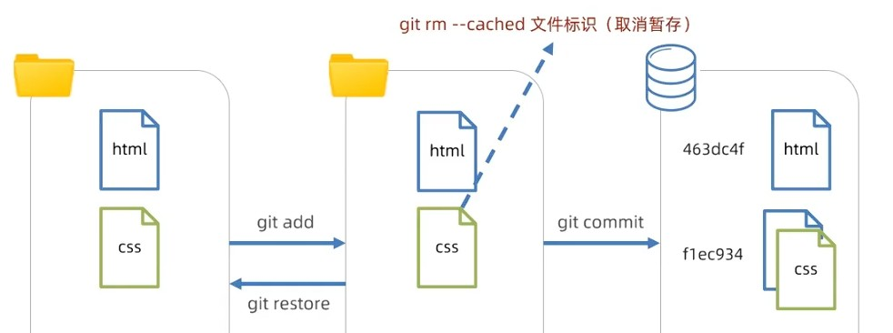
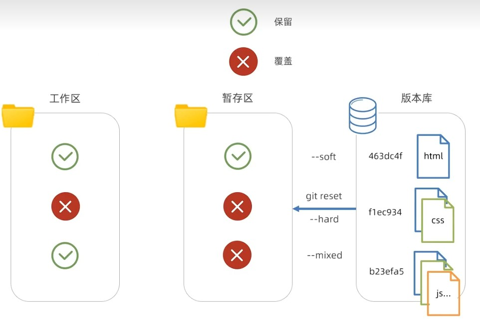
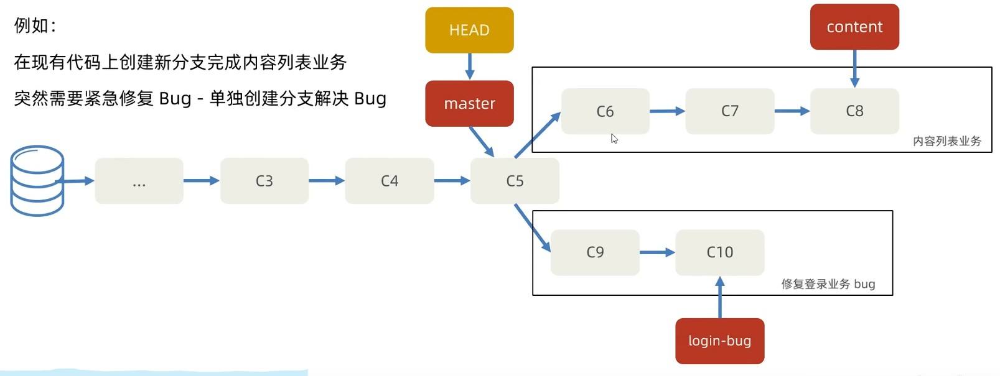
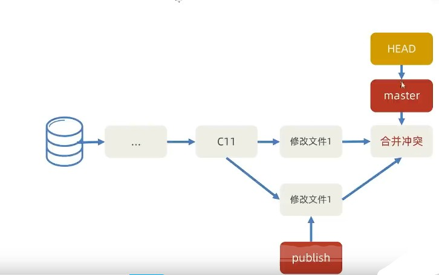

# 代码的时光机

**Git 是什么？**

Git 是目前世界上最流行的分布式版本控制系统，它就像是代码的"时光机器"，能够记录项目的每一次变化。它由 Linux 之父 Linus Torvalds 开发，最初是为了管理 Linux 内核开发而创建的。

**有了 Git，你就能：**

- 回溯到任意历史版本
- 多人协作互不干扰
- 并行开发多个功能
- 随时备份和恢复代码
- 追踪和管理每一处代码变动

# Git 基础配置与工作区概念

## 初次配置

在开始使用 Git 的旅程前，先要告诉 Git 你是谁：

```bash
# 设置用户名和邮箱（全局配置）
git config --global user.name "你的名字"
git config --global user.email "你的邮箱"

# 想看看自己的配置？试试这个
git config --list
```

## 创建你的第一个 Git 仓库

两种方式踏上 Git 之旅：

```bash
# 方式1：把现有项目变成Git仓库
git init

# 方式2：复制别人的仓库到本地（克隆）
git clone https://github.com/username/repository.git
```

## 理解 Git 的三个工作区域


1. **工作目录(Working Directory)**：你写代码的地方，就像草稿本
2. **暂存区(Staging Area)**：临时存放改动的地方，像是草稿箱
3. **仓库(Repository)**：正式提交后的存档，永久保存在`.git`目录中

# Git 的基本工作流

## 文件的生命周期

在 Git 的世界里，文件有这些状态：


- **未跟踪(`U`标注)**：新文件，Git 还不认识它们
- **已跟踪**：Git 已经认识的文件

```bash
# 查看文件状态
git status

# 查看Git跟踪的文件列表
git ls-files
```

## 最常用的三连操作

Git 的日常使用就是这三步：改动文件 → 暂存改动 → 提交改动

```bash
# 第一步：修改你的文件

# 第二步：添加改动到暂存区
git add 文件名     # 添加单个文件
git add .         # 添加所有改动文件

# 第三步：提交到仓库
git commit -m "添加了登录功能"

# 想看看提交历史？
git log --oneline  # 简洁模式
```

添加改动到暂存区后，Git 就会跟踪这些文件，被跟踪的文件又

- **已修改(`M`标注)**：改动了但还没放入暂存区
- **已暂存**：改动已放入暂存区，准备提交
- **已提交**：改动已安全存储在本地仓库

## 使用暂存区的高级技巧

暂存区不只是过渡站，还是强大的工具：



```bash
# 把暂存区的内容覆盖工作区（小心使用！会丢失未暂存的改动）
git restore 文件名

# 不想跟踪某个文件了？
git rm --cached 文件名
```

## 版本回退

犯错是常事，Git 让你能随时穿越时光：

```bash
# 先看看历史提交记录
git log --oneline
```



```bash
# 撤销工作区的修改（回到最后一次git add或commit的状态）
git checkout -- 文件名
# 或使用新版命令
git restore 文件名

# 撤销已暂存的修改
git reset HEAD 文件名
# 或使用新版命令
git restore --staged 文件名

# 修改最后一次提交（忘记提交某些文件或提交信息写错了）
git commit --amend

# 时光倒流，回到过去某个版本
git reset --soft 提交ID  # 保留工作区和暂存区的改动
git reset --hard 提交ID  # 完全回到过去，丢弃之后的所有改动（慎用！）
```

💡 **实际应用**：上线前发现代码有问题，可以用`git reset --hard`快速回到上一个稳定版本。

## 忽略不需要的文件

并不是所有文件都需要被 Git 管理，`.gitignore`文件告诉 Git 哪些文件该忽略：

```
# 忽略node_modules文件夹
node_modules/

# 忽略所有.log文件
*.log

# 忽略编译输出目录
/dist

# 忽略环境配置文件（可能含密码）
.env
```

# 分支管理

**什么是分支**

分支就像平行宇宙，让你可以同时探索多个开发方向：

```bash
# 查看所有分支
git branch
```



**HEAD 指针**指向当前所在分支，影响工作区和暂存区的代码状态。

## 分支操作基础

创建和切换分支比开辟新宇宙还简单：

```bash
# 创建新分支
git branch 分支名

# 切换到指定分支
git checkout 分支名
# 或使用更新的命令
git switch 分支名

# 一步到位：创建并切换
git checkout -b 分支名
```


- 开发新功能：`git checkout -b feature/login`
- 修复 bug：`git checkout -b bugfix/navbar`
- 尝试新想法：`git checkout -b experiment/newUI`

## 合并分支


```bash
# 先切换到目标分支（通常是主分支）
git checkout main

# 合并另一个分支到当前分支
git merge feature/login

# 合并成功后可以删除已合并的分支
git branch -d feature/login
```

当两个分支都有各自的新提交时，合并会自动创建一个"合并提交"：


功能开发完成后，通常会将功能分支合并回主分支，然后可以删除功能分支保持仓库整洁。

## 解决合并冲突

当不同分支修改了同一个文件的同一部分，Git 无法自动合并，产生冲突：



解决冲突的步骤：

1. 打开冲突文件，查找`<<<<<<<`、`=======`和`>>>>>>>`标记
2. 手动编辑为最终想要的内容
3. 删除冲突标记
4. 添加修改并提交

```bash
# 解决冲突后提交
git add .
git commit -m "解决合并冲突"
```

在团队合作中，冲突是常见的，学会高效解决冲突是必备技能。VSCode 等编辑器提供图形化冲突解决工具，可以更直观地处理冲突。

## 变基操作

变基(rebase)可以让分支历史更加线性和整洁：

```bash
# 将当前分支变基到main分支
git rebase main

# 交互式变基，可以重写历史
git rebase -i HEAD~3  # 重写最近3个提交
```

在推送到远程仓库前，可以用变基整理本地提交历史，让提交记录更清晰。但注意：**永远不要对已推送到远程的提交进行变基**。

# 远程协作

## 远程仓库操作

远程仓库是托管在因特网或其他网络中的你的项目的**版本库**
能够保存版本库的历史记录，多人协作

Git 的分布式特性使多人协作成为可能：

```bash
# 添加远程仓库（给远程起个别名，通常是origin）
git remote add origin https://github.com/username/repo.git

# 查看远程仓库信息
git remote -v

# 从远程获取最新代码（不合并）
git fetch origin

# 拉取远程代码并自动合并（fetch + merge）
git pull origin main

# 推送本地更改到远程
git push origin main
```

- 每天开始工作前：`git pull`获取最新代码
- 每个功能开发完成后：`git push`分享你的代码

## 实际项目协作流程

这是一个典型的团队工作流程：

1. **克隆项目**：`git clone 项目地址`
2. **创建功能分支**：`git checkout -b feature/xx`
3. **编写代码并提交**：`git add . && git commit -m "消息"`
4. **获取最新主分支**：`git checkout main && git pull`
5. **将主分支合并到功能分支**：`git checkout feature/xx && git merge main`
6. **解决可能的冲突**
7. **推送功能分支**：`git push origin feature/xx`
8. **创建 Pull Request**（在 GitHub/GitLab 等平台上）
9. **代码审查后合并到主分支**

这种基于功能分支的工作流是大多数团队的标准流程。

## 常见协作模式

### GitHub Flow（简单）

- 主分支始终保持可部署状态
- 开发新功能时从主分支创建功能分支
- 通过 Pull Request 合并回主分支

### GitFlow（复杂但结构化）

- 两个长期分支：main（生产）和 develop（开发）
- 三种临时分支：feature、release 和 hotfix
- 适合有计划发布周期的大型项目

小团队通常使用简单的 GitHub Flow，大型项目可能采用 GitFlow 或自定义流程。

# 高级技巧

## 临时保存工作

当你需要临时切换任务但又不想提交未完成的工作：

```bash
# 暂存当前改动
git stash save "正在开发登录功能"

# 查看暂存列表
git stash list

# 应用暂存（不删除stash）
git stash apply stash@{0}

# 应用并删除暂存
git stash pop
```

正在开发新功能时，突然需要修复一个紧急 bug，可以用 stash 保存当前工作，切换到 bugfix 分支修复后再恢复。

## 提交信息规范

好的提交信息应该遵循一定格式：

```
类型: 简短描述（不超过50个字符）

详细描述（可选，需要空一行）
```

常见类型：

- `feat`：新功能
- `fix`：修复 bug
- `docs`：文档更新
- `style`：格式调整（不影响代码功能）
- `refactor`：重构（不是新功能也不是修 bug）
- `test`：增加测试
- `chore`：构建过程或辅助工具变动

规范的提交信息有助于自动生成更新日志，也便于团队成员理解提交目的。

## 版本标签管理

为重要的提交点添加标签，通常用于标记版本发布：

```bash
# 创建轻量标签
git tag v1.0.0

# 创建带注释的标签
git tag -a v1.0.0 -m "第一个正式版本"

# 推送标签到远程
git push origin v1.0.0
# 推送所有标签
git push origin --tags
```

每次正式发布版本时，添加版本标签便于回溯特定版本的代码。

## Git 工作效率小技巧

```bash
# 查看特定文件的修改历史
git log -p 文件名

# 查看谁修改了文件的每一行（追责神器）
git blame 文件名

# 保存认证信息，避免重复输入密码
git config --global credential.helper store

# 设置命令别名
git config --global alias.co checkout
git config --global alias.br branch
git config --global alias.st status
```

这些小技巧可以在日常工作中节省大量时间，尤其是设置命令别名。

# Git 常用命令速查表

| 操作       | 命令                                         |
| ---------- | -------------------------------------------- |
| 初始化仓库 | `git init`                                   |
| 克隆仓库   | `git clone <url>`                            |
| 查看状态   | `git status`                                 |
| 添加文件   | `git add <file>` 或 `git add .`              |
| 提交改动   | `git commit -m "消息"`                       |
| 查看历史   | `git log --oneline`                          |
| 创建分支   | `git branch <name>`                          |
| 切换分支   | `git checkout <name>` 或 `git switch <name>` |
| 合并分支   | `git merge <branch>`                         |
| 拉取更新   | `git pull origin <branch>`                   |
| 推送更新   | `git push origin <branch>`                   |
