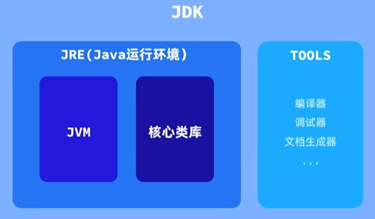
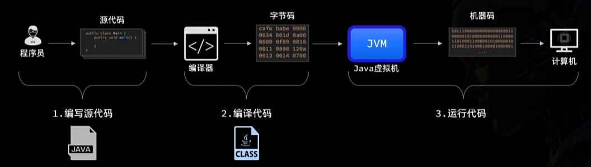
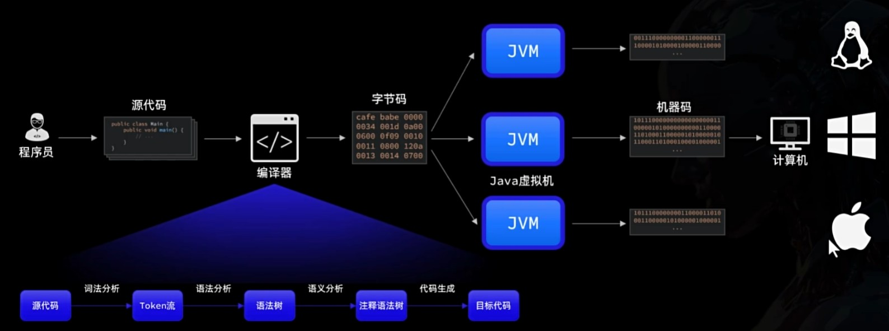

# Java 简介

**Java 是一门面向对象编程语言, 其特点是:**

面向对象三大特征: **封装** **继承** **多态**
面向对象基本概念: **类** **对象** **方法** **属性**

> 常说的 Java 三大版本是:
> **Java SE(Standard Edition)** 标准版, 面向桌面应用的开发环境.
> **Java EE(Enterprise Edition)** 企业版, 面向企业级应用的开发环境.
> **Java ME(Micro Edition)** 微型版, 面向移动终端的开发环境.

### 开发工具

开发 Java 程序必须先安装好 JDK, JDK 其中也包含了常见的开发工具, 以及 JRE

- JDK(Java Development Kit): 开发工具包, 包含开发环境, 编译器, 类库, 工具等.
- JRE(Java Runtime Environment): 运行环境, 包含 Java 虚拟机(JVM), 类库, 工具等.



在选择版本时, 选择官方指定的长期支持版 LTS 版本(Long Term Support)

[官方下载地址](https://www.oracle.com/cn/java/technologies/downloads/#java21)

### 集成开发环境

集成开发环境(Intergrated Development Environment) IDE, 是集成了代码编写功能、分析功能、编译功能、调试功能等一体化集成环境的开发软件.

目前 Java 开发最知名, 最常用的 IDE 就是 Jetbrain 公司出品的[Intellij IDEA](https://www.jetbrains.com/idea/)了.

[IntelliJ IDEA 下载](https://www.jetbrains.com/idea/download/)  
[IntelliJ IDEA 激活](https://3.jetbra.in/)

IDEA 中有很多快捷键可以提高我们的开发效率，常见的有：

| 快捷键                          | 功能说明         |
| ------------------------------- | ---------------- |
| CTRL + D                        | 复制一行         |
| CTRL + Y                        | 删除当前行       |
| CTRL + ALT + L                  | 格式化代码风格   |
| ALT + SHIFT + ↑，ALT + SHIFT+ ↓ | 上下移动当前代码 |
| CTRL + /，CTRL + SHIFT + /      | 注释选中的代码   |

### Java 程序结构

Java 程序通常由以下几部分组成：

- 方法（Method）: 程序**最基本的功能单位**, 例如计算器上的 '+' 就包含一个求和的**方法**.
- 类（Class）: 功能相关联的**方法**放在一起, 就是一个 **类**.
- 包（Package）: 将**类**按照功能模块划分到一个个**不同目录**中, 这些目录称为**包**.
- 项目/工程（Project）: 最后再把所有的**包**放到一个目录中管理，整个目录称之为**项目**或**工程**.

特别注意程序的入口, main 方法.
程序启动后都会去执行 main 方法, 然后再通过 main 方法调用其它方法.

因此：任何程序都必须写一个**main**方法，而且 main 方法的写法是固定的：

```Java
public static void main(String[] args){
}
```

# Java 程序运行原理

作为程序员编写的, 是由很多英文单词和符号组成的源代码, 是方便人类读写的.
计算机目前无法直接理解这种语言, 它只能识别简单的指令.

Java 的解决方式是将 程序员写好的 .java 文件, 使用编译器转换为 .class 文件, 让虚拟机 JVM 转换为机器码以可在计算机上运行.



这种提前准备好的指令集, 一旦编译完成, 就可以在没有编译器的帮助下独立运行的语言类型, 我们称之为:

**编译型语言**

由于 Java 虚拟机的存在, Java 语言可以很轻易地运行在任意平台上.



在 CMD 中, 使用

```bash
javac java文件.java
```

编译 .java 文件
接着使用:

```bash
java java文件
```

将刚刚编译后生成的 .class 文件运行
这就是不使用集成开发环境手动编译和运行的过程.

# 注释

用于在源代码中解释代码, 不会被执行.

写注释是一个好习惯, 不然刚写完的代码只有自己和上帝能, 过几天就只剩上帝能看得懂了...
注释有三种写法:

1. 单行注释
2. 多行注释
3. 文档注释

```java
// 这是一行单行注释

/*
	而这个就是多行注释,
	只要在这两个符号内的文字都会被认定为注释
	...
*/

/**
 * 这就是文档注释
 * 它可以用在类, 方法, 字段上 来解释其作用
 */
```

在 idea 中
快捷键 `ctrl`+`/` 可以快速单行注释选中的代码.
快捷键 `ctrl`+`shift`+`/` 可以快速多行注释.

# 变量与常量

### 变量

指向内存中的一片区域, 可以被读写, 修改.

```Java
// 定义一个变量 数据类型 变量名 = 数据字面量;

int number = 10;
```

由于不同的数据类型所需的空间大小不一样的, 又由于 Java 是一种**强类型语言**,
强类型语言为了精确地分配变量在内存中的空间大小, 在使用变量前需要先定义它们的类型.
变量按数据类型可分为:

### 常量

与变量类似, 都是指向内存中的一片空间, 能够被读取.
不同的是, 常量中的数据不可以被改变.

```Java
// 定义一个常量 final 数据类型 变量名 = 10;

final int NUMBER = 10;
// 为了区分, 常量一般全大写
```

### 标识符

- 标识符: 自己定义的用来命名 变量, 方法, 类 等的字符.

> 由字母, 数字, 下划线 `_` 或美元符号 `$` 组成.
> 不能以 数字 开头, 必须以字母, 下划线 或 美元符号开头.
> 标识符不能与关键字或保留字相同.

- 关键字: 被 Java 语言赋予特殊含义的单词, 不能作为标识符.
- 保留字: 现在还未被 Java 语言使用, 但以后版本的 Java 语言可能会使用.

#### 命名规范

为了遵循这些规则, 会有一套建议的标识符规范, 如下:

- 包名: 全部小写, 单词之间用点分隔.
- 类, 接口名: 首字母大写, 驼峰命名法.
- 方法, 变量名: 首字母小写, 驼峰命名法.
- 常量名: 全部大写, 下划线连接.

# 数据类型

### 基本数据类型

- 整数类型

| 类型  | 字节数 | 取值范围                |
| ----- | ------ | ----------------------- |
| byte  | 1      | $-128$ 到 $127$         |
| short | 2      | $-2^{15}$ 到 $2^{15}-1$ |
| int   | 4      | $-2^{31}$ 到 $2^{31}-1$ |
| long  | 8      | $-2^{63}$ 到 $2^{63}-1$ |

整数类型默认为 int, 如果要声明一个 long 类型的整数,
需要在值的末尾加上 `L` 注明其是 long 类型.

- 浮点类型

| 类型   | 字节数 | 取值范围                                        | 精度  |
| ------ | ------ | ----------------------------------------------- | ----- |
| float  | 4      | $3.4 \times 10^{-38}$ 到 $3.4 \times 10^{38}$   | 7 位  |
| double | 8      | $2.2 \times 10^{-308}$ 到 $2.2 \times 10^{308}$ | 15 位 |

浮点类型默认是 double, 同理声明 float 类型时需加上 `F`

- 布尔类型

| 类型    | 字节数 | 取值范围      |
| ------- | ------ | ------------- |
| boolean | 1      | true 或 false |

- 字符类型

| 类型 | 字节数 | 取值范围       |
| ---- | ------ | -------------- |
| char | 2      | $0$ 到 $65535$ |

字符类型声明赋值时, 值需要 `' '` (单引号) 包裹.

### 引用数据类型

不是以上基本数据类型的, 都称作引用数据类型.

- String 类

`String` 不是一个基本类型.是一个真正的类 但是 java 语言对这个类有些特殊处理

`String` 可用 null 赋值.  
`String` 类是典型的不可变类.

> 容量小的数据类型在计算时会自动转换为容量大的类型.
> byte, short, char 之间不能转换, 他们三者在计算时会自动转换为 int.

Java 在处理 `字符串` 和 `基本类型` 时, + 号有特殊处理(方法的重载), 例如拼接字符串等.

# 从键盘录入

从键盘录入分为三步:

#### 1. 导入 Scanner 类

在 Java 标准库中, 已经实现了从键盘录入的方法.
在 IDEA 等高级开发工具中, 当需要这个包时, 开发工具会自动添加这一行:

```Java
import java.util.Scanner;
```

#### 2.创建 Scanner 对象

创建这个对象才能使用:

```Java
Scanner scanner = new Scanner(System.in);
```

后面会详细介绍对象相关.
这里括号内的 `System.in` 是指使用`System.in`作为输入源.

创建好对象后, 就可在此类中多次使用这个对象.

#### 3.读取不同类型的数据

Scanner 类中有多种方法来读取不同类型的数据:

- `nextInt()`: 读取下一个整数
- `nextDouble()`: 读取下一个双精度浮点数
- `nextLine()`: 读取输入行的剩余部分, 包括空格

例如, 如果你想读取一个整数，可以这样做:

```Java
int number = scanner.nextInt();
```

注意, 当需要录入 `char` 类型时, Scanner 中并没有 `.nextchar( )` 这个方法.
直接:

```Java
String gender = scanner.next();
```

不录入 `char` 而是转为 `String` 类型 , 效果上是一样的.

# 运算符

### 算术运算符

| 类型     | 运算符          | 描述                                                               |
| -------- | --------------- | ------------------------------------------------------------------ |
| 加减乘除 | `+` `-` `*` `/` | 基本的四则运算符                                                   |
| 取模     | `%`             | 两数相除的的余数, 舍去整数部分.                                    |
| 自增     | `++`            | 变量加 1<br>自增在前时先加 1, 再赋值.<br>自增在后时先赋值, 再加 1. |
| 自减     | `--`            | 变量减 1, 与自增同理.                                              |

> 注意:
> 除法运算 `/` 在计算 `int` 类型时, 结果也会是 `int` , 会保留整数部分, 舍去余数,
> 其与取模是对立的.
> 如果想要精确的计算, 可以用 `double` 类型进行除法运算.

### 赋值运算符

| 类型               | 运算符                       | 描述                   |
| ------------------ | ---------------------------- | ---------------------- |
| 赋值               | `=`                          | 简单的赋值运算符       |
| 四则赋值(包括取余) | `*=`, `/=`, `%=`, `+=`, `-=` | 先计算右操作数, 再赋值 |

### 关系运算符

| 类型                 | 运算符    | 描述                                                 |
| -------------------- | --------- | ---------------------------------------------------- |
| 等于                 | `==`      | 判断两边是否相等                                     |
| 不等于               | `!=`      | 判断两边是否不等                                     |
| 大于<br>小于         | `>` `<`   | 判断左边是否大于右边<br>判断左边是否小于右边         |
| 大于等于<br>小于等于 | `>=` `<=` | 判断左边是否大于等于右边<br>判断左边是否小于等于右边 |

关系运算符**不能直接**比较 引用数据类型 (如字符串)
字符串比较, 需使用 `.equals()` . 面向对象部分会详细说明.

> 关系运算符的结果是 `boolean` 类型.

### 逻辑运算符

| 类型     | 运算符 | 描述                                                               |
| -------- | ------ | ------------------------------------------------------------------ |
| 逻辑与   | &      | 两边都为 true, 结果为 true                                         |
| 逻辑或   | \|     | 两边有一个为 true, 结果为 true                                     |
| 逻辑非   | !      | 取反, 若操作数为 true, 结果为 false, 若操作数为 false, 结果为 true |
| 逻辑异或 | ^      | 两边结果相同 (都为 true 或都为 false), 结果为 true                 |

> 逻辑运算符的结果也是 boolean 类型.

逻辑运算符还有两个更为智能的符号, 会在满足必定条件后, 忽略不必要的操作.
在实际开发中优先使用.

| 类型   | 运算符 | 描述                            |
| ------ | ------ | ------------------------------- |
| 短路与 | &&     | 左边为 false ,右边则不执行判断. |
| 短路或 | \|\|   | 左边为 true, 右边则不执行判断.  |

### 位运算符(了解)

在编程中使用较少, 但在底层有用.

| 类型       | 运算符 | 描述                                                                                           |                                        |
| ---------- | ------ | ---------------------------------------------------------------------------------------------- | -------------------------------------- |
| 按位与     | `&`    | 两个操作数的对应位都为 1, 结果为 1                                                             |                                        |
| 按位或     | `      | `                                                                                              | 两个操作数的对应位有一个为 1, 结果为 1 |
| 按位异或   | `^`    | 两个操作数的对应位不同时为 1, 结果为 1                                                         |                                        |
| 按位取反   | `~`    | 反转操作数的每一位, 即 0 变 1, 1 变 0                                                          |                                        |
| 左移       | `<<`   | 按位左移, 左操作数的各二进位全部左移若干位, 右操作数指定了移动的位数                           |                                        |
| 右移       | `>>`   | 按位右移, 左操作数的各二进位全部右移若干位, 右操作数指定了移动的位数                           |                                        |
| 无符号右移 | `>>>`  | 逻辑右移, 左操作数的各二进位全部右移若干位, 右操作数指定了移动的位数, 移动后高位丢弃, 低位补 0 |                                        |

# 类型转换

#### 自动类型转换

**只能**由数值**范围小**的类型转换赋值给数值**范围大**的类型, 反之不行.

```Java
byte x = 10;
int y = x;
```


Java 的算数运算中, 参与运算的数据都会被子的类型转换为运算中最大的数据类型.

例如:

```Java
byte x = 10;
int sum = x + 200;
```

由于 200 是 `int` 类型, 因此 x 会被自动转换为 `int` 类型进行计算.


#### 强制类型转换

使用**圆括号** `()` 规定类型, 能将一种数据类型强制转换为另一种数据类型.
在内存中, 强制转换会舍弃高位, 只保留低位.

```Java
int x = 10;
byte y = (byte) x;
```


在赋值运算符中, 存在一种强制转换:

```Java
byte a = 10;
a += 5; // a = (byte)(a + 5)
```

一定要注意此类情况, 比较难以察觉.


# 控制语句

### 条件判断

#### if-else

```Java
if (条件1) {
    执行代码
} else if (条件2) {
    执行代码
} else {
    执行代码
}
```

当需要在条件判断下执行的代码只有一行时, 可以省略大括号.
需要执行多行时, 不可省略大括号, 在其他控制语句中同样适用.

#### 三目运算符

当 if-else 的执行代码是**赋值表达式**(直接将结果赋值给变量的语句)时, 可以使用三目运算符代替.

```Java
int result = (判断条件) ? 表达式1 : 表达式2;
```

当条件表达式为 `True` 执行 表达式 1, 否则执行 表达式 2.

#### switch-case

当 if-else 的判断分支较多, 而且判断条件都是比较值是否相等, 就可以用 switch 代替.
switch 只会将表达式的值比较一次, 相比于 if-else 效率更高.

```Java
switch (表达式) {
    case 值1:
        执行代码1
        break;
    case 值2:
        执行代码2
        break;
    default:
        执行代码3
}
```

switch-case 存在一种简化写法:

```Java
switch (level){
	case 0 -> 执行代码0;
	case 1 -> 执行代码1;
	case 2 -> 执行代码2;
	default -> 执行代码3;
}
```

当两种条件所需执行的代码逻辑相同时, 可以合并 case;

```Java
switch (表达式) {
    case 值1:
        执行代码1
        break;
    case 值2:
    case 值3:
        执行代码2
        break;
    default:
        执行代码3
}
```

简化写法( JDK11 后):

```Java
switch (表达式){
	case 值0 -> 执行代码0;
	case 值1, 值2 -> 执行代码1;
	default -> 执行代码2;
}
```

JDK 17 后, switch 可以直接返回结果

```Java
String goal = switch (bodyType) {
	case "值0" -> "结果1";
	case "值1", "值2" -> "结果2";
	default -> "结果3";
}
```

### 流程控制

#### 循环结构

```Java
for (初始化; 条件; 迭代) {
    // 语句
}

while (条件) {
    // 语句
}

do {
    // 语句
} while (条件);
```

Java 中提供了 break 和 continue 关键字来控制循环的执行.

- break: 跳出循环
- continue: 跳过本次循环

# 方法

是程序中最基本的功能单位, 是用来实现功能的代码块, 一个程序往往有很多方法组成.

```Java
// 声明方法
int sum(int a, int b){
	return a + b;
}

void cleanMemory(){
	System.out.println(sum);
}

public static voud main(String[] args){
	// 调用有返回值的方法
	int sum = sum(10, 20);

	// 调用无返回值方法
	clearMemory();
}
```

选中一个方法, IDEA 会自动抽取方法, 选中后快捷键为 `Ctrl` + `Alt` + `M`

全部大写: `Ctrl` + `Shift` + `U`

# 数组

数组是一种存储多个相同类型元素的集合, 数组的声明格式如下:

```Java
数据类型[] 数组名 = new 数据类型[数组长度];
```

### 数组遍历

for 循环与 while 循环 功能类似, 但语法更加简洁, 紧凑, 更适合用来遍历数据:

```Java
for (0.初始化变量; 1.循环判断条件; 2.更新变量){
	3.执行方法
}
```

```Java
for (int i = 0; i arr.length; i++){
	System.out.println(arr[i]);
}
```

### 二维数组

二维数组: 如果一个数组的元素类型是一维数组, 那么这个数组就是二维数组.

```Java
int[][] arr = {
{1, 3, 5},
{2, 4, 6}
}
```

访问时也与一维类似:

```Java
arr[0][0]; // 索引为0的数组内, 索引为0的数 -> 1
arr[1][1]; // 索引为1的数组内, 索引为1的数 -> 4
```

### 可变参数

当一个方法的参数类型确定, 但是参数个数不确定时, 可以使用可变参数:

```Java
返回值 方法名(数据类型 ... 参数名){

}
```

例如实现一个任意数求和的方法:

```Java
int add(int ... nums){
具体方法
}

int sum = add();
// 可以传入任意数量的参数
sum = add(10, 20);
sum = add(10, 20, 30, 40);
```

可变参数本质时一个数组, 可以用数组的方式来获取可变参数中的每一个值.

 可变参数永远只能放在最后. 
