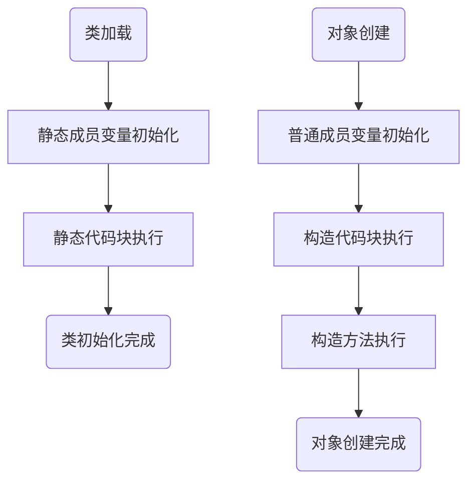
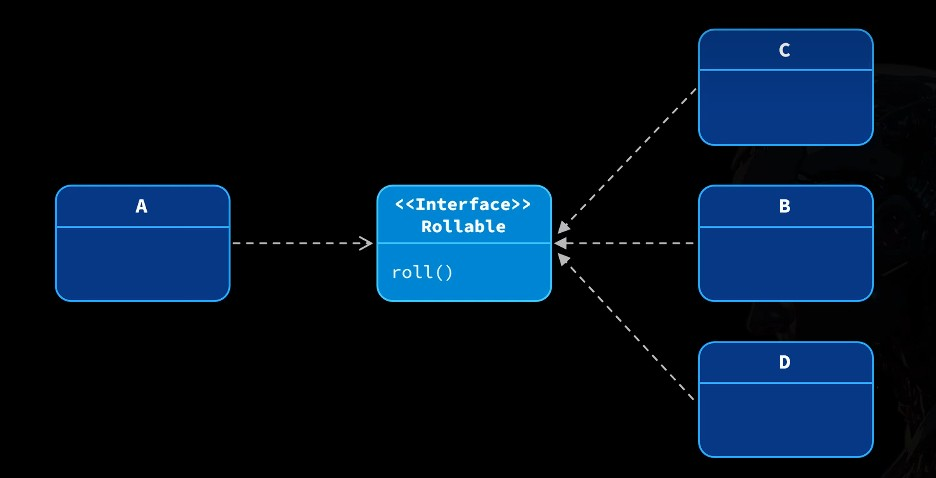
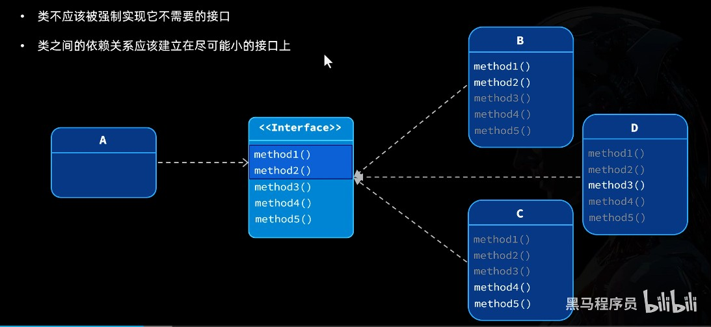
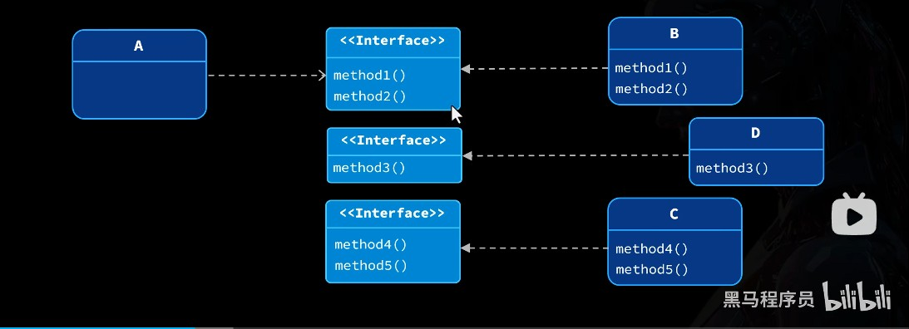

# 类

类: 用来描述一类事物的模板.
对象: 根据类这个模板创建的具体实例.

- 类中的变量叫成员变量, 表示事物的属性
- 类中的方法叫成员方法, 表示事物的行为

### 类的语法格式

```Java
修饰符 class 类名 {
    // 属性声明 (属性, 成员变量, 不用初始化)
    数据类型 变量名;

    // 方法声明 (行为, 方法 也叫函数)
    public 数据类型 方法名(参数列表) {
        // 方法体
    }
}
```

### 对象创建

有了 类 这个模板后, 我们就能实例化出具体的对象了.

```Java
// 实例化对象
类名 对象名 = new 类名();

// 调用对象的方法
对象名.方法名(参数列表);
```

定义的变量会存储在 **栈** 中, 创建的对象会存储在 **堆** 中.

- 局部变量一般存在栈里, 存取快.
- 对象实例存在堆里, 堆地方大.
- 对象引用存在栈里, 方便快速找到对象实例.

# 封装

封装(Encapsulation)是面向对象的核心特点之一, 要求将数据和操作这些数据的方法捆绑在一起, 作为一个整体.

例如, 以下是一个 **过程式编程** 案例, 求最终工资:

```Java
public class SalaryDemo {
	public static void main(String[] args){
	//底薪
	int baseSalary = 5000;
	//奖金
	int bonus = 10000;
	//绩效等级
	char grade ='B';

	//计算薪资
	int salary = calculateSalary(baseSalary，bonus， grade);
	System.out.println(salary);
	}

	public static int calculateSalary(int baseSalary，int bonus，char grade）{
	double rate = switch (grade）{
	case 'A' -> 1.0;
	case 'B' -> 0.8;
	case 'c' -> 0.6;
	case 'D' -> 0.4;
	default ->0;
	};
	return baseSalary +(int)(bonus * rate);
	}
}
```

其中, 底薪 奖金 绩效等级 就是 数据; 计算薪资 就是 方法.

使用面向对象编程, 将其封装:

```Java
// 定义员工模板, 不用赋值
public class Employee{
	int baseSalary;
	int bonus;
	// grade 不固定, 不在此处定义

	public calculateSalary(char grade）{
	// 计算奖金系数
	double rate = switch (grade）{
	case 'A' -> 1.0;
	case 'B' -> 0.8;
	case 'c' -> 0.6;
	case 'D' -> 0.4;
	default ->0;
	};
	// 计算薪资
	return baseSalary +(int)(bonus * rate);
}
```

这样, 一个员工类就定义好了, 接下来使用它:

```Java
public static void main(String[] args){
	// 使用模板
	Employee employee = new Employee();
	// 为属性赋值
	employee.baseSalary = 5000;
	employee.bonus = 10000;

	// 调用类中计算薪资的方法
	int salary = employee.calculateSalary( grade: 'A');
	System.out.println(salary);
}
```

 对选中的元素快速定义变量以接收结果: `alt` + `enter`

### Getter and Setter

为了避免给属性赋错误的值, 我们还需要在类中定义校验方法.

在刚刚封装的类中添加方法

```Java
public void setBaseSalary(int baseSalary){
	if(校验条件){
		不符合值的处理方法
	}
	// 符合的值, 将当前的值赋给类的属性.
	this.baseSalary = baseSalary;
}
```

`this`. 是为了区分 当前对象 和 方法参数,
`this.baseSalary = baseSalary;`
其含义就是将此方法的参数值赋给当前类

不过此时我们仍然能用老办法 `employee.baseSalary = 5000;` 的方式赋值,
为了只让外部通过 `.setBaseSalary` , 需要在类的属性添加 `private`

```Java
	private int baseSalary;
	private int bonus;
```

private 限制其只在类的内部使用, 而禁止外部调用.

同理地, 为了安全地获取值, 可以再定义一个 `.getBaseSalary`

```Java
public int getBaseSalary(){
	return baseSalary;
}
```

#### 小结

通常, 在做封装时.
成员变量 做 **私有化**, 禁止对外访问.
同时, 对外提供 **set 和 get 方法**, 使其能正常获取和赋值.

这些对外提供的方法, 称之为 Getter 和 Setter .
他们的作用为:
能够设置校验, 避免给属性赋错误的值.

### 降低耦合

耦合是指事物之间存在相互依赖, 相互影响, 相互制约的情况.
在程序设计中是指一个类依赖另一个类的程度.

类与类之间相互协作, 一些耦合是无法避免的.
不重要的方法可以使用 `private` 修饰, 以减少耦合的可能性.

### 构造方法

```Java
Employee employee = new Employee()
```

调用了**构造方法**, 是由 JVM 自动生成的方法, 会自动为成员变量赋初值, 初值类型由数据类型决定.

自定义构造方法, 让其带参数:

```Java
public Employee(int baseSalary, int bonus){
	this.baseSalary = baseSalary;
	this.bonus = bonus;
}
/*
 * 构造方法特点:
 *  1.没有返回值
 *  2.方法名与类名完全一致
 */
```

为了安全调用成员变量, 我们可以使用写好的 Getter 和 Setter:

```Java
public Employee(int baseSalary, int bonus){
	setBaseSalary(BaseSalary);
	setBouns(bonus);
}
```

这样, 我们就能更进一步降低耦合, 只将自定义后的构造方法暴露.

当自定义了有参的构造方法, 无参构造就会消失, 可根据实际要求选择是否需要手动定义.

```Java
// 空参构造
public Employee(){
}
```

## 总结

封装是面向对象的三大特征之一(封装 继承 多态), 简单来说就是:
将数据和操作数据的方法放到一起.

封装降低了耦合, 提高程序的可维护性和可复用性.

#### 如何实现封装

- 将数据和操作数据的方法放到一个类中, 作为类的**成员变量**和**成员方法**.
- 成员变量私有化, 对外提供 Getter 和 Setter 方法操作成员变量.
- 对于必须初始化的变量, 以构造方法来接收参数完成初始化.
- 使用 Private 隐藏不必要的细节, 只对外暴露必要的方法.

# 继承

在程序设计中, 继承是指让一个类继承另一个类的成员, 从而提高代码的复用性.
被继承的类叫父类, 继承的类就是子类.

例如, 商品分为实体商品和虚拟商品.

它们都属于商品, 都会有 商品名称 商品价格
而实体商品又独特拥有 重量;
虚拟商品又独特拥有 卡密.

定义一个父类:

```Java
// 父类 Produce
public class Product {
	private String name;
	private double price;

	public String displayInfo(){
		return "商品名称：" + name + "，商品价格：" + price;
	}

	public void setName(String name) {
		this.name = name;
	}

	public void setPrice(double price) {
		this.price = price;
	}

	// 空参构造
	public Product(){
	}
```

使用 `extends` 定义子类, 只用声明特有的属性行为:

```Java
// 子类 PhysicalProduct
public class PhysicalProduct extends Product {
	private double weight;

	public double getWeight() {
		return weight;
	}

	public void setWeight(double weight) {
		this.weight = weight;
	}
```

Java 中一切类都直接或者间接地继承了 Object 类.

### 调用父类构造

由于共性成员变量(名称/价格)在父类中都是私有的, 无法直接在子类中操作.
如何让子类的构造和父类的构造相互协作, 共同完成初始化?

使用关键字 `super` 可访问当前类的父类.

```Java
super(); // 调用当前父类的构造方法
// ()中没有参数, 调用的是空参构造
```

这句代码 JVM 默认会自动生成.

因此, 当我们 `new PhysicalProduct()` 子类对象时, 会首先执行这句自动生成的代码.
结果就是调用了父类构造 `Product()` 的空参构造.

只要通过 super() 传递参数, 再由父类的有参构造接收参数即可:

```Java
// 父类 Produce
public class Product {
	private String name;
	private double price;

	public String displayInfo(){
		return "商品名称：" + name + "，商品价格：" + price;
	}

	public void setName(String name) {
		this.name = name;
	}

	public void setPrice(double price) {
		this.price = price;
	}

	// 有参构造
	public Product(String name, double price){
		this.name = name;
		this.price = price;
	}
```

```Java
// 子类 PhysicalProduct
public class PhysicalProduct extends Product {
	private double weight;

	public double getWeight() {
		return weight;
	}

	public void setWeight(double weight) {
		this.weight = weight;
	}

	// 有参构造
	public PhysicalProduct(String name, double price, double weight){
	super(name, price); // 调用父类的有参构造, 对父类的成员变量初始化
	this.weight = wegiht; // 对自己的成员变量赋值
	}
```

这时只需要调用子类的构造方法即可让子类的构造和父类的构造相互协作, 共同完成初始化:

```Java
public static Demo(){
	public static void main(String[] args){
		PhysicalProduct p = new PhysicalProduct("")
	}
}
```

注意, 一旦使用有参构造, 默认的空参构造会被覆盖, 默认调用的 `super();` 找不到空参构造会报错.
因此 `super(name, price);` 是不可少的.

### 方法的覆写

覆写（override）也叫重写, 是指子类定义了一个与父类中**声明完全相同**, 但实现不同的方法.
子类的实现就覆盖了父类的实现.

例如, 之前商品的例子中, 父类的 `displayInfo()` 只展示了商品的共性(名称/价格).
要展示子类独特的成员变量显然是不够的.

重写的方法应在开头加入 `@Override` 标记, 此标记会自动检测重写是否正确.
在子类中覆写 `displayInfo()` 方法:

```Java
@Override
public String displayInfo(){
	return super.displayInfo() + ",商品重量" + weight + "g"
}
```

使用 `super` 关键字调用父类的方法, 然后再拼接额外的信息.

> IDEA 覆写快捷键: `Ctrl` + `O`

当不希望方法被重写\类被继承, 添加 `final` 关键字:

```Java
public final void notify()
```

### 权限修饰符

权限修饰符 (AccessModifier) 用来修饰类和类的成员, 它约束了类的成员的可访问范围.

| 修饰符          | 作用于本类 | 相同包下的类 | 子类 | 其他类 |
| --------------- | ---------- | ------------ | ---- | ------ |
| `private`       | √          |              |      |        |
| `default(默认)` | √          | √            |      |        |
| `protected`     | √          | √            | √    |        |
| `public`        | √          | √            | √    | √      |

# 多态

多态 (Polymorphism) 就是事物具有多种不同形态, 或者同一行为, 具有多种不同表现.

设计一个创建订单的方法:

```Java
PhysicalProduct p = new PhysicalProduct("手机",1999,672);
DigitalProduct d = new DigitalProduct("充值卡",99.9,"123456")

// 父类型变量指向子类型的对象, JVM会隐式类型转换, 向上将子类型转换为父类型
createOrder(p);
createOrder(d);

public static void createOrder(Product product){
	// 向上转型只能调用父类方法
	System.out.println(product.displayInfo())
	System.out.println("订单已确定")
}
```

一般不会使用向下转型, 了解即可:

```Java
public static void createOrder(Product product){
	// 向下转型必须判断类型
	if (product instanceof PhysicalProduct){
		PhysicalProduct p = (PhysicalProduct) product;
		p.setWeight(586.00)
	}
	System.out.println(product.displayInfo())
	System.out.println("订单已确定")
}
```

### 抽象

抽象 (Abstract) 是与具体相对应的概念, 代表事物中共性的但不确定的特征.

例如实体商品和虚拟商品, 它们都应有一个发货的行为, 但不确定行为的具体表现.
实体商品通过邮寄发货, 虚拟商品通过发送卡密信息发货.

"发货"这个方法, 就可以称之为 抽象方法.
定义抽象方法的类, 就是抽象类.

在父类 Product 使用 `abstract` 关键字, 定义 抽象方法:

```Java
public abstract void sendProduct();
```

抽象方法必须定义在抽象类中, 被抽象的类无法再用 new 方法实例化

在实体商品和虚拟商品中添加定义发货的方法:

- 实体商品

```Java
public void sendProduct(){
	System.out.println("通过物流发货");
}
```

- 虚拟商品

```Java
public void sendProduct(){
	System.out.println("通过网络发货");
}
```

新建测试类:

```Java
public static void main(String[] args){
	PhysicalProduct p = new PhysicalProduct("华为Mate70", 7299.00, 672.00) ;
	DigitalProduct d = new DigitalProduct("Appstore 充值卡", 99.9, "123456");

	// 使用数组存储多个
	public static void sendProducts(Product[] products){
		for (int i = 0; i < products.length; i++) {
			Product product = products[i];
		}
	}
}
```

IDEA 中 输入 `需要遍历的变量名称.fori` 回车, 即可自动生成 for 循环.

# static 静态

#### 静态变量

静态变量就是类中用 static 关键字修饰的变量, 静态变量是属于类的变量, 可以理解为一类事物的共享属性.

- 静态变量随着类首次使用而加载，并且完成初始化
- 使用静态变量无需创建对象，可以直接使用`类名.变量名`访问

#### 静态方法

静态方法就是类中用 static 关键字修饰的方法, 静态方法是属于类的方法.

- 静态方法无需创建对象, 直接用`类名.方法名`调用.
- 静态方法中不能直接访问非静态成员（变量和方法）, 只能访问静态成员.

```Java
private static int count = 0;

public static int getCount(){
	// 静态方法不能使用 this 关键字
	return count;
}
```

# 工具类

静态的实际用途是用来做工具类.

工具类是用来封装某一非业务领域内一些通用的公共方法的类.
由于这些方法不需要用到实例变量, 仅仅是作为工具方法使用, 因此通常都是静态的.

例如, 一个角度转弧度的方法:

```Java
public class MathUtil{

	public static final double PI = 3.14
	public static final double STRAIGHT_ANGLR = 180

	public static double toRadians (double degrees){
		return degrees * 3.14 / 180
	}
}
```

### 静态工厂方法

静态工厂方法就是在类中提供一个用来创建对象的静态方法来代替构造方法.

```Java
public class Worker() {
	public Worker(){

	}

	// 提供一个用来创建对象的静态方法
	public static Worker getInstance(){
		ruturn new Worker();
	}
}
```

为什么要这样多此一举呢?
先来几个案例:

#### 简化开发

例如, 定义一个代表程序运行结果的类 Result, 具备以下属性:

| 属性名称 | 类型   | 描述                                        |
| -------- | ------ | ------------------------------------------- |
| code     | int    | 结果状态码: <br>0 成功, 1 失败              |
| msg      | String | 结果描述: <br>ok 表示成功, 失败描述失败原因 |
| data     | Object | 运行成功返回的结果数据                      |

```Java
public class Result {
	private int code;
	private String msg;
	// 使用 Object 顶级父类,以此来接收任意类型
	private Object data;

	public Result(int code, String msg, Object data){
		this.code = code;
		this.msg  = msg;
		this.data = data;
	}

	// 省略了Getter Setter
}
```

假设通过 id 查询学生信息, 有 查询成功(有返回结果) 和失败 两种情况,
通过 id 删除学生信息, 有 删除成功(无返回结果) 和 失败 两种情况.
如果不使用静态工厂方法:

- 成功,有返回结果:

```Java
return new Result(0, "OK", student)
```

- 成功, 无返回结果:

```Java
return new Result(0, "Ok", null)
```

- 失败, 返回错误信息, 无返回结果:

```Java
return new Result(1, "id不能小于0", null)
// null 代表是空, 通常是指一个引用类型数据不存在
```

每一次需要此对象时, 都必须如此声明.
虽然编译不报错, 但可以使用 静态工厂方法 来进一步简化.

在 Reslut 类中定义 静态工厂方法.

```Java
// 成功,有返回结果
public static Result ok(Object data){
    return new Result(0, "OK", data);
}

// 成功, 无返回结果
public static Result ok(){
    return ok(null);
}

// 失败
public static Result fail(String msg){
    return new Result(1, msg, null);
}
```

在测试类中调用定义的方法:

- 成功,有返回结果:

```Java
return Result.ok(student);
```

- 成功, 无返回结果:

```Java
return new Result(0, "Ok", null);
```

- 失败, 返回错误信息, 无返回结果:

```Java
return Result.fail("id不能小于0");
```

增强了可读性和可维护性

#### 避免重复创建对象

有这样一个需求:
定义一个表示性别的类 Gender, 包含以下属性.

| 属性名称 | 类型   | 描述                            |
| -------- | ------ | ------------------------------- |
| value    | int    | 性别标识:<br>0 代表男, 1 代表女 |
| lable    | String | 性别标签:<br>男, 女             |

首先定义一个传统的 Gender 类.
包含 属性, 有参构造和 Getter Setter.

```java
public class Gender{
	private int value;
	private String label;

	public Gender(int value String label){
		this.value = value;
		this.label = label;
	}

	public void getValue(){
		return value;
	}
	public void setValue(int value){
		this.value = value;
	}

	public String getLabel(){
		return label;
	}
	public void setLabel(String label){
		this.label = label;
	}
}
```

使用这个传统的 Gender 类, 会遇到如下问题:

- 能重复创建对象, 导致空间浪费.
- 创建对象无限制, 会出现意料之外的错误(创建了两种以上的性别标签).
- 数字与标识的关联不强(每次用 if 判断来识别标签).

为了避免这些问题, 可以这样修改:

```java
public class Gender{
	private int value;
	private String label;

	// 1.构造方法私有化, 禁止在外部随意创建对象, 只能通过内部的工厂方法创建
	private Gender(int value String label){
		this.value = value;
		this.label = label;
	}
	// 3.使用常量预先构造好对象, 避免重复创建
	private static final Gender MALE = Gender(0, "男")
	private static final Gender FEMALE = Gender(2, "女")
	// 2.使用工厂方法规定创建的对象类型
	public static Gender male(){
		return new MALE;
	}
	public static Gender female(){
		return new FEMALE;
	}

	// 4.根据值得到当前类对象
	public static Gender valueOf(int value){
		if(value != 0 && != 1 )
		throw new IllegalArgumentException("性别参数不合法.");
	}

	public void getValue(){
		return value;
	}
	public void setValue(int value){
		this.value = value;
	}

	public String getLabel(){
		return label;
	}
	public void setLabel(String label){
		this.label = label;
	}
}
```

#### 创建不同子类

在父类中定义创建子类的方法.

```Java
public static PhysicalProduct createPhysicalProduct(String name, double price, double weight){
	return new PhysicalProduct(name, price, weight);
}
```

这样定义所有的子类方法后,

> 快捷键:
> 快速生成变量 `Alt` + `Enter`
> 在变量后输入 `.var` 回车, 也是同样的效果.

### 代码块

代码块就是用大括号括起来, 独立于方法之外的代码片段

```Java
public class CodeBlock{

	public CodeBlock(){
		System.out.println("无参构造方法");
	}
	public void func(){
		System.out.println("普通方法");
	}
	//代码块
	{
		System.out.println("构造代码块");
	}
	static{
		System.out.println("静态代码块");
	}
}
```

静态代码块在类的加载时执行, 用于处理静态成员变量.
构造代码块在每次构造方法加载时执行, 用于处理普通的成员变量.

运行以下代码:

```Java
public class CodeBlock{
// 1.类加载和初始化的顺序
// 1.1 静态成员变量的初始化
	public static int num = 100;
	// 2.对象创建的流程
	// 2.1 普通成员变量初始化
	public int num2 = 10;
	// 2.3 构造方法初始化
	public CodeBlock(){
		System.out.println("num2 = " + num2);
		System.out.println("无参构造方法");
	}

	public void func(){
		System.out.println("普通方法");
	}
	// 2.2 构造代码块初始化
	{
		System.out.println("num2的初始值:" + num2);
		num2 = 20;
		System.out.println("构造代码块");
	}
// 1.2 静态代码块执行, 只在类加载后初始化时执行一次
	static{
	System.out.println("num的初始值:" + num);
	num++;
		System.out.println("静态代码块");
	}
}
```

```Java
public class CodeBlockDemo {
    public static void main(String[] args) {
        System.out.println("num = " + CodeBlock.num);
        System.out.println("num = " + CodeBlock.num);
        System.out.println("======================");
        CodeBlock cb1 = new CodeBlock();
        cb1.func();
        System.out.println("======================");
        CodeBlock cb2 = new CodeBlock();
        cb2.func();
    }
}
```

所得结果:

```text
num的初始值:100
静态代码块
num = 101
num = 101
======================
num2的初始值:10
构造代码块
num2 = 20
无参构造方法
普通方法
======================
num2的初始值:10
构造代码块
num2 = 20
无参构造方法
普通方法

Process finished with exit code 0
```



#### 静态代码块案例

需求: 定义一个表示交通信号灯的类 TrafficLight, 包含下列属性:

```Java
public class TrafficLight {
    private String label;
    private  TrafficLight nextLight;

    private TrafficLight(String label){
        this.label = label;
    }

    public static final TrafficLight RED;
    public static final TrafficLight YELLOW;
    public static final TrafficLight GREEN;
	// 使用静态代码块初始化
	static{
	    RED = new TrafficLight("红");
	    YELLOW = new TrafficLight("黄");
	    GREEN = new TrafficLight("绿");
	    RED.nextLight = YELLOW;
	    YELLOW.nextLight = GREEN;
	    GREEN.nextLight = YELLOW;
	}

    public String getLabel() {
        return label;
    }
    public TrafficLight getNextLight() {
        return nextLight;
    }
}
```

调用:

```Java
public static void main(String[] args) {
    System.out.println(TrafficLight.GREEN.getLabel()+"灯下一个灯是"+TrafficLight.GREEN.getNextLight().getLabel()+"灯");
    System.out.println(TrafficLight.YELLOW.getLabel()+"灯下一个灯是"+TrafficLight.YELLOW.getNextLight().getLabel()+"灯");
    System.out.println(TrafficLight.RED.getLabel()+"灯下一个灯是"+TrafficLight.RED.getNextLight().getLabel()+"灯");
}
```

```text
绿灯下一个灯是黄灯
黄灯下一个灯是绿灯
红灯下一个灯是黄灯

Process finished with exit code 0
```

# 接口

前面提到过耦合, 耦合是指不同模块 (如类、方法等) 之间相互依赖的程度.
为了减少耦合, 尽可能隐藏类中的细节.


不过这种方式终究还是无法避免耦合,
接口为此而生.

接口 **(Interface)** 是一种类似于 class 的类型,但是只定义方法的声明, 不定义具体实现.

```Java
public interface Rollable{
	void roll;
}
```

例如制作饺子皮, 一般都使用擀面杖来制作.
不过非得要擀面杖来制作吗?

擀饺子皮，重在不在于用什么'工具'，重点在于'擀'.
'擀'就是接口中的方法，擀面杖、火腿肠、苹果，都是'擀'的实现类.

这样擀面杖与制作饺子皮就解除耦合了.



接口只定义需要什么样的行为, 具体实现由其他类来实现.
接口解除类与类的耦合, 提高代码的拓展性.

新建一个接口:

```Java
public interface Coupon{
	// 接口默认为 public abstract, 可以省略
	int calculateDiscount(double totalPrice);
}
```

实现这个接口:

```Java
public class PriceDiscountCoupon implements Coupon{
	private int threshold;
	private int discount;

	public PriceDiscountCoupon(int threshold, int discount){
		this.threshold = threshold;
		this.discount = discount;
	}

	@Override // 加上此注解以便于更好地排查错误
	public int calculateDiscount(double totalPrice){
		return totalPrice >= threshold ? discount : 0;
	}
}
```

使用接口:

```Java
public class Order{
	private Product product;
	private int amout;
	// 使用接口
	private Coupon coupon;

	public Order(Product product, int amount, int amount, int threshold, int discount){
		this.product = product;
		this.amount = amount;
		// 仍然存在耦合
		this.coupon = new PriceDiscountCoupon(threshold, discount);
	}

	public void showOrderInfo(){
		...
	}
}
```

### 依赖注入

依赖注入(Dependency Injection) 是一种软件设计模式, 它要求类不再创建他所依赖的对象,而是由其他类提供并注入这些依赖项.

依赖注入常见方式:

#### 构造函数注入

```Java
// 直接接收优惠券对象
	public Order(Product product, int amount, int amount, Coupon coupon){
		this.product = product;
		this.amount = amount;
		this.coupon = coupon;
	}
```

使用者注入对象:

```Java
public class void main(String[] args){
	Product product = Product.createPhysicalProduct( name:"华为Mate70", price: 7299.00, weight:672.00);
	// 需要提前创建好对象
	Coupon coupon = new PriceDiscountCoupon(threshold:9000,discount:1000)
	Order order = new Order(product, amount: 2,coupon);

	order.showorderInfo();
}
```

能在创建对象那一刻, 立马将所需要的依赖项都注入.
适用于明确知道对象不再变化.

#### setter 注入

```Java
// 在setter中接收优惠券对象
public void setCoupon(Coupon coupon){
	this.coupon = coupon;
}
```

```Java
Coupon coupon = new RateDiscountCoupon(9000,85);
order.setCoupon(coupon);

order.showorderInfo();
```

#### 总结

接口时定义要做什么, 尽量不要变化.
类时定义怎么做, 可以看作是协议的履行者.

### 接口分离

接口分离原则（InterfaceSegregationPrinciple）也叫接口隔离原则.

- 一个接口中应该只包含相同职责的方法, 尽可能少的方法, 方法过多时应考虑拆分接口.

注意事项:

- Java 中 1 个类可以实现多个接口, 但是只能单继承
- 接口之间是可以继承的, 而且可以多继承.

例如三个类只需要接口中的一部分方法.



只需要将接口拆分成三个即可.



实际案例, 实现快捷键和鼠标点击的事件监听:

```Java
public interface EventListener{
	void onclick(); // 处理用户鼠标点击
	void onkeydown(String key); // 处理用户按下键盘
	void onchange(); // 监控用户输入内容做补全
}
```

如此将全部功能定义在一个接口中, 我们在实现接口时, 就不得不把接口中所有的功能都实现:
例如我只想在这个类中实现 `onclick()` 方法:

```Java
public class PackageEventListener implements EventListener{
    @Override
    public void onclick() {
          System.out.println("展开包中的文件.")
    }
	// 并不需要实现下列方法
    @Override
    public void onkeydown(String key) {

    }

    @Override
    public void onchange() {

    }
}
```

此时遵守接口分离原则更为便利
将接口按功能和需求拆分:

```Java
public interface MouseEventListener{
	void onclick();
}
```

注意: 一个类中只能有一个接口

同理的, 接着拆分:

```java
public interface KeyEventListener{
	void onkeydown(String key)
}
```

这样, 原接口还剩下:

```Java
public interface EventListener{
	void onchange(); // 监控用户输入内容做补全
}
```

这样三个接口就独立开来.
只想在这个类中实现 `onclick()` 方法时只需要:

```Java
public class PackageEventListener implements EventListener{
    @Override
    public void onclick() {
          System.out.println("展开包中的文件.")
    }
}
```

即可.

#### 拓展功能

如果又同时需要两个接口有以下两种方法:

##### 方法一

```Java
public class PackageEventListener implements EventListener, KeyEventListener{
    @Override
    public void onclick() {
        System.out.println("展开包中的文件.");
    }
    @Override
    public void onkeydown(String key) {
        System.out.println("快捷键被按下了.");
    }
}
```

实现多个接口, 适用于需要实现的接口数量较少.

##### 方法二

当需要实现的接口数量较多, 可以使用继承的方式组合多个接口:

```Java
public interface EventListener extends MouseEventListener, EventListener{
	void onchange();
}
```

### 其他特性(了解)

在 Java 发展的过程中, Interface 添加了很多本来不应该属于它的特性, 例如:

- 接口中的变量默认就是 public static final，也就是静态常量
- 接口中可以定义静态方法，可以直接用接口名.方法名调用
- 接口中可以定义默认方法，实现接口的类可以不用实现该方法

```Java
  public interface Shape {
  //静态常量，默认是 public staticfinal
  double PI = 3.14159265354979323846;
  //静态方法
  static double calculatePerimeter(double radius）{
  return 2 _ PI _ radius;
  }
  //默认方法
  default double calculateArea(double radius）{
  return PI * radius * radius;
```

### 小结

什么时候需要使用接口（解除与依赖项之间的耦合关系）？

- 依赖的类将来有可能会升级或替换
- 与第三方系统对接，可能更换第三方服务提供者，例如支付、发短信
- 通过接口定义协议，不断开发新的接口实现类来拓展新功能

接口和抽象类有什么区别？

- 接口，用来定义协议，实现低耦合、拓展性强的代码
- 抽象类，部分实现的类，用来在子类之间共享代码
