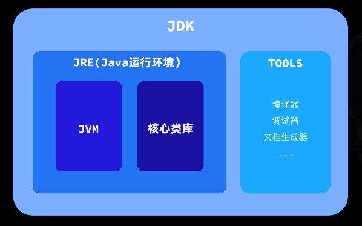
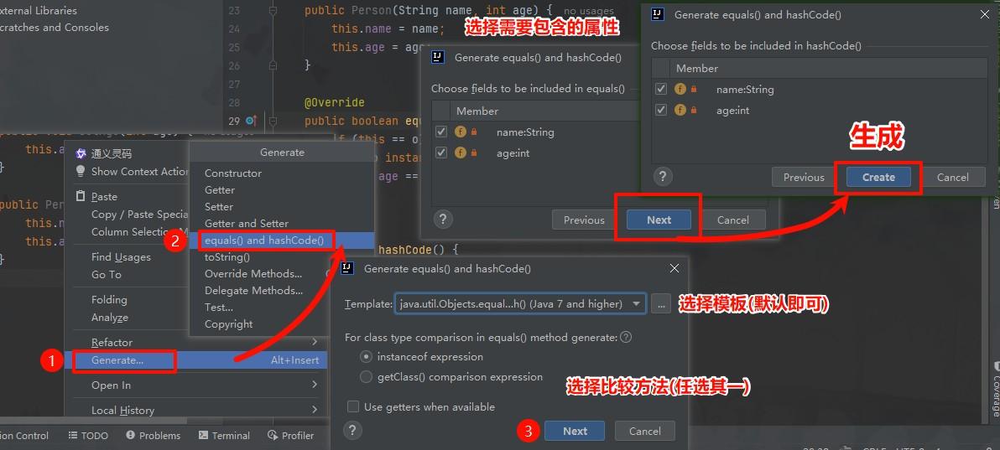
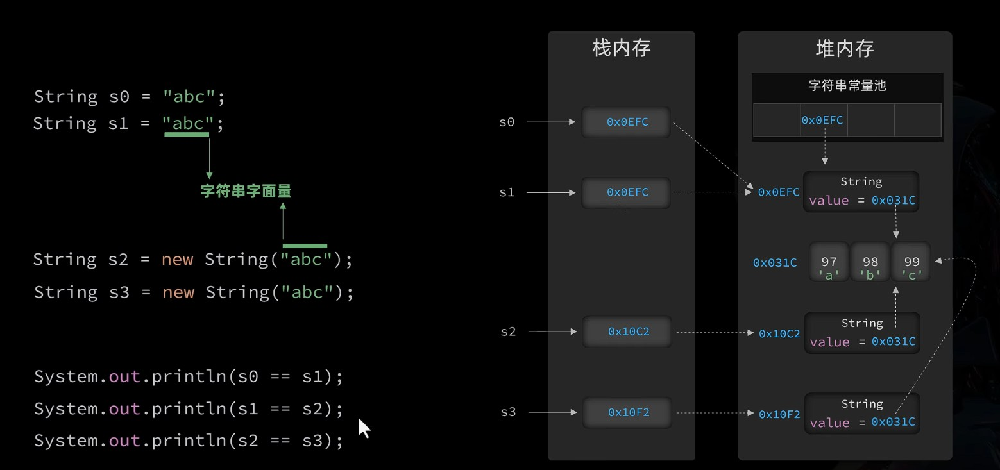
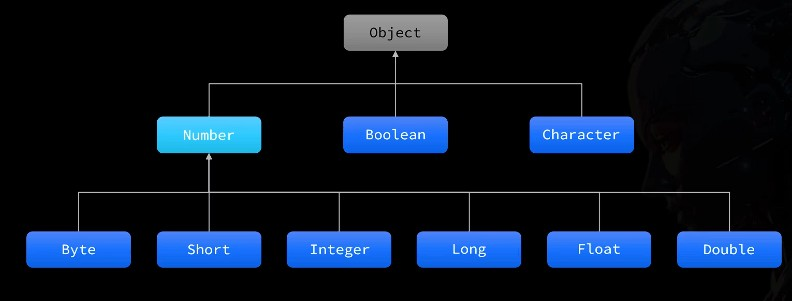
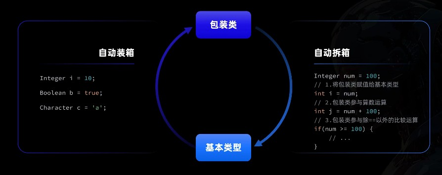
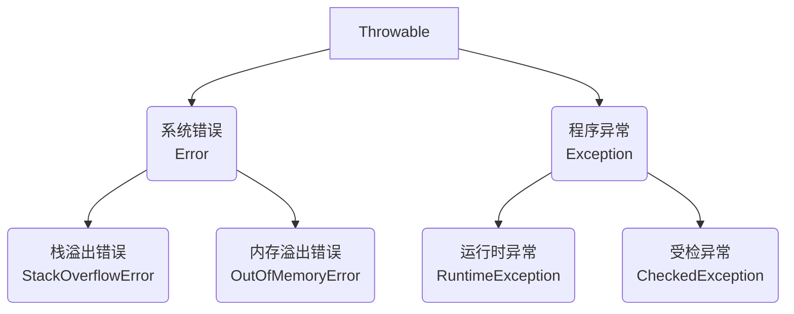
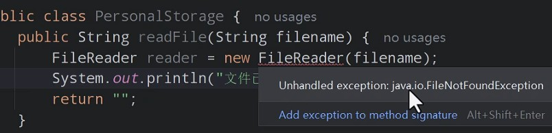

API(Application Programing Interface), 也就是应用程序接口, 通常是指应用程序之间交换的协议和标准.
有了这一套标准, 每个团队遵循这套标准各自开发对应的内容, 最后完成的项目就能正确的交互和协作.

在 Java 运行环境 中 包含核心类库, 这套核心类库, 就是 Java 为开发者提供的一套核心 API 了.



[Java® 平台、标准版和 Java 开发工具包 版本 17 API 规范](https://doc.qzxdp.cn/jdk/17/zh/api/index.html)

# Object

Java 中所有类, 都直接或间接地继承了 Object 类, 因此都可以使用 Object 中定义方法.

### equals

比较两个对象是否相等, 比较对象建议用 `equals()`,
而不是 `==` , 双等号会比较**变量里面的值**, 比较对象时, 其中存储的是地址, 不能达到预期效果.

不过, 在 equals 方法中的默认实现如下, 仍然是用的 `==` 比较.

```Java
public boolean equals(Object obj){
	return(this == obj);
}
```

> 在 IDEA 中, 按住 `Ctrl` 点击方法名可跳转至实现类.

这是因为 `Object` 作为所有类的超级父类, 其作用只是提供一个基本的比较逻辑.
当没有重写覆盖 `equals()` 方法时, 才会调用这个默认实现.

而 String 类能够正常比较就是重写了 `equals()` 方法.

如果我们需要比较自定义的类,
例如一个包含 `name` 和 `age` 属性的 `Person` 类, 覆写 `equals()` 方法:

```Java
@Override
public boolean equals(Object obj){
	if(!(obj instanceof Person)){ // 向下强转需要判断类型, 保证健壮性
		return false;
	}
	Person p = (Person) obj;
	retrun this.name.equals(p.name) && this.age == p.age;
}
```

`equals()` 方法通常配合 `hashCode()` 共同使用.

### hashCode

根据对象信息, 计算出一个哈希值(整数), 将来会在哈希表中用到.

> 哈希表可以当作一种数据结构.
> 哈希值会影响对象在哈希表中存储的位置.

`hashCode()` 方法必须满足以下条件:

- 同一个对象, 多次调用该方法, `hashCode()` 必须始终返回相同整数.
- 如果两个对象用 `equals()` 比较:
  - 若相同, 则两个对象的 `hashCode()` 必须返回相同结果.
  - 若不同, 则两个对象的 `hashCode()` 尽量返回不同结果 (不是必须).

`hashcode()` 的默认算法是用一种随机数生成法生成 (Marsaglia 的 xor-shift), 使用 C 语言实现.

```Java
public native int hashCode();
```

同一个对象只会在第一次时生成一个随机数, 这个随机数会被缓存, 以保证每次调用始终返回相同值.

若要满足全部的条件,
`hashCode()` 需要根据属性计算得到 , 这需要手动重写`hashCode()` 方法.
而刚刚提到的 `equals()` 方法同样也与属性关联.
我们在重写 `equals()` 方法的同时, 也应该重写 `hashCode()`.

IDEA 提供了自动生成 这两个方法的功能.

与生成 Getter 和 Setter 类似, 在代码编辑窗口右键:



以此自动生成了两个方法.

```Java
@Override
public boolean equals(Object o) {
    if (this == o) return true;
    if (!(o instanceof Person person)) return false;
    return age == person.age && Objects.equals(name, person.name);
}

@Override
public int hashCode() {
    return Objects.hash(name, age);
}
```

### toString

返回对象的字符串表示形式, 以便人们阅读并了解对象中的数据或信息.
当我们直接打印一个对象, 或者将对象与字符串拼接时, 默认就会调用对象的 toString 方法.

Objiect 中的默认实现如下:

```Java
public String toString(){
 return getClass().getName() + "@" + Integer.toHexString(hashCOde());
}
```

`getClass().getName()` 会展示当前类的完整名称 (包名 + 类名)
`Integer.toHexString(hashCode())` 会先通过 hashCode 方法计算哈希值, 然后再转换为十六进制展示.

如果要展示自定义的对象, 肯定是想展示其属性, 这时就需要重写此方法.
当然, IDEA 已经内置了自动生成 tostring() 方法, 操作方式与之前类似.

# String

是一个特殊的引用类型数据, 可以直接用字符串字面量创建对象.
(别的引用类型需要`new`关键字创建.

```Java
String name = "Wreckloud"
```

不过 `String 类` 当然也能通过 `new` 关键字创建, 以下是常见的构造方法:

| 构造方法                              | 描述                                   |
| ------------------------------------- | -------------------------------------- |
| String(String original)               | 基于传入的字符串创建一个字符串对象副本 |
| String(byte[] bytes)                  | 用默认编码表将字节数组转换为字符串对象 |
| String(byte[] bytes, Charset charset) | 用指定的编码表将字节数组转为字符串对象 |
| String(char[] value)                  | 用字符数组创建出一个字符串对象         |

```Java
// 直接用字符串字面量创建
String str = "Hello, World!";

// 用字符串字面量创建一个副本
String strCopy = new String(str);

// 用字节数组创建一个字符串
byte[] bytes = {72, 101, 108, 108, 111, 44, 32, 87, 111, 114, 108, 100, 33};

// 用默认编码表将字节数组转换为字符串对象
String strFromBytes = new String(bytes);

// 用指定的编码表将字节数组转为字符串对象
String strFromBytesWithCharset = new String(bytes, Charset.forName("UTF-8"));

// 用字符数组创建出一个字符串对象
char[] chars = {'H', 'e', 'l', 'l', 'o', ',', ' ', 'W', 'o', 'r', 'l', 'd', '!'};
String strFromChars = new String(chars);
```

更推荐使用 直接用字符串字面量创建对象.

无论在哪, 只要**用字面量**创建字符串对象, 都会在堆内存中的字符换常量池中检查是否存在.
`new()` 的方式都会额外在堆内存中开辟空间.



## intern

当调用时, 检查字符串常量池是否包含当前字符串相等的字符串(通过 `.equals()` 判断).
如果存在, 会直接返回池中字符串对象;
否则, 将此字符串添加到池中, 并返回此对象.

```Java
public static void main(String[] args) {
    // 创建一个字符串，会自动进入字符串池
    String str1 = "Hello";
    String str2 = "Hello";

    // 使用 new 创建字符串，不会自动进入字符串池
    String str3 = new String("Hello");
    String str4 = new String("Hello");

    // 比较使用字面量创建的字符串
    System.out.println(str1 == str2); // 输出: true

    // 比较使用 new 创建的字符串
    System.out.println(str3 == str4); // 输出: false

    // 使用 intern 方法
    String str5 = str3.intern();
    System.out.println(str5 == str1); // 输出: true

    // 对比调用 intern 前后的结果
    System.out.println(str3 == str5); // 输出: false
}
```

## 判断与比较

### 比较

| 方法                           | 描述                                 | 大小写敏感 |
| ------------------------------ | ------------------------------------ | ---------- |
| `equals(Object obj)`           | 严格比较字符串内容是否**完全相同**   | ✔️ 是      |
| `equalsIgnoreCase(String str)` | 比较字符串内容是否相同（忽略大小写） | ❌ 否      |

```java
String str1 = "Hello";
System.out.println(str1.equals("hello"));        // false
System.out.println(str1.equalsIgnoreCase("HELLO")); // true
```

### 空值检查

| 方法        | 描述                                  | 空白字符处理           |
| ----------- | ------------------------------------- | ---------------------- |
| `isEmpty()` | 检查字符串**长度是否为 0**（即 `""`） | 不识别空格             |
| `isBlank()` | 检查字符串是否为空**或全为空白字符**  | 识别空格/制表符/换行符 |

```java
System.out.println("".isEmpty());        // true
System.out.println("   ".isEmpty());     // false

System.out.println("   ".isBlank());     // true
System.out.println(" \t\n".isBlank());   // true（含制表符、换行符）
```

### 前后缀检查

| 方法                        | 描述                             |
| --------------------------- | -------------------------------- |
| `startsWith(String prefix)` | 判断字符串**是否以指定前缀开头** |
| `endsWith(String suffix)`   | 判断字符串**是否以指定后缀结尾** |

```java
String path = "/data/images/photo.jpg";
System.out.println(path.startsWith("/data")); // true
System.out.println(path.endsWith(".png"));    // false
```

### 内容匹配

| 方法                        | 描述                           | 匹配方式                                   |
| --------------------------- | ------------------------------ | ------------------------------------------ |
| `contains(CharSequence cs)` | 判断是否包含**指定子字符串**   | 精确字符匹配                               |
| `matches(String regex)`     | 判断是否符合**正则表达式规则** | 正则模式匹配<br>[[正则表达式\|正则表达式]] |

```java
// 检查是否包含子字符串
String text = "Java编程基础";
System.out.println(text.contains("编程")); // true

// 正则表达式验证手机号
System.out.println("13800138000".matches("\\d{11}")); // true
```

#### 综合应用案例

**场景**：验证文件名合法性  
要求：

1. 必须以 `report_` 开头
2. 必须包含日期格式 `2023-12-31`
3. 必须以 `.pdf` 结尾

```java
String filename = "report_销售数据_2023-10-05.pdf";

boolean isValid = filename.startsWith("report_")
               && filename.contains("2023-")
               && filename.endsWith(".pdf");

System.out.println(isValid); // true
```

**注意事项**：

1. `equals()` 比较的是**字符串内容**，不是内存地址（与 `==` 不同）
2. `isBlank()` 需 Java 11+ 支持，低版本可用 `trim().isEmpty()` 替代
3. `matches()` 要求**完全匹配**整个字符串（相当于正则表达式自动添加 `^...$`）

String 类中提供的判断或比较字符串的方法, 返回值都是 boolean 类型.

| 方法                                                             | 描述                                                         |
| ---------------------------------------------------------------- | ------------------------------------------------------------ |
| `equals(Object obj)`<br>`equalsIgnoreCase(String anotherString)` | 将当前字符串与指定对象比较<br>忽略大小写比较                 |
| `isEmpty()`<br>`isBlank()`                                       | 判断字符串是否为空字符串<br>判断字符串是否为空或全是空白     |
| `endsWith(String suffix)`<br>`startsWith(String prefix)`         | 判断字符串是否以指定后缀结尾<br>判断字符串是否以指定前缀开始 |
| `matches(String regex)`                                          | 判断字符串是否与指定的正字表达式匹配                         |
| `contains(CharSequence cs)`                                      | 判断当前字符串是否包含指定的子字符串                         |

```Java
public static void main(String[] args) {
    // 1. equals(): 比较两个字符串是否相等（区分大小写）
    String user = "Alice";
    System.out.println(user.equals("alice")); // false
    // 2. equalsIgnoreCase(): 比较两个字符串是否相等（忽略大小写）
    System.out.println(user.equalsIgnoreCase("alice")); // true

    // 3. isEmpty(): 判断字符串是否为空字符串
    String empty = "";
    System.out.println(empty.isEmpty()); // true
    // 4. isBlank(): 判断字符串是否为空或仅包含空白字符
    String blank = "   ";
    System.out.println(blank.isBlank()); // true

    // 5. startsWith(): 判断字符串是否以指定前缀开头
    String path = "data/users.txt";
    System.out.println(path.startsWith("data")); // true
    // 6. endsWith(): 判断字符串是否以指定后缀结尾
    System.out.println(path.endsWith(".txt")); // true

    // 7. matches(): 判断字符串是否匹配指定的正则表达式
    System.out.println("13800138000".matches("\\d{11}")); // true

    // 8. contains(): 判断字符串是否包含指定的子字符串
    String article = "Java 是一种编程语言。";
    System.out.println(article.contains("Java")); // true
}
```

## 获取

### 基础属性获取

| 方法                | 作用                   | 参数说明                      | 返回值说明             |
| ------------------- | ---------------------- | ----------------------------- | ---------------------- |
| `length()`          | 获取字符串**字符数量** | 无                            | 字符串长度（int）      |
| `charAt(int index)` | 获取指定索引位置的字符 | 索引范围：`0` 到 `length()-1` | 对应位置的字符（char） |

```java
String str = "HelloWorld";

// 获取字符串长度
System.out.println(str.length());   // 10
// 获取索引为3的字符（索引从0开始）
System.out.println(str.charAt(3));  // 'l'
```

### 切割与截取

| 方法                                      | 作用                       | 参数说明                             |
| ----------------------------------------- | -------------------------- | ------------------------------------ |
| `split(String regex)`                     | 按正则表达式规则拆分字符串 | 支持复杂分隔符（如逗号、空格等）     |
| `substring(int beginIndex, int endIndex)` | 截取指定索引范围的子字符串 | 含头不含尾（包含 begin，不包含 end） |

```java
// 按空格拆分字符串
String[] words = "Java Python C++".split("\\s+");
System.out.println(Arrays.toString(words)); // [Java, Python, C++]

// 截取索引2到5的字符（含2不含5）
System.out.println("ABCDEFG".substring(2,5)); // "CDE"
```

### 类型转换与查找定位

| 方法                      | 作用                         | 返回值说明            |
| ------------------------- | ---------------------------- | --------------------- |
| `toCharArray()`           | 将字符串转为字符数组         | 包含所有字符的 char[] |
| `indexOf(String str)`     | 查找子字符串首次出现的位置   | 未找到返回 `-1`       |
| `lastIndexOf(String str)` | 查找子字符串最后次出现的位置 | 未找到返回 `-1`       |

```java
// 转换为字符数组
char[] letters = "Hello".toCharArray();
System.out.println(Arrays.toString(letters)); // [H, e, l, l, o]

// 查找子字符串位置
System.out.println("apple".indexOf("pl"));    // 2
System.out.println("apple".indexOf("banana"));// -1
```

### 扩展方法

| 方法变体                             | 作用说明                   |
| ------------------------------------ | -------------------------- |
| `substring(int beginIndex)`          | 从指定位置截取到字符串末尾 |
| `indexOf(int ch)`                    | 查找字符首次出现的位置     |
| `indexOf(String str, int fromIndex)` | 从指定位置开始查找子字符串 |

```java
// 从索引3截取到末尾
System.out.println("0123456789".substring(3)); // "3456789"

// 查找字符 'a' 的位置
System.out.println("banana".indexOf('a'));     // 1

// 从索引2开始查找 "na"
System.out.println("banana".indexOf("na",2));  // 4
```

#### 综合应用案例

**场景**：解析日志条目  
日志格式：`[2023-10-05] [ERROR] Connection timeout`

```java
String log = "[2023-10-05] [ERROR] Connection timeout";

// 1. 提取日期部分
String date = log.substring(1, 11);  // "2023-10-05"

// 2. 拆分日志级别和内容
String[] parts = log.split("\\] \\[");
String level = parts[1].substring(0, parts[1].indexOf(']')); // "ERROR"

// 3. 获取错误描述
String message = log.substring(log.lastIndexOf(']')+2); // "Connection timeout"

System.out.println("日期：" + date);       // 2023-10-05
System.out.println("级别：" + level);      // ERROR
System.out.println("描述：" + message);    // Connection timeout
```

**注意事项**：

1. `substring` 的结束索引不包含在结果中（类似 Python 切片）
2. `split` 使用正则表达式时，特殊字符需转义（如 `.` 要写成 `\\.`）
3. `charAt` 索引越界会抛出 `StringIndexOutOfBoundsException`

## 转换

### 基础替换操作

| 方法                                                     | 作用说明                    | 匹配方式       |
| -------------------------------------------------------- | --------------------------- | -------------- |
| `replace(CharSequence target, CharSequence replacement)` | **精确替换**指定字符/字符串 | 普通文本匹配   |
| `replaceAll(String regex, String replacement)`           | **正则替换**匹配内容        | 正则表达式匹配 |

```java
// 精确替换字符
String text = "Hello World!";
System.out.println(text.replace("l", "*"));  // He**o Wor*d!

// 正则替换数字为星号
String code = "Room 205, ID: A123";
System.out.println(code.replaceAll("\\d", "*"));  // Room ***, ID: A***
```

### 大小写转换

| 方法            | 作用说明     | 语言敏感处理  |
| --------------- | ------------ | ------------- |
| `toLowerCase()` | 转换为全小写 | ✔️ 支持多语言 |
| `toUpperCase()` | 转换为全大写 | ✔️ 支持多语言 |

```java
// 大小写互转
String str = "Java编程";
System.out.println(str.toUpperCase());  // JAVA编程
System.out.println("ÄÖÜ".toLowerCase());  // äöü（德语字符正确处理）
```

### 空格处理

| 方法      | 作用说明                                 | 空白字符识别范围            |
| --------- | ---------------------------------------- | --------------------------- |
| `strip()` | 删除**前后**所有空白字符（包括全角空格） | 空格/制表符/换行符/全角空格 |
| `trim()`  | 删除前后半角空白字符（兼容旧版本）       | 仅半角空格/制表符/换行符    |

```java
// 处理含全角空格的字符串
String s = "　 Hello　";
System.out.println(s.strip());       // "Hello"
System.out.println(s.trim());        // "　Hello"（仍保留全角空格）

// 处理常规空白
System.out.println("  data\n  ".strip());  // "data"
```

### 扩展方法与案例

| 方法变体                                         | 作用说明               |
| ------------------------------------------------ | ---------------------- |
| `replaceFirst(String regex, String replacement)` | 仅替换**第一个**匹配项 |

```java
// 替换首个数字
System.out.println("A1B2C3".replaceFirst("\\d", "*"));  // A*B2C3

// 删除字符串首尾星号
String s = "**重要通知**";
System.out.println(s.replaceAll("^\\*+|\\*+$", ""));  // 重要通知
```

### 综合应用案例

**场景**：格式化用户输入的手机号  
要求：

1. 去除所有空格
2. 将区号中的 `0086` 统一转为 `+86`
3. 隐藏中间 4 位号码

```java
String input = " 0086 138 0013 8000 ";
String formatted = input
    .strip()                          // 去空格 → "0086 138 0013 8000"
    .replace(" ", "")                  // 删空格 → "008613800138000"
    .replaceFirst("0086", "+86")       // 改区号 → "+8613800138000"
    .replaceAll("(\\d{3})\\d{4}(\\d{4})", "$1****$2");

System.out.println(formatted);  // +86138****8000
```

**注意事项**：

1. `replaceAll` 使用正则时，需对特殊符号转义（如 `.` 要写成 `\\.`）
2. `strip()` 需要 Java 11+，低版本可用 `trim()` + 正则处理全角空格
3. 所有转换方法均**返回新字符串**，原始字符串不可变（符合字符串不可变性原则）

## 拼接

### 静态拼接方案

**核心方法**：`String.join()`

```java
// 使用分隔符拼接多个元素
String result = String.join("-", "2023", "10", "05");
System.out.println(result); // "2023-10-05"

// 拼接集合元素
List<String> colors = Arrays.asList("Red", "Green", "Blue");
System.out.println(String.join(" | ", colors)); // "Red | Green | Blue"
```

**特点**：

- 适合已知元素数量的场景
- 自动处理分隔符插入
- 可接收数组/集合作为参数

### 动态拼接工具：StringBuilder

**核心方法**：

| 方法               | 作用               | 链式调用示例                 |
| ------------------ | ------------------ | ---------------------------- |
| `append()`         | 追加任意类型数据   | `sb.append("A").append(123)` |
| `insert(int, obj)` | 在指定位置插入内容 | `sb.insert(2, "X")`          |
| `reverse()`        | 反转字符串内容     | `sb.reverse()`               |

```java
// 创建与基础使用
StringBuilder sb = new StringBuilder();
sb.append("订单号：")
  .append("TX")
  .append(System.currentTimeMillis())
  .append("\n商品：")
  .append("手机");

System.out.println(sb.toString());
// 输出：
// 订单号：TX1633425600000
// 商品：手机
```

**性能优势场景**：

```java
// 低效做法（产生多个中间字符串）
String str = "";
for(int i=0; i<1000; i++) {
    str += i; // 每次循环创建新对象
}

// 高效做法（单对象操作）
StringBuilder sb = new StringBuilder();
for(int i=0; i<1000; i++) {
    sb.append(i);
}
```

### 小结

#### 综合应用案例

```java
// 生成 SQL 语句
List<String> conditions = new ArrayList<>();
conditions.add("age > 18");
conditions.add("status = 1");

StringBuilder query = new StringBuilder("SELECT * FROM users");
if(!conditions.isEmpty()) {
    query.append(" WHERE ")
         .append(String.join(" AND ", conditions));
}

System.out.println(query);
// 输出：SELECT * FROM users WHERE age > 18 AND status = 1
```

#### 差异对比

| 场景             | `+` 操作符             | `StringBuilder`      |
| ---------------- | ---------------------- | -------------------- |
| **单次拼接**     | 直接使用（编译器优化） | 不必要               |
| **循环内拼接**   | 产生大量临时对象       | 单对象高效操作       |
| **需要中间操作** | 无法实现               | 支持插入/删除/替换等 |

#### 注意事项

1. **字面量合并机制**：

   ```java
   String s = "A" + "B";  // 编译后优化为 "AB"
   String a = "A";
   String b = "B";
   String s2 = a + b;     // 运行时创建新对象
   ```

2. **类型自动转换**：

   ```java
   // StringBuilder可接受任意类型
   new StringBuilder().append(100)
                      .append(true)
                      .append(new Object());
   ```

3. **线程安全替代方案**：
   - 多线程环境使用 `StringBuffer`（方法同步）
   - 单线程优先使用 `StringBuilder`（更高效）

# 包装类

包装类 是八种基本数据类型对应的 **引用类型**.

| 基本类型 | 包装类型  |
| -------- | --------- |
| byte     | Byte      |
| short    | Short     |
| int      | Integer   |
| long     | Long      |
| float    | Float     |
| double   | Double    |
| boolean  | Boolean   |
| char     | Character |

八种包装类的关系如图:



**存在意义**：

1. 让基本类型具备对象特性（可放入集合/支持 null 值/实现泛型）
2. 提供类型转换、进制转换等工具方法
3. 符合面向对象设计原则

**内存差异**：

```java
int num = 10;                // 栈内存直接存储值
Integer objNum = 10;         // 堆内存存储对象（包含方法区引用）
```

### 自动装箱和拆箱

JDK5 开始 , Java 引入了自动装箱和自动拆箱机制, 实现了包装类与基本类型之间的自动转换.

**装箱**：基本类型 → 包装类型（自动调用`valueOf()`）  
**拆箱**：包装类型 → 基本类型（自动调用`xxxValue()`）



```java
// 自动装箱
Integer a = 100;        // 等价于 Integer.valueOf(100)

// 自动拆箱
int b = a;              // 等价于 a.intValue()

// 集合中的自动装箱
List<Integer> list = new ArrayList<>();
list.add(5);            // 自动装箱为 Integer
```

**风险点**：

空指针风险（重点规避）

**典型场景**：包装类对象为 `null` 时执行拆箱操作

```java
Integer price = getFromDB(); // 可能返回 null
int total = price + 10;      // 抛出 NullPointerException
```

### 常用方法

#### 1. 类型转换

| 方法                      | 作用              | 示例                                 |
| ------------------------- | ----------------- | ------------------------------------ |
| `Integer.parseInt("123")` | 字符串 → 基本类型 | `int x = Integer.parseInt("42")`     |
| `Integer.valueOf("101")`  | 字符串 → 包装类型 | `Integer y = Integer.valueOf("101")` |
| `numObj.toString()`       | 包装类型 → 字符串 | `"Value: " + Integer.valueOf(5)`     |

#### 2. 进制转换

```java
// 二进制转换
System.out.println(Integer.toBinaryString(10));    // 1010

// 十六进制转换
System.out.println(Integer.toHexString(255));      // ff
```

#### 3. 极值常量

```java
int max = Integer.MAX_VALUE;   // 2147483647
double min = Double.MIN_VALUE; // 4.9E-324
```

---

### 对象缓存机制

**缓存范围**：

- `Integer`: -128 ~ 127
- `Boolean`: true/false 全部缓存
- `Character`: 0 ~ 127

**影响比较逻辑**：

```java
Integer a = 127;
Integer b = 127;
System.out.println(a == b);       // true（使用缓存对象）

Integer c = 128;
Integer d = 128;
System.out.println(c == d);       // false（新建对象）
```

**正确比较方式**：

```java
// 使用 equals() 比较内容
System.out.println(c.equals(d));  // true（值相同）

// 使用 compareTo() 比较大小
System.out.println(c.compareTo(200)); // -72（小于返回负数）
```

##### 1. 优先使用基本类型场景

```java
// 反例：无意义的对象创建
for(int i=0; i<10000; i++) {
    Integer num = i;  // 产生大量临时对象
}

// 正例：基本类型更高效
long sum = 0L;        // 基本类型无对象开销
```

##### 2. Null 安全处理方案

```java
Integer price = getFromDB();  // 可能返回null

// 方案一：默认值处理
int safePrice = (price != null) ? price : 0;

// 方案二：Optional处理
int safePrice = Optional.ofNullable(price).orElse(0);
```

##### 3. 性能敏感场景优化

```java
// 低效做法（反复拆箱装箱）
Integer total = 0;
for(int i=0; i<100000; i++) {
    total += i;  // 等效于 total = Integer.valueOf(total.intValue() + i)
}

// 高效做法（使用基本类型）
int total = 0;
for(int i=0; i<100000; i++) {
    total += i;
}
```

### 典型应用场景

1. **数据库字段映射**：

   ```java
   // 允许字段值为null
   class User {
       private Integer age;  // 使用包装类表示年龄可能未知
   }
   ```

2. **JSON 数据解析**：

   ```java
   // 处理可能缺失的数值字段
   JSONObject data = getApiResponse();
   Integer score = data.has("score") ? data.getInt("score") : null;
   ```

3. **泛型集合操作**：
   ```java
   List<Integer> ids = new ArrayList<>();  // 基本类型不能用于泛型
   ids.add(1001);
   ids.add(null);  // 允许存储空值
   ```

### 自定义异常

自定义异常 就是自定义类并继承 Exception 或 Runtime Exception.

自定义异常有以下好处:

- 能够针对不同业务定义不同异常
- 避免了臃肿的方法声明
- 简化异常处理逻辑
- 更清晰地展示错误信息

# 异常处理

异常就是程序执行过程中导致程序正常执行流程被中断的不确定事件.

Java 对异常进行了总结归类, 然后把他们封装成了不同的类, 形成了一整套的异常继承体系.
其中, 最顶级的父类是 `Throwable` .



Error 是程序之外的错误, 例如:

- StackOverflowError: 栈溢出错误.
- OutOfMemoryFeeoe: 内存溢出错误

Exception 是程序本身的异常, 可以分为

- 运行期异常, 也叫 unchecked 异常
- 编译期异常, 也叫 checked 异常

**高频异常类型**：

```java
// 运行时异常（无需提前处理）
NullPointerException // 空指针
ArrayIndexOutOfBoundsException // 数组越界

// 受检异常（必须处理）
IOException // 文件操作异常
SQLException // 数据库操作异常
```

### 异常捕获

编译期异常, 也就是**受检异常**(checked Exception) 是需要在开发时显式处理的, 不然程序编译不会通过.


处理方案之一就是 `try-carch` 捕获异常.

**基础模板**：

```java
try {
    // 可能出问题的代码
    FileInputStream fis = new FileInputStream("data.txt");
} catch (FileNotFoundException e) {
    // 处理文件未找到的情况
    System.out.println("文件不存在！");
    e.printStackTrace(); // 打印错误栈
} finally {
    // 无论是否异常都会执行
    System.out.println("资源清理操作");
}
```

**多异常处理**：

```java
try {
    int[] arr = new int[3];
    System.out.println(arr[5]); // 可能数组越界
    Integer num = null;
    num.toString(); // 可能空指针
} catch (ArrayIndexOutOfBoundsException | NullPointerException e) {
    System.out.println("发生运行时异常：" + e.getClass().getSimpleName());
}
```

### 异常抛出

异常除了 `try-catch` 捕获以外, 也可通过 `throw` 抛出.
如果抛出的是编译期异常, 还需要再抛出的方法上用 `throws` 声明抛出的异常.

**方法声明抛出**：

```java
// 读取配置文件方法
public static String readConfig() throws IOException {
    return Files.readString(Path.of("config.cfg"));
}
```

**手动抛出异常**：

```java
public class BankAccount {
    private double balance;

    public void withdraw(double amount) throws InsufficientFundsException {
        if(amount > balance) {
            throw new InsufficientFundsException("余额不足");
        }
        balance -= amount;
    }
}
```

### 自定义异常

自定义异常 就是自定义类并继承 `Exception` 或 `Runtime Exception`.
自定义异常有以下好处:

- 能够针对不同业务定义不同异常
- 避免了臃肿的方法声明
- 简化异常处理逻辑
- 更清晰地展示错误信息

**创建自定义异常**：

```java
// 继承RuntimeException（非受检异常）
class InvalidAgeException extends RuntimeException {
    public InvalidAgeException(String message) {
        super(message);
    }
}

// 继承Exception（受检异常）
class PaymentFailedException extends Exception {
    public PaymentFailedException(String errorCode) {
        super("支付失败，错误码：" + errorCode);
    }
}
```

**实际使用**：

```java
public class UserService {
    public void register(int age) {
        if(age < 18) {
            throw new InvalidAgeException("年龄必须≥18岁");
        }
        // 注册逻辑...
    }
}
```

### 总结

1. **不要吞掉异常**

   ```java
   // 错误做法
   try {
       riskyOperation();
   } catch (Exception e) {
       // 空catch块隐藏问题！
   }
   ```

2. **精准捕获原则**

   ```java
   try {
       parseData();
   } catch (NumberFormatException e) {  // 明确异常类型
       handleNumberError();
   } catch (IOException e) {
       handleIOError();
   }
   ```

3. **finally 资源释放**
   ```java
   BufferedReader br = null;
   try {
       br = new BufferedReader(new FileReader("data.txt"));
       // 读取操作...
   } finally {
       if(br != null) {
           br.close(); // 确保文件流关闭
       }
   }
   ```

### Date 类（旧版 API，线程不安全）

**作用**：表示时间戳（1970-01-01 00:00:00 GMT 至今的毫秒数），适用于简单时间记录和系统间传输

#### 构造方法表

| 方法签名                  | 示例代码                               | 说明                                               |
| ------------------------- | -------------------------------------- | -------------------------------------------------- |
| `Date()`                  | `Date now = new Date()`                | 创建当前系统时间实例（含毫秒）                     |
| `Date(long milliseconds)` | `Date date = new Date(1672531200000L)` | 创建指定时间戳实例（对应 2023-01-01 00:00:00 GMT） |

#### 常用方法表

| 方法                | 返回值  | 应用场景                     | 典型返回值示例  |
| ------------------- | ------- | ---------------------------- | --------------- |
| `after(Date when)`  | boolean | 验证票据有效期               | `true`/`false`  |
| `before(Date when)` | boolean | 判断活动是否已开始           | `true`/`false`  |
| `compareTo(Date)`   | int     | 时间排序（任务调度队列）     | `1`/`0`/`-1`    |
| `getTime()`         | long    | 生成唯一 ID（时间戳+随机数） | `1690012345678` |

```java

// 场景1：验证订单有效期
Date createTime = new Date(1690000000000L);
Date expireTime = new Date(1690000000000L + 3600_000L); // 1小时后过期
boolean isValid = new Date().before(expireTime); // 检查当前是否在有效期内

// 场景2：生成唯一ID
String generateOrderId() {
    long timestamp = new Date().getTime();
    int random = new Random().nextInt(1000);
    return timestamp + "-" + random; // "1690012345678-742"
}

// 场景3：时间排序
List<Date> dates = Arrays.asList(
    new Date(1690000000000L),
    new Date(1680000000000L),
    new Date(1700000000000L)
);
Collections.sort(dates); // 自然顺序排序
```

### LocalDate（日期处理）

**作用**：处理年月日（YYYY-MM-DD），不包含时间及时区

#### 常用方法

| 方法                   | 返回值    | 说明                           |
| ---------------------- | --------- | ------------------------------ |
| `now()`                | LocalDate | 获取当前日期                   |
| `of(year, month, day)` | LocalDate | 创建指定日期                   |
| `parse(String)`        | LocalDate | 解析标准格式字符串（ISO 8601） |
| `plusDays(long)`       | LocalDate | 日期加法（天）                 |
| `minusMonths(long)`    | LocalDate | 日期减法（月）                 |
| `isBefore(LocalDate)`  | boolean   | 日期比较                       |

```java
// 创建示例
LocalDate today = LocalDate.now();
LocalDate nationalDay = LocalDate.of(2023, 10, 1);
LocalDate parsedDate = LocalDate.parse("2023-07-20");

// 应用场景：计算有效期
LocalDate orderDate = LocalDate.now();
LocalDate expireDate = orderDate.plusDays(30);  // 30天后过期
```

### LocalDateTime（日期时间处理）

**作用**：处理年月日时分秒（精确到纳秒），不包含时区

#### 常用方法

| 方法                                 | 返回值        | 说明             |
| ------------------------------------ | ------------- | ---------------- |
| `now()`                              | LocalDateTime | 获取当前日期时间 |
| `of(year, month, day, hour, minute)` | LocalDateTime | 创建指定日期时间 |
| `plusHours(long)`                    | LocalDateTime | 时间加法（小时） |
| `toLocalDate()`                      | LocalDate     | 提取日期部分     |

```java
// 创建与操作示例
LocalDateTime now = LocalDateTime.now();
LocalDateTime meetingTime = LocalDateTime.of(2023, 8, 15, 14, 30);

// 应用场景：会议提醒
LocalDateTime nextMeeting = meetingTime.plusWeeks(1).withHour(15);  // 下周同时间，改为15点
```

#### DateTimeFormatter（格式化解析）

**作用**：线程安全的日期格式处理

#### 常用模式

| 模式符号 | 说明          | 示例输出 |
| -------- | ------------- | -------- |
| `yyyy`   | 四位年份      | 2023     |
| `MM`     | 两位月份      | 08       |
| `dd`     | 两位日期      | 15       |
| `HH`     | 24 小时制小时 | 14       |
| `mm`     | 分钟          | 30       |
| `ss`     | 秒            | 45       |

```java
// 格式化示例
DateTimeFormatter formatter = DateTimeFormatter.ofPattern("yyyy-MM-dd HH:mm");
String formatted = now.format(formatter);  // "2023-07-20 14:30"

// 解析示例
LocalDateTime parsed = LocalDateTime.parse("2023-12-31 23:59", formatter);
```

---

### Duration（时间间隔）

**作用**：精确计算时间差（支持纳秒级精度）

#### 常用方法

| 方法                  | 返回值   | 说明                 |
| --------------------- | -------- | -------------------- |
| `between(start, end)` | Duration | 计算两个时间的间隔   |
| `toHours()`           | long     | 转换为小时总数       |
| `plusMinutes(long)`   | Duration | 增加分钟数           |
| `isNegative()`        | boolean  | 判断是否为负时间间隔 |

```java
// 计算代码执行时间
LocalDateTime start = LocalDateTime.now();
// ...执行操作...
LocalDateTime end = LocalDateTime.now();

Duration duration = Duration.between(start, end);
System.out.println("耗时：" + duration.toMillis() + "ms");

// 时间增量操作
Duration extended = duration.plusHours(2).plusMinutes(30);
```
