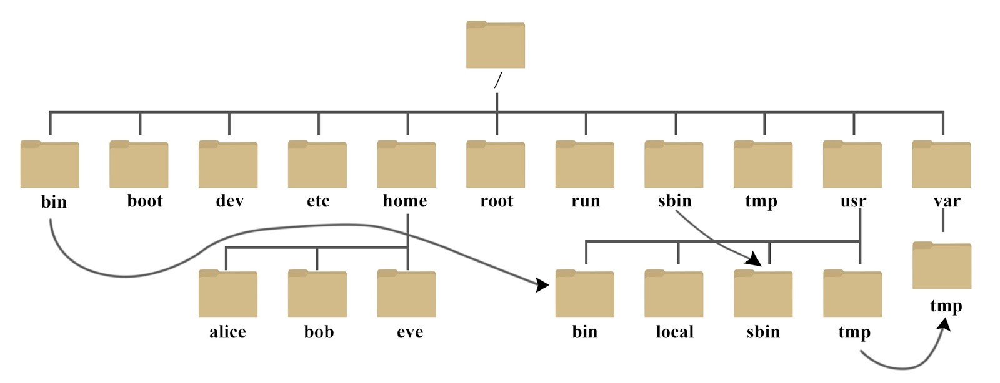
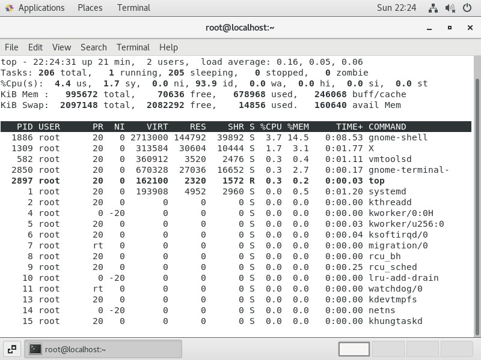

# Linux 简介

> **要点**: Linux 是一个开源的操作系统内核，具有开源、稳定、轻量和灵活的特点，被广泛应用于服务器、云计算和嵌入式系统。

### Linux 操作系统

操作系统是软件的一类，是用户和计算机硬件之间的桥梁。

Linux 由 **林纳斯 托瓦兹** 在大学期间创作，后来经过全世界网友支持，能够兼容多种硬件，成为最为流行的服务器操作系统之一。

Linux 系统由 `Linux系统内核` 和 `系统级应用程序` 两部分组成。由于 Linux 内核是免费开源的，因此任何人都可以获得并修改内核，封装发行 Linux。

提供了 **内核+系统级程序** 的完整封装的，称之为 Linux 发行版。
常用的 Linux 发行版 有

- `Ubuntu`：新手友好，界面美观易用，社区支持强大，预装软件丰富，定期更新，LTS 版适合企业。
- `CentOS`：基于 RHEL，稳定免费，兼容性好，安全维护周期长，适合企业级服务器。
- `Debian`：完全自由开源，稳定可靠，软件包管理便捷，支持多硬件架构，安全性高。
- `RedHat` ：企业级首选，高度稳定，提供专业支持，功能强大，满足企业安全与合规需求。

### Linux 的发展历史和意义

1991 年，芬兰赫尔辛基大学的学生林纳斯·托瓦兹（Linus Torvalds）编写了 Linux 内核的第一个版本，并在互联网上发布。它继承了 Unix 的设计哲学，但采用了开源模式。

Linux 的重要意义：

- **开源精神**：任何人都可以查看、修改和分发源代码
- **稳定性与安全性**：多用户设计和权限系统提供良好安全性
- **轻量与灵活**：可在各种硬件上运行，从超级计算机到嵌入式设备
- **社区支持**：全球开发者共同维护和改进

如今，Linux 已成为互联网基础设施的重要组成部分，大部分网站服务器、云计算平台和超级计算机都运行在 Linux 上。Android 操作系统也是基于 Linux 内核开发的。

# 命令行基础

命令行是与 Linux 系统交互的主要方式，也是 Linux 的灵魂所在。不同于 Windows 系统主要依赖图形界面，Linux 世界里命令行才是真正的主角。

### 什么是终端和 Shell


终端（Terminal）是一个**程序**，提供了命令行界面（CLI）让用户与计算机交互。而 Shell 是一个命令解释器，负责解释用户在终端中输入的命令并执行。

**Bash**（Bourne Again Shell）就是最常用的 Shell，大多数 Linux 发行版的默认 Shell。

为什么 Linux 用户偏爱命令行？

1. **效率高**：熟练后，命令行操作比图形界面快得多
2. **资源占用少**：不需要渲染图形界面，适合服务器环境
3. **自动化能力**：可以编写脚本自动执行重复任务
4. **远程管理便捷**：通过 SSH 连接即可完全控制远程服务器
5. **精确控制**：可以精确控制系统的各个方面

**如何打开终端**

- **图形界面中**：一般在应用菜单中找到"终端"或"控制台"
- **快捷键**：多数发行版支持 `Ctrl+Alt+T`
- **远程连接**：使用 SSH 客户端（如 FinalShell）连接到 Linux 服务器

### 命令行基本语法

Linux 命令基本结构为：

```
command [options] [arguments]
```

- **command**：要执行的命令名
- **options**：修改命令行为的选项，通常以 `-`（短选项）或 `--`（长选项）开头
- **arguments**：命令的参数，如文件名、路径等

例如：

```bash
ls -la /home
```

- `ls` 是命令（列出目录内容）
- `-la` 是选项（l 表示详细信息，a 表示显示所有文件）
- `/home` 是参数（要列出内容的目录）

### 基础命令入门

掌握几个基础命令是学习 Linux 的第一步。这些命令就像是我们在 Windows 中点击鼠标完成的操作，只是在 Linux 中通过输入文本来实现。以下是最常用的命令，刚开始可以集中精力掌握这些：

#### 查看当前位置

```bash
pwd
```

> 显示当前工作目录（Print Working Directory）

#### 列出文件和目录

```bash
ls            # 列出当前目录内容
ls -l         # 以详细列表形式显示
ls -a         # 显示隐藏文件(以.开头的文件)
ls /home      # 列出指定目录的内容
```

#### 切换目录

```bash
cd /home      # 切换到指定目录
cd ~          # 切换到当前用户的家目录
cd ..         # 切换到上一级目录
```

#### 创建和删除目录

```bash
mkdir 目录名     # 创建新目录
rmdir 目录名     # 删除空目录
```

#### 文件操作

```bash
touch 文件名                 # 创建空文件
cp 源文件 目标文件           # 复制文件
mv 源文件 目标文件           # 移动文件或重命名
rm 文件名                    # 删除文件
rm -r 目录名                 # 删除目录及其内容(谨慎使用!)
```

#### 查看文件内容

```bash
cat 文件名      # 显示整个文件内容
head 文件名     # 显示文件开头10行
tail 文件名     # 显示文件末尾10行
```

这些命令是 Linux 日常操作的基础，熟练掌握它们后，你就能在系统中自如导航并进行基本操作。更多高级命令可以在实际需要时再学习。记住：多练习是掌握命令行的关键。

### 获取帮助

不确定命令如何使用？Linux 提供了多种获取帮助的方式：

```bash
man command           # 查看命令的手册页
command --help        # 显示简短的帮助信息
info command          # 查看更详细的信息
```

例如 `man ls` 会显示 ls 命令的完整手册。

### 命令行小技巧

1. **Tab 补全**：输入命令或文件名的前几个字母后按 Tab 键自动补全
2. **历史命令**：使用 ↑↓ 箭头键浏览之前执行过的命令
3. **Ctrl+C**：中断当前运行的命令
4. **Ctrl+L** 或 `clear`：清屏
5. **通配符**：使用 `*`、`?` 等匹配多个文件，如 `ls *.txt`

### 重定向和管道

Linux 命令行强大的功能之一是能够通过重定向和管道组合命令。

1. **重定向**：改变输入输出的位置

   ```bash
   ls > filelist.txt   # 将输出保存到文件
   cat < input.txt     # 从文件读取输入
   ls >> filelist.txt  # 追加到文件末尾
   ```

2. **管道**：将一个命令的输出作为另一个命令的输入
   ```bash
   ls -la | grep "txt"  # 找出含 txt 的文件
   cat file.txt | sort  # 对文件内容排序
   ```

掌握命令行基础，是成为 Linux 高手的第一步。随着使用的深入，你会发现命令行的效率和灵活性远超图形界面，尤其是在服务器管理和自动化任务方面。

# 文件系统

Linux 的文件系统是其最基本也是最重要的概念之一。与 Windows 不同，Linux 遵循"一切皆文件"的哲学，这意味着设备、进程、网络套接字等在 Linux 中都以文件的形式呈现。

**"一切皆文件" 的概念**

在 Linux 中：

- 普通文件（如文本、图片）是文件
- 目录（文件夹）是文件
- 硬件设备（如硬盘、键盘）是文件
- 网络连接是文件
- 甚至进程也是以文件的形式呈现

这种统一的抽象使得我们可以用相同的命令和工具操作各种系统资源，是 Linux 强大且灵活的根源。

**文件系统的层次结构**

Linux 文件系统采用树形结构，从根目录（用 `/` 表示）开始，向下分支形成各个子目录。不同于 Windows 的盘符系统（C 盘、D 盘），Linux 中所有内容都从这个根开始，形成一个统一的树。



Linux 中的主要目录有特定的用途：

- **/** - 根目录：所有目录的起点
- **/home** - 用户目录：存放用户个人文件（类似于 Windows 的"我的文档"）
- **/root** - 超级用户目录：管理员(root)用户的主目录
- **/boot** - 启动目录：包含内核和启动加载程序
- **/etc** - 配置目录：系统和应用程序的配置文件
- **/bin** - 基本命令目录：基本系统命令
- **/usr** - 用户程序目录：大多数用户级程序和数据
- **/var** - 可变数据目录：日志文件、临时文件等动态变化的内容
- **/tmp** - 临时文件目录：临时文件存储

了解基本结构有助于导航和找到所需文件。

### 文件类型

Linux 中有几种主要的文件类型：

1. **普通文件 (-)**：包含数据、文本或程序代码
2. **目录 (d)**：存储其他文件的容器
3. **链接文件 (l)**：类似 Windows 的快捷方式
4. **块设备文件 (b)**：硬盘等存储设备
5. **字符设备文件 (c)**：键盘、鼠标等 IO 设备

可以使用 `ls -l` 命令查看文件类型，第一个字符表示文件类型。

### 文件权限

Linux 是多用户系统，文件权限机制确保了系统安全。每个文件都有三组权限：

- **所有者 (u)**：文件的创建者
- **用户组 (g)**：文件所属的用户组
- **其他人 (o)**：系统上的其他用户

每组都有三种权限：

- **读 (r)**：查看文件内容或列出目录中的文件
- **写 (w)**：修改文件或在目录中添加、删除文件
- **执行 (x)**：运行文件（如脚本或程序）或进入目录

使用 `ls -l` 命令时，权限显示如下：

```
-rwxr-xr--
```

这表示：

- 第一个字符：文件类型（-表示普通文件）
- 接下来三个字符 (rwx)：所有者权限
- 接下来三个字符 (r-x)：组权限
- 最后三个字符 (r--)：其他人权限

**修改文件权限**

使用 `chmod` 命令修改文件权限：

```bash
chmod 755 文件名    # 八进制表示法: 7=rwx, 5=r-x, 即所有者可读写执行，组和其他人可读执行
chmod u+x 文件名    # 符号表示法: 给所有者添加执行权限
```

**文件系统导航小技巧**

- **相对路径与绝对路径**

  - 绝对路径：从根目录开始，如 `/home/user/file.txt`
  - 相对路径：从当前位置开始，如 `../file.txt`（上级目录的文件）

- **特殊目录符号**
  - `.` - 当前目录
  - `..` - 上级目录
  - `~` - 当前用户的主目录

理解 Linux 文件系统是掌握这个操作系统的关键一步。虽然开始可能觉得结构复杂，但这种组织方式为系统带来了极大的灵活性和安全性。随着使用的深入，你会逐渐欣赏这种设计的优雅之处。

# 进程管理

在 Linux 中，每个程序运行时都会创建一个或多个进程。理解进程及其管理是有效使用 Linux 系统的重要部分，尤其是在服务器环境中。

**什么是进程**

进程是运行中程序的实例。当你运行一个程序（如浏览器或文本编辑器）时，系统会创建一个进程来执行这个程序。每个进程都有：

- 唯一的进程 ID（PID）
- 占用的系统资源（内存、CPU 时间）
- 运行状态
- 所有者（哪个用户启动了它）

Linux 作为多任务系统，可以同时运行数百个进程，由内核负责调度这些进程在 CPU 上的执行时间。

**查找特定进程**

要找到特定程序的进程：

```bash
pgrep 进程名        # 查找进程 ID
ps aux | grep 关键词 # 查找包含关键词的进程
```

### 查看进程

几个常用的命令可以帮助我们查看系统中运行的进程：

```bash
ps          # 显示当前终端的进程
ps aux      # 显示所有进程的详细信息
top         # 动态显示进程信息（实时更新）
```

`ps aux` 输出的各列含义：

- USER：进程所有者
- PID：进程 ID
- %CPU：CPU 占用率
- %MEM：内存占用率
- STAT：进程状态（R=运行，S=睡眠，T=停止，Z=僵尸）
- COMMAND：命令名称和参数

`top` 命令提供了系统资源使用的动态视图，按 `q` 键退出：



### 终止进程

当程序无响应或需要强制停止时，可以使用 `kill` 命令终止进程：

```bash
kill PID            # 向进程发送终止信号
kill -9 PID         # 强制终止进程（当普通终止无效时使用）
killall 进程名       # 终止所有同名进程
```

使用 `kill` 命令前，通常需要先用 `ps` 或 `top` 查找目标进程的 PID。

### 后台运行进程

如果要运行一个命令但不想占用当前终端，可以：

```bash
命令 &              # 在后台启动进程
ctrl+z             # 暂停当前前台进程
bg                 # 将刚才暂停的进程放到后台继续运行
fg                 # 将后台进程调到前台运行
jobs               # 查看当前终端的后台任务
```

这对长时间运行的命令特别有用，比如下载大文件或运行耗时的脚本。

### 进程优先级

Linux 允许调整进程优先级，决定 CPU 分配给不同进程的时间比例：

```bash
nice -n 10 命令     # 以较低优先级启动命令
```

普通用户只能提高 nice 值（降低优先级），只有 root 用户能降低 nice 值（提高优先级）。

### 系统服务管理

现代 Linux 系统（如 CentOS 7、Ubuntu）使用 systemd 管理系统服务：

```bash
systemctl status 服务名    # 查看服务状态
systemctl start 服务名     # 启动服务
systemctl restart 服务名   # 重启服务
systemctl enable 服务名    # 设置开机自启动
```

了解进程管理命令能帮助你掌控系统运行状态，诊断性能问题，在程序失去响应时进行处理。作为 Linux 用户，这些工具是你日常工作的得力助手。

# 网络配置与管理

网络是 Linux 系统最强大的功能领域之一，众多网站服务器和云服务都运行在 Linux 上。掌握基本的网络配置和管理命令，是使用 Linux 的必备技能。

**查看网络配置**

首先，我们需要了解如何查看当前系统的网络配置：

```bash
ifconfig          # 显示所有网络接口信息（可能需要安装net-tools包）
ip addr           # 现代Linux系统推荐使用的命令，显示IP地址
ip link           # 显示网络接口状态
```

网络接口一般命名为：

- `eth0`, `eth1` - 以太网接口
- `wlan0` - 无线网络接口
- `lo` - 本地回环接口（localhost）

**基本网络测试**

这些命令可以帮助诊断网络问题：

```bash
ping 目标地址        # 测试与目标主机的连通性
traceroute 目标地址  # 显示数据包到目标地址的路由路径
nslookup 域名        # 查询域名对应的IP（需要安装）
```

例如，测试到百度服务器的连接：

```bash
ping www.baidu.com
```

**配置网络接口**

在 Linux 中配置网络有几种方式，根据发行版不同略有差异：

**临时配置 IP 地址**：

```bash
sudo ip addr add 192.168.1.100/24 dev eth0  # 添加IP地址
sudo ip link set eth0 up                    # 启用网卡
```

**查看和修改 DNS 配置**：

```bash
cat /etc/resolv.conf         # 查看DNS配置
```

**网络管理工具**

现代 Linux 系统常用的网络管理工具：

1. **NetworkManager** - 图形和命令行网络管理工具：
   ```bash
   nmcli con show            # 显示所有连接
   nmcli device status       # 显示网络设备状态
   ```

**防火墙配置**

防火墙是保护服务器安全的重要工具，现代 Linux 主要使用以下两种防火墙：

**iptables** (传统):

```bash
sudo iptables -L             # 列出防火墙规则
```

**firewalld** (CentOS 7+, RHEL 7+):

```bash
sudo firewall-cmd --state                      # 查看防火墙状态
sudo firewall-cmd --zone=public --add-port=80/tcp --permanent  # 开放80端口
sudo firewall-cmd --reload                     # 重载配置
```

**远程连接**

SSH（Secure Shell）是最常用的 Linux 远程连接工具：

```bash
ssh 用户名@服务器地址         # 连接到远程服务器
ssh-keygen                   # 生成SSH密钥对
```

**SCP 命令** - 安全复制文件：

```bash
scp 本地文件 用户名@服务器地址:远程路径  # 上传文件
scp 用户名@服务器地址:远程文件 本地路径  # 下载文件
```

**网络故障排查**

当遇到网络问题时，可以使用以下方法排查：

1. **检查物理连接和网络接口状态**：

   ```bash
   ip link
   ```

2. **检查 IP 配置**：

   ```bash
   ip addr
   ```

3. **检查 DNS 解析**：
   ```bash
   ping www.baidu.com  # 如果域名能解析但ping不通，说明DNS正常
   ```

掌握了这些基本的网络配置和管理命令，你就能够设置 Linux 系统的网络连接，进行基本的排障，以及配置简单的网络服务。

---

# 软件包管理

在 Linux 上安装、更新和管理软件，我们不像 Windows 那样到处下载安装包，而是使用专门的软件包管理器。不同的 Linux 发行版有不同的包管理系统，但它们的基本概念是相似的。

### RPM 和 YUM（CentOS/RHEL）

CentOS 和 RedHat 企业版使用的是 RPM 包管理系统，YUM 是其前端工具，让安装更简单。

**常用命令**：

```bash
yum install 软件名                # 安装软件包
yum remove 软件名                 # 删除已安装的软件
yum search 关键词                 # 搜索相关软件
yum update                      # 更新所有软件包
```

### APT（Debian/Ubuntu）

Debian 和 Ubuntu 系统使用 APT 包管理工具，非常易用且强大。

**常用命令**：

```bash
apt update                      # 更新软件包索引
apt install 软件名               # 安装软件
apt remove 软件名                # 删除软件但保留配置
apt search 关键词                # 搜索软件包
apt upgrade                     # 升级所有可更新的包
```

### 常见软件安装示例

无论是什么发行版，以下是一些常见的软件安装命令：

**Web 服务器**：

```bash
# CentOS
yum install httpd

# Ubuntu
apt install apache2
```

**数据库**：

```bash
# CentOS
yum install mariadb-server

# Ubuntu
apt install mysql-server
```

### 管理启动服务

安装好软件后，通常需要设置它是否开机启动：

```bash
# 设置服务开机启动
systemctl enable 服务名

# 禁止服务开机启动
systemctl disable 服务名
```

了解这些基本的软件包管理命令，你就可以轻松地在 Linux 系统上安装和管理各种软件了。软件包管理器的一大优势是它们会自动处理依赖关系，让软件安装过程变得简单可靠。

# Shell 脚本入门

Shell 脚本就像是批处理命令的集合，可以让你自动化执行一系列任务。掌握基本的 Shell 脚本编写，能极大提高工作效率。

**什么是 Shell 脚本**

简单来说，Shell 脚本就是把你平时在命令行中输入的一串命令保存到文件中，这样就可以一键执行了。脚本还可以添加逻辑判断、循环和变量，使其更加强大。

### 创建第一个脚本

让我们创建一个简单的 "Hello World" 脚本：

1. 创建脚本文件：

   ```bash
   touch hello.sh
   ```

2. 编辑文件：

   ```bash
   vim hello.sh
   ```

3. 添加以下内容：

   ```bash
   #!/bin/bash
   # 这是我的第一个shell脚本
   echo "Hello, World!"
   ```

   第一行 `#!/bin/bash` 告诉系统这个脚本应该使用 bash 解释器执行

4. 添加执行权限：

   ```bash
   chmod +x hello.sh
   ```

5. 运行脚本：
   ```bash
   ./hello.sh
   ```

### 基础语法

#### 变量使用

在 Shell 脚本中，变量使用非常简单：

```bash
#!/bin/bash

# 定义变量（等号两边不能有空格）
name="张三"
age=25

# 使用变量（前面加$符号）
echo "我的名字是 $name，今年 $age 岁了。"

# 命令结果赋值给变量
current_dir=$(pwd)
echo "当前目录是：$current_dir"
```

#### 接收用户输入

脚本可以接收用户输入，使其更加灵活：

```bash
#!/bin/bash

echo "请输入你的名字："
read username

echo "你好，$username！欢迎学习Linux！"
```

#### 条件判断

使用 if 语句可以进行条件判断：

```bash
#!/bin/bash

echo "请输入一个数字："
read num

if [ $num -gt 10 ]; then
    echo "你输入的数字大于10"
elif [ $num -eq 10 ]; then
    echo "你输入的数字等于10"
else
    echo "你输入的数字小于10"
fi
```

比较运算符：

- `-eq`：等于
- `-ne`：不等于
- `-gt`：大于
- `-lt`：小于

#### 循环结构

Shell 脚本支持 for 和 while 循环：

**for 循环**：

```bash
#!/bin/bash

# 列出1到5
for i in 1 2 3 4 5
do
    echo "数字：$i"
done
```

**while 循环**：

```bash
#!/bin/bash

count=1

while [ $count -le 5 ]
do
    echo "计数：$count"
    count=$((count + 1))
done
```

### 实用脚本示例

下面是一个实用的备份脚本示例：

```bash
#!/bin/bash

# 简单的备份脚本
backup_dir="/backup"
source_dir="/home/user/documents"
date_format=$(date +%Y%m%d)
archive_name="backup_$date_format.tar.gz"

# 创建备份
echo "开始备份..."
tar -czf "$backup_dir/$archive_name" "$source_dir"

# 检查是否成功
if [ $? -eq 0 ]; then
    echo "备份成功！文件保存为 $backup_dir/$archive_name"
else
    echo "备份失败！"
fi
```

Shell 脚本是 Linux 系统强大的自动化工具，掌握基本的脚本编写，可以帮你节省大量重复工作。随着经验积累，你可以编写更复杂的脚本来满足特定需求。
