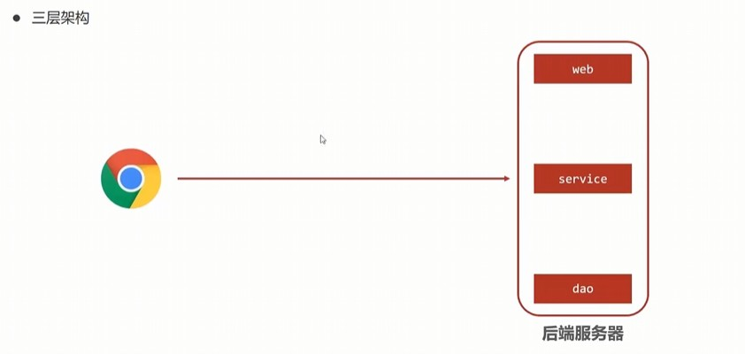
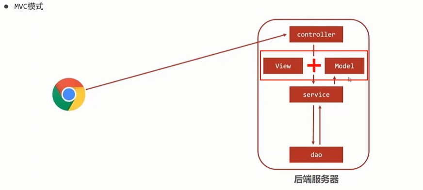
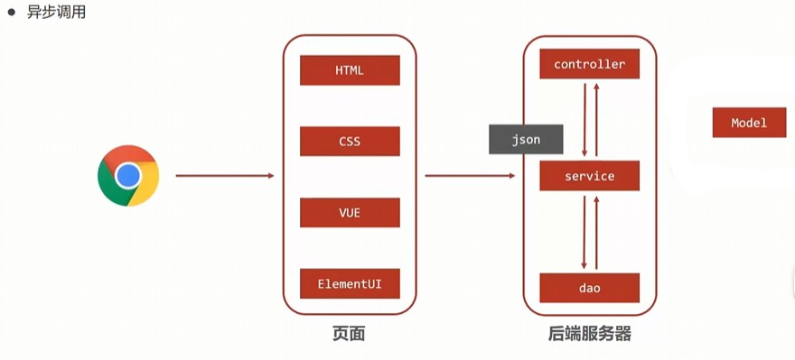
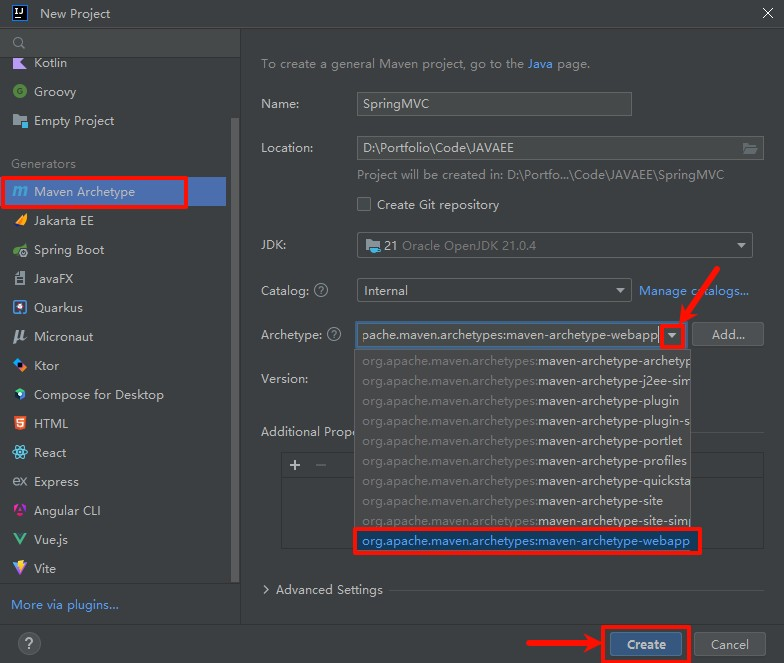
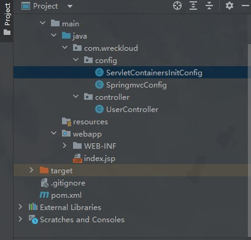
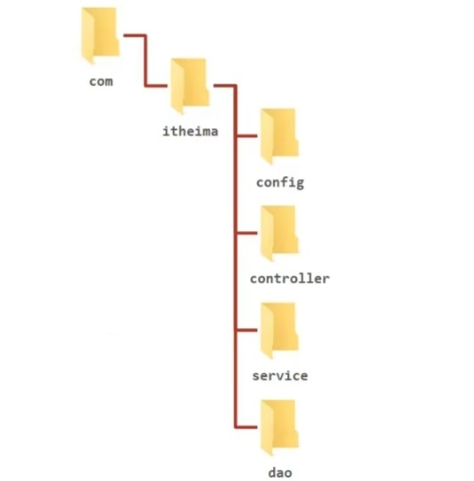

# SpringMVC简介

[spring官网](https://spring.io)

SpringMVC 是 Spring 框架的一部分, 是一种基于 Java 实现的 MVC 轻量级Web框架, 可以用于Web开发.  
相比于 Servlet , 使用更加简单便捷.

当浏览器发出一个请求给后端服务器以后, servlet 容器就会收到请求.  
但 servlet 并不能进行真正的数据处理, 它主要负责接收请求, 调用业务逻辑层进行数据处理, 并将处理结果组织成页面, 返回给客户端.  

这种架构称为 **"三层架构"**.  

* **表现层(web):**     负责页面数据收集和产生页面.
* **业务层(service):**   进行业务逻辑处理.
* **持久层(dao):**     进行数据持久化, 比如说数据的库操作.



但是, 一个 servlet 只能处理一个请求, 这就轮到新技术 SpringMVC 出场了.  

SpringMVC 将 servlet 细分成三块.  
当浏览器发出一个请求后, **控制器(controller)** 会接受到请求, 并调用**业务层(service)** 进行业务处理.  
**业务层**会调用**持久层(dao)** 进行数据处理, 并将处理结果组织成 **数据模型(model/Java对象)**, 并与 **视图层(view)** 共同作用, 产生页面.  



这种基于控制器的模式下, 一个 servlet 就能做请求的分发了, 从而实现了请求的并发处理.  

顺便提一句, 老一代的技术中, view 一般是 `.jsp`.  
而目前流行的技术中, view 采用 **异步调用**(HTML+CSS+VUE+ElementUI)的形式.  



要注意的是, 返回的 model/Java对象 无法直接在 view 中使用, 不过将其转换为 JSON 格式后, 再由前端把数据从 JSON 中抽取出来 就可以组织成页面, 反馈给浏览器了.  

在这个过程中, SpringMVC 就主要做以下两件事:

1. 把 model/Java对象 转换为 view 所需的 JSON 格式.
2. 负责 controller 对应的开发.

# SpringMVC 入门案例

### 案例实现

需求: 实现一个简单的 SpringMVC 项目, 实现一个简单的 Hello World 页面.

#### 创建 Maven 项目

新建项目, 选择 Maven Archetype 类型, 并选择 webapp 模板.



进入项目后, 需等待 Maven 下载依赖包.  
如果项目目录久久没有变化, 可以检查一下 Maven 的配置是否正确.  

#### 1. 引入 SpringMVC 依赖

对于 项目的 `pom.xml` 文件, 配置如下:

```xml
<project xmlns="http://maven.apache.org/POM/4.0.0" xmlns:xsi="http://www.w3.org/2001/XMLSchema-instance"
  xsi:schemaLocation="http://maven.apache.org/POM/4.0.0 http://maven.apache.org/maven-v4_0_0.xsd">
  <modelVersion>4.0.0</modelVersion>
  <groupId>org.wreckloud</groupId>
  <artifactId>SpringMVC</artifactId>
  <packaging>war</packaging>
  <version>1.0-SNAPSHOT</version>
  <name>SpringMVC Maven Webapp</name>
  <url>http://maven.apache.org</url>
  <dependencies>
    <!--  servlet 依赖  -->
    <dependency>
      <groupId>jakarta.servlet</groupId>
      <artifactId>jakarta.servlet-api</artifactId>
      <version>5.0.0</version> <!-- 确保版本与你的Tomcat版本相匹配 -->
      <scope>provided</scope>
    </dependency>

    <!--  SpringMVC 依赖  -->
    <dependency>
      <groupId>org.springframework</groupId>
      <artifactId>spring-webmvc</artifactId>
      <version>6.1.13</version>
    </dependency>

    <dependency>
      <groupId>junit</groupId>
      <artifactId>junit</artifactId>
      <version>3.8.1</version>
      <scope>test</scope>
    </dependency>
  </dependencies>
  <build>
    <finalName>SpringMVC</finalName>
    <plugins>
      <!--   配置tomcat插件   -->
      <plugin>
        <groupId>org.apache.tomcat.maven</groupId>
        <artifactId>tomcat7-maven-plugin</artifactId>
        <version>2.2</version>
        <configuration>
          <port>80</port>
          <path>/</path>
        </configuration>
      </plugin>
    </plugins>
  </build>
</project>

```

> 注意: 确保版本与你的Tomcat版本相匹配.

接下来补全必要的包和类, 如图, 补全后项目目录如下:



接下来详细说明这些包和类:

#### 2. 创建 SpringMVC 配置文件

在 controller 包下, 新建编写一个简单的 controller 控制器, 用于处理请求.

```java
import org.springframework.stereotype.Controller;
import org.springframework.web.bind.annotation.RequestMapping;
import org.springframework.web.bind.annotation.ResponseBody;

@Controller  // 专门用作表现层的注解
public class UserController {

    @RequestMapping("/save")  // 关联了下面的方法. 当执行 "/save" 路径时, 拦截到下面的方法中.
    @ResponseBody // 告诉 SpringMVC 此方法不是页面, 作为响应体返回
    public String save(){
        return "{'info':'Hello World!'}";
    }
}
```

#### 3. 初始化 SpringMVC 环境

在 config 包下, 新建一个配置类, 用于初始化 SpringMVC 环境.

```java
import org.springframework.context.annotation.ComponentScan;
import org.springframework.context.annotation.Configuration;

@Configuration // 代替传统的 xml 配置文件, 告诉Spring这是一个配置类
@ComponentScan("com.wreckloud.controller") // 扫描, 加载对应的 bean(注解为 @Controller), 使其能够加载控制器
public class SpringmvcConfig {
}
```

#### 4. 初始化容器配置类

`AbstractDispatcherServletInitializer` 类是 SpringMVC 提供的快速初始化 web 3.0 容器的抽象类.  

它提供三个接口方法供用户实现:

* `createServletApplicationContext()`: 创建 Servlet 容器时, 加载 SpringMVC 对应的bean, 并放入 `WebApplicationContext` 对象范围中.
* `getServletMappings()`: 配置由 tomcat 处理还是 springmvc 处理.
* `createRootApplicationContext()`: 创建 `WebApplicationContext` 对象, 用于加载 Spring 配置文件.

```java
import org.springframework.web.context.WebApplicationContext;
import org.springframework.web.context.support.AnnotationConfigWebApplicationContext;
import org.springframework.web.servlet.support.AbstractDispatcherServletInitializer;

public class ServletContainersInitConfig extends AbstractDispatcherServletInitializer {
    @Override
    protected WebApplicationContext createServletApplicationContext() {
        AnnotationConfigWebApplicationContext context = new AnnotationConfigWebApplicationContext();  // 初始化容器对象
        context.register(SpringmvcConfig.class);  // 注册容器配置类, 加载具体配置
        return context;
    } // 一旦 Tomcat 启动, 就会加载对应的容器对象.

    @Override
    protected String[] getServletMappings() {  // 配置由 tomcat 处理还是 springmvc 处理
        return new String[]{"/"}; // 设置为 "/" 表示拦截所有请求, 都由 SpringMVC 来处理
    }

    @Override
    protected WebApplicationContext createRootApplicationContext() { // 加载springMVC之外的其他bean配置对应的容器对象
        return null; // 这个案例中不需要加载其他bean配置, 所以返回null.
    }
}
```

#### 5. 启动, 访问页面

启动项目, 访问 `http://localhost:8080/save`, 即可看到 "Hello World" 页面.

### 案例分析

Controller 加载控制与业务 bean 加载控制



* SpringMvc相关bean（表现层bean）
* Spring控制的bean
   * 业务bean (Service)
   * 功能bean（DataSource等）

为了避免加载到错误的 bean, 我们需要对 bean 的加载进行控制.

#### 方式一：设定排除范围

在 config 包下, 修改 SpringMVC 的配置类:

```java
@Configuration
@ComponentScan(value = "com.wreckloud", // 扫描全部的包
    excludeFilters = @ComponentScan.Filter( // 按注解过滤
            type = FilterType.ANNOTATION,
            classes = { Controller.class } //排除注解为Controller的bean
    )
) 
public class SpringmvcConfig {
}
```

`@ComponentScan` 有以下两个属性:

* `excludeFilters`: 排除指定注解的bean.
* `includeFilters`: 包含指定注解的bean.

#### 方式二：设定精准的扫描范围

在 config 包下, 修改 SpringMVC 的配置类:

```java
@Configuration
@ComponentScan({"com.wreckloud.service","com.wreckloud.dao"}) // 可以通过大括号和逗号分隔多个包名, 精准的扫描范围.
public class SpringmvcConfig {
}
```

### 简化开发

容器配置类可以用以下更简洁的写法:

```java
public class ServletContainersInitConfig extends public class ServletContainersInitConfig extends AbstractAnnotationConfigDispatcherServletInitializer{
    protected Class<?>[] getServletconfigClasses(){
        return new Class[]{SpringmvcConfig.class};
    }
    protected String[]getServletMappings(){
        return new String[]{"/"};
    }
    protected Class<?>[] getRootConfigClasses(){
        return new Class[]{Springconfig.class};
    }
```

