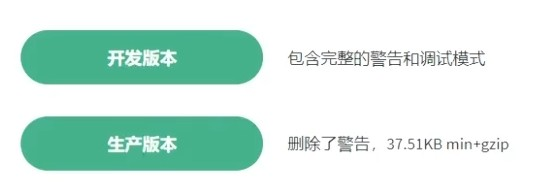
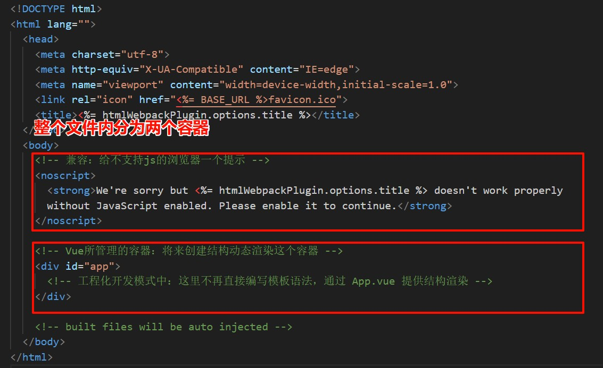
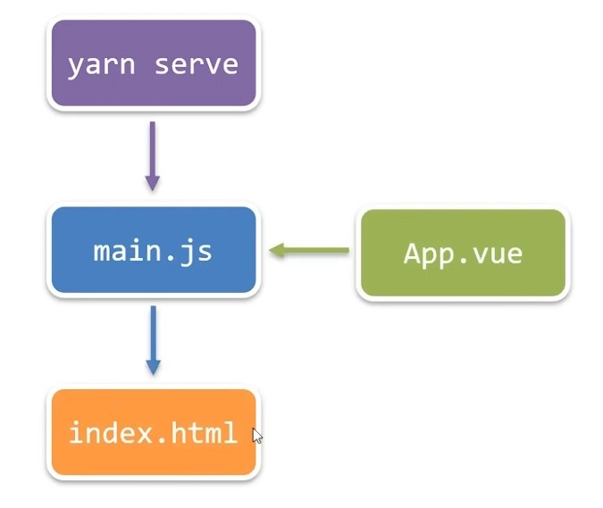
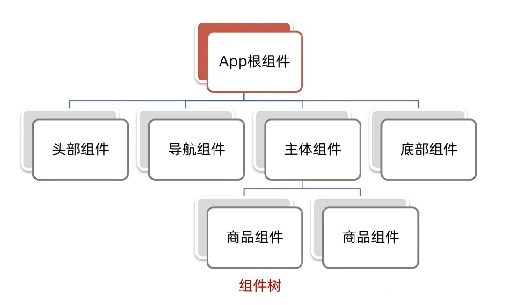
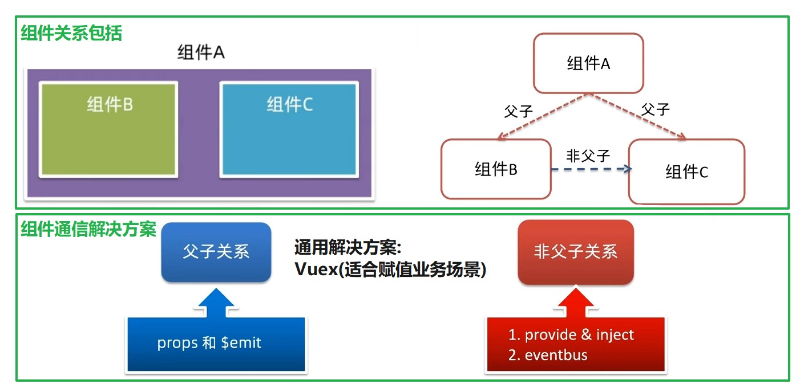
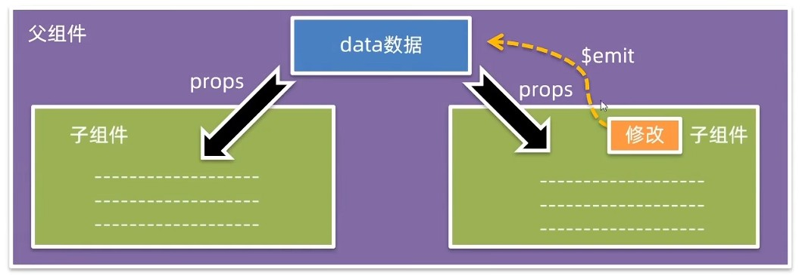
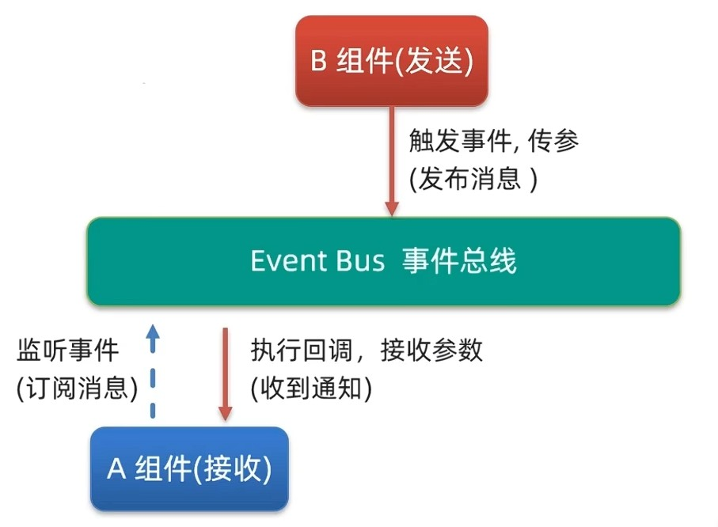
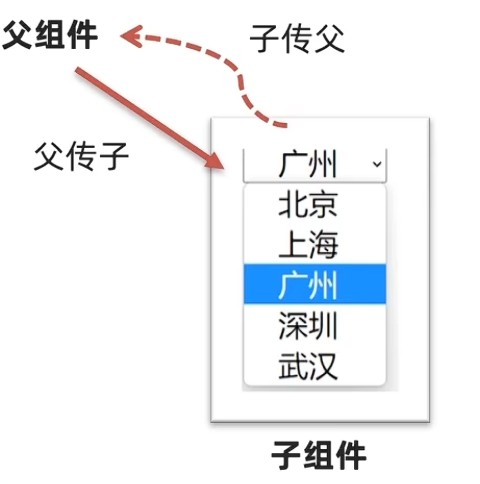

# Vue 核心概念

**什么是 Vue？**

Vue 是一款用于**构建用户界面**的**渐进式** JavaScript **框架**。
官方网站：[VUE3](https://cn.vuejs.org) [VUE2](https://v2.cn.vuejs.org/)

- **构建用户界面**：基于数据渲染出用户看到的界面
- **渐进式**：可以根据需求逐步集成，无需一次性掌握所有功能
- **框架**：提供完整的项目解决方案，包含核心功能、路由、状态管理等

只需具备基础的 HTML 和 JavaScript 知识即可快速上手 Vue！

**Vue 的核心特性**

Vue 的主要工作是：

1. 声明式渲染：自动更新画面，你改变数据，画面自动跟着变化
2. 响应式系统：表单输入和数据的双向绑定，用户输入会自动更新数据，数据变化也会自动更新输入框。
3. 组件化开发：就像搭积木一样！每个功能都是一块积木，可以随意组合。

# 快速上手 Vue

## 创建第一个 Vue 应用

1. 准备一个 HTML 容器

```HTML
<div id="app">
  <!-- Vue 将在这里控制这个元素 -->
</div>
```

2. 引包



包分为 开发版本/生产版本 ，区别如图所示。

开发版本：

```HTMl
<script src="https://cdn.jsdelivr.net/npm/vue@2.7.16/dist/vue.js"></script>
```

生产版本：

```HTMl
<script src="https://cdn.jsdelivr.net/npm/vue@2.7.16"></script>
```

```HTML
<!-- 引入开发版本包 -包含完整的注释和警告 -->
<script src="https://cdn.jsdelivr.net/npm/vue@2.7.16/dist/vue.js"></script>
```

3. 创建 VUE 实例

```HTML
<!-- 然后就可以直接使用Vue变量了 -->
<script>
  // 这里的Vue就是刚才引入的"工具"
  const app = new Vue({
    // 通过 el 配置选择器, 指定 VUE 管理的容器
    el: '#app',
    // 通过 data 提供数据
    data: {
	    msg: 'Hello wolf!'
    }

  })
</script>
```

4. 渲染数据

```HTML
<div id="app">
  {{ msg }}
</div>
```

`{{ msg }}` 是**插值表达式**，会被替换为 `data` 中对应属性的值。
当数据变化时，网页会自动更新。

插值表达式里最好只放简单的表达式，不要放太复杂的逻辑。

使用插值表达式时，要注意：

1. 使用的数据要存在于 data 中
2. 支持的是表达式，禁止使用 JS 的关键字
3. 不能再标签熟悉里使用


**插值表达式 `{{ }}`**

`{{ 表达式 }}` 是 Vue 的数据展示窗口，将 data 中的数据直接呈现在 HTML 中。数据变化时，界面自动刷新。

**三个使用规则：**

- 仅展示 data 中存在的数据
- 只能写简单表达式，不能使用 JS 关键字(如 if、for 等)
- 只能用在标签内容中，不能用在属性上(属性用 v-bind/`:`)

```html
<!-- 正确示例 -->
<p>{{ message }}</p>
<p>{{ price * 0.8 }}</p>
```

## 完整入门示例

```HTML
<body>
  <div id="app">
    {{ msg }}
  </div>

  <script src="https://cdn.jsdelivr.net/npm/vue@2.7.16/dist/vue.js"></script>
  <script>
    const app = new Vue({
      el: '#app',
      data: {
        msg: 'Hello wolf!'
      }
    })

  </script>
</body>
```

# Vue 核心指令

指令是 Vue 中带有 `v-` 前缀的特殊属性，能让普通 HTML 元素获得动态能力。每个指令都有特定用途，使界面更加智能和动态。

```html
<p v-指令名="表达式">内容</p>
```

**核心指令一览：**

| 指令            | 作用         | 通俗解释                 |
| --------------- | ------------ | ------------------------ |
| `v-bind`(:)     | 动态属性绑定 | 让标签属性与数据"牵手"   |
| `v-on`(@)       | 事件监听     | 让元素能"听懂"点击等动作 |
| `v-model`       | 双向数据绑定 | 输入框与数据"心灵相通"   |
| `v-if`/`v-else` | 条件渲染     | 元素的"隐身术"(完全移除) |
| `v-for`         | 列表渲染     | 数据批量"克隆"元素       |
| `v-show`        | 显示/隐藏    | 元素的"隐形斗篷"(仅隐藏) |
| `v-text`        | 文本渲染     | 安全地设置文本内容       |
| `v-html`        | HTML 渲染    | 设置 HTML 内容(慎用)     |

## v-bind

`v-bind` 实现 HTML 属性与数据的动态绑定，使属性值可以随数据变化。

```html
<!-- 完整写法 -->


<!-- 简写形式（常用） -->

```

**使用场景：**

```html
<div id="app">
  <!-- 动态图片链接 -->
  

  <!-- 动态样式绑定 -->
  <div :class="{'active': isActive, 'danger': hasError}">
    智能样式切换
  </div>

  <!-- 动态禁用按钮 -->
  <button :disabled="isLoading">
    {{ isLoading ? '加载中...' : '提交' }}
  </button>
</div>
```

**class 与 style 的特殊增强：**

```html
<!-- 对象写法（条件添加类） -->
<div :class="{ active: isActive, 'text-danger': hasError }"></div>

<!-- 数组写法（应用多个类） -->
<div :class="[baseClass, isActive ? 'active' : '']"></div>

<!-- 内联样式对象写法 -->
<div :style="{ color: textColor, fontSize: fontSize + 'px' }"></div>
```

## v-on

`v-on` 用于监听 DOM 事件，实现页面与用户的交互。

```html
<!-- 完整写法 -->
<button v-on:click="count++">点我+1</button>

<!-- 简写形式（推荐） -->
<button @click="count++">点我+1</button>
```

**灵活的使用方式：**

```html
<div id="app">
  <!-- 直接写表达式 -->
  <button @click="count++">简单+1</button>

  <!-- 调用方法 -->
  <button @click="increment">方法+1</button>

  <!-- 传递参数 -->
  <button @click="addCount(10)">+10</button>

  <!-- 访问原生事件对象 -->
  <input @input="updateValue($event)">
</div>
```

**事件修饰符：**

```html
<!-- 阻止事件传播 -->
<button @click.stop="doThis">阻止冒泡</button>

<!-- 阻止默认行为 -->
<form @submit.prevent="onSubmit">不会刷新页面</form>

<!-- 按键修饰符 -->
<input @keyup.enter="submit">回车键提交</input>
```

## v-model

`v-model` 在表单元素上创建双向数据绑定：用户输入自动更新数据，数据变化自动更新表单。

```html
<输入元素 v-model="数据属性"></输入元素>
```

**适用于各种表单元素：**

```html
<div id="app">
  <!-- 文本输入框 -->
  <input v-model="username" placeholder="请输入用户名">
  <p>你好, {{ username || '访客' }}</p>

  <!-- 多行文本 -->
  <textarea v-model="message" placeholder="留言"></textarea>

  <!-- 复选框 -->
  <input type="checkbox" id="agree" v-model="isAgreed">
  <label for="agree">同意用户协议</label>

  <!-- 单选按钮 -->
  <input type="radio" id="male" value="male" v-model="gender">
  <label for="male">男</label>
  <input type="radio" id="female" value="female" v-model="gender">
  <label for="female">女</label>

  <!-- 下拉选择框 -->
  <select v-model="selected">
    <option value="">请选择城市</option>
    <option value="beijing">北京</option>
    <option value="shanghai">上海</option>
    <option value="hangzhou">杭州</option>
  </select>
</div>
```

**实用修饰符：**

```html
<!-- 自动去除首尾空格 -->
<input v-model.trim="username">

<!-- 自动转换为数字类型 -->
<input v-model.number="age" type="number">

<!-- 延迟同步，失去焦点时才更新 -->
<input v-model.lazy="message">
```

## v-for

`v-for` 基于数组或对象高效渲染列表，是批量生成内容的最佳选择。

```html
<!-- 遍历数组 -->
<li v-for="item in items" :key="item.id">
  {{ item.name }}
</li>

<!-- 带索引的数组遍历 -->
<li v-for="(item, index) in items" :key="item.id">
  {{ index + 1 }}. {{ item.name }}
</li>
```

**关键点：始终添加`:key`属性**

`:key`属性帮助 Vue 识别每个元素，提高更新效率。应使用唯一标识(如 id)作为 key 值。

```html
<div id="app">
  <!-- 商品列表示例 -->
  <div class="product-list">
    <div v-for="product in products" :key="product.id" class="product-card">
      
      <h3>{{ product.name }}</h3>
      <p>￥{{ product.price }}</p>
      <button @click="addToCart(product)">加入购物车</button>
    </div>
  </div>

  <!-- 也可以遍历对象 -->
  <ul class="user-info">
    <li v-for="(value, key) in userInfo" :key="key">
      {{ key }}: {{ value }}
    </li>
  </ul>
</div>
```

## v-if vs v-show

两个指令都能控制元素显示或隐藏，但工作方式不同：

| v-if                            | v-show                                  |
| ------------------------------- | --------------------------------------- |
| 真正的条件渲染（添加/移除 DOM） | 基于 CSS 显示/隐藏（改变 display 属性） |
| 切换开销大，适合不频繁变化      | 初始开销大，适合频繁切换                |
| 条件为假时，不渲染事件监听器    | 元素始终存在于 DOM 中                   |

```html
<div id="app">
  <!-- v-if 完全移除/创建元素 -->
  <div v-if="type === 'A'">方案A（不存在于DOM）</div>
  <div v-else-if="type === 'B'">方案B（条件成立才存在）</div>
  <div v-else>默认方案</div>

  <!-- v-show 只是隐藏元素 -->
  <div v-show="isVisible">
    我只是隐身了，其实还在DOM中
  </div>

  <button @click="toggleVisible">切换显示</button>
</div>
```

**选择指南：**

- 频繁切换用`v-show`（如标签页、弹窗）
- 条件很少改变用`v-if`（如权限控制、环境判断）

# 指令的修饰符

指令修饰符是通过点号(`.`)附加在指令后的特殊后缀，用于精确控制指令的行为。修饰符可以链式使用。

```html
<元素 v-指令.修饰符="表达式"></元素>
```

## 事件修饰符

用于 `v-on` 指令（简写为 `@`），简化事件处理逻辑：

```html
<!-- 阻止事件传播 -->
<button @click.stop="doThis">阻止冒泡</button>

<!-- 阻止默认行为 -->
<form @submit.prevent="onSubmit">不刷新页面提交</form>

<!-- 组合使用修饰符 -->
<a @click.stop.prevent="doThat">停止传播且阻止默认行为</a>

<!-- 只在元素自身触发时调用 -->
<div @click.self="doThat">仅当点击div本身</div>

<!-- 只触发一次 -->
<button @click.once="doThis">只响应第一次点击</button>
```

## 按键修饰符

用于键盘事件，指定特定按键触发：

```html
<!-- 按回车键时提交 -->
<input @keyup.enter="submit">

<!-- 常用按键修饰符 -->
<input @keyup.esc="cancel">
<input @keyup.tab="handleTab">
<input @keyup.delete="handleDelete">
<input @keyup.space="handleSpace">
<input @keyup.up="handleUp">
<input @keyup.down="handleDown">

<!-- 组合按键 -->
<input @keyup.alt.enter="clear">
```

## 表单修饰符

针对 `v-model` 指令，用于自动处理输入数据：

```html
<!-- 自动去除首尾空格 -->
<input v-model.trim="username">

<!-- 自动转换为数字类型 -->
<input v-model.number="age" type="number">

<!-- 在变更完成时而非输入时更新数据 -->
<input v-model.lazy="message">
```

修饰符极大地简化了常见操作的处理代码，让开发更加高效流畅。需要注意的是，修饰符的使用顺序会影响执行效果，应根据需求合理组合。

# 计算属性与侦听器

## `computed` 计算属性

计算属性是基于依赖自动计算并缓存的值，当依赖变化时自动更新。

```javascript
export default {
  data() {
    return {
      price: 100,
      quantity: 2
    }
  },
  computed: {
    // 计算总价
    totalPrice() {
      return this.price * this.quantity
    },

    // 计算是否有优惠
    hasDiscount() {
      return this.totalPrice > 100
    }
  }
}
```

**使用方式：**

```html
<div>
  <p>单价: ¥{{ price }}</p>
  <p>数量: {{ quantity }}</p>
  <p>总价: ¥{{ totalPrice }}</p>
  <p v-if="hasDiscount">恭喜获得优惠!</p>
</div>
```

**为什么使用计算属性：**

1. **缓存机制**：依赖不变时直接返回缓存结果，不重复计算
2. **代码清晰**：逻辑集中在一处，便于维护
3. **自动响应**：依赖变化时自动更新

## `watch` 侦听器

侦听器用于监视数据变化，执行一些业务逻辑或异步操作

简单写法 : 简单类型数据，直接监视

```javascript
export default {
  data() {
      question: '',
      obj: {
	    words: ''
      }
  },
  watch: {
    // question变化时会调用执行
    question(newQuestion, oldQuestion) {
		console.log('变化了',newQuestion)
    }
    // 调用对象里的值写法
    'obj.words'(newValue){
		console.log('变化了',newValue)
    }
  },
  }
}
```

**高级侦听选项：**

完整写法 : 添加额外配置项

deep: true 对复杂类型深度监视
immediate: true 初始化立刻执行一次 handler 方法

```javascript
watch: {
  // 监听对象的深层变化
  obj: {
    deep: true,          // 深度监听
    immediate: true,      // 立即执行一次
    handler(newValue) {
      console.log('用户资料变化了', newValue)
    },

  }
}
```

# Vue 生命周期

什么时候可以发送初始化渲染请求？（越早越好）什么时候可以开始操作 dom？（至少 dom 得渲染出来）
一些特定的代码是需要在特定的阶段执行的，此时就需要利用生命周期
每个 Vue 组件从创建到销毁都经历一系列阶段，我们可以在特定阶段执行代码：

```
创建阶段 → 挂载阶段 → 更新阶段 → 销毁阶段
```


Vue 生命周期过程中，会自动运行一些函数，被称为【生命周期钩子】→ 让开发者可以在【特定阶段】运行自己的代码。


**主要生命周期钩子**

| 钩子函数  | 触发时机                  | 最佳用途                  |
| --------- | ------------------------- | ------------------------- |
| created   | 实例创建完成，可访问数据  | 初始化数据、发起 API 请求 |
| mounted   | DOM 渲染完成              | 操作 DOM、初始化第三方库  |
| updated   | 数据变化导致 DOM 更新完成 | 访问更新后的 DOM 状态     |
| unmounted | 组件销毁完成              | 清理资源、移除事件监听    |

```javascript
    const app = new Vue({
      el: '#app',
      data: {
        count: 100,
        title: '计数器'
      },
      // 生命周期函数在此定义
    })
```

### `created`创建阶段（准备数据）

```javascript
beforeCreate () {
        console.log('beforeCreate 响应式数据准备好之前', this.count)
      },
created () {
        console.log('created 响应式数据准备好之后', this.count)
        // this.数据名 = 请求回来的数据
        // 可以开始发送初始化渲染的请求了
      },
```

### 挂载阶段（渲染模板）

```javascript
beforeMount () {
        console.log('beforeMount 模板渲染之前', document.querySelector('h3').innerHTML)
      },
      mounted () {
        console.log('mounted 模板渲染之后', document.querySelector('h3').innerHTML)
        // 可以开始操作 dom 了
      },
```

### 更新阶段(修改数据 → 更新视图)

```javascript
beforeUpdate () {
        console.log('beforeUpdate 数据修改了，视图还没更新', document.querySelector('span').innerHTML)
      },
      updated () {
        console.log('updated 数据修改了，视图已经更新', document.querySelector('span').innerHTML)
      },
```

### 卸载阶段

```javascript
beforeDestroy () {
        console.log('beforeDestroy, 卸载前')
        // 通常会在此清除掉一些 Vue 以外的资源占用，定时器，延时器...
      },
      destroyed () {
        console.log('destroyed，卸载后')
      }
      // 使用 VUE 官方提供的方法 app.$destroy() 可提前卸载
```

# 工程化开发

Vue CLI 是 Vue 官方提供的全局命令行工具，能够快速生成规范的 Vue 项目脚手架，并集成了开箱即用的 Webpack 配置。

### 使用步骤

1. 全局安装（只需一次）

```bash
# 使用npm安装
npm install @vue/cli -g
# 或使用yarn安装
yarn global add @vue/cli
```

2. 验证安装版本

```bash
vue --version
```

3. 创建项目脚手架（注意：项目名需使用英文）

```bash
vue create project-name
```

4. 启动开发服务器

```bash
npm run serve
# 或
yarn serve
```

所有命令参数可在 package.json 中查看和修改。项目创建后，通过 `npm run build` 可进行生产环境打包。

## 脚手架目录结构详解

Vue 项目根目录核心文件结构如下：

```
VUE-DEMO/
├── node_modules/    # 第三方依赖库（自动生成，勿手动修改）
├── public/          # 静态资源托管目录
│   ├── favicon.ico  # 网站标签页图标
│   └── index.html   # 项目主模板文件（重点关注）
├── src/             # 核心开发目录（重点关注）
├── .gitignore       # Git版本控制忽略规则
├── babel.config.js  # ES6+语法编译配置
├── jsconfig.json    # JavaScript项目配置
├── package.json     # 项目管理核心配置（依赖/脚本/元数据）
├── README.md        # 项目说明文档
├── vue.config.js    # Vue-CLI自定义配置扩展
└── yarn.lock        # 精确锁定依赖版本（自动生成）
```

`public/index.html` 是项目主模板文件，它是应用渲染的容器：



`src` 目录是项目的核心开发目录，结构如下：

```
src/
├── assets/          # 静态资源仓库（图片、字体等）
├── components/      # 公共组件库
│   └── ExampleComponent.vue
├── App.vue          # 应用根组件（主界面）
└── main.js          # 应用启动入口（全局注册/初始化）
```

### `App.vue`

不只是 `App.vue` ，每个 `.vue` 文件由三个核心部分组成：

1. **template**：组件结构（HTML 模板）

```vue
<template>
  <!-- 组件的HTML结构，Vue2中有且只能有一个根元素 -->
</template>
```

2. **script**：组件逻辑（JavaScript）

```vue
<script>
export default {
  // 组件配置项
  data() {
    return {
      // 响应式数据
    }
  },
  methods: {
    // 组件方法
  },
  // 其他配置：computed、watch、生命周期等
}
</script>
```

3. **style**：组件样式（CSS/LESS/SASS）

```vue
<style lang="less">
/* 组件样式，添加lang="less"启用Less支持 */
/* 需要安装依赖：yarn add less less-loader -D */
</style>
```

> 提示：在 VS code 中输入 `<vue` 再按 `tab` 补全 即可快速生成 Vue 组件基础结构

### `main.js`

`main.js` 是应用的启动入口，主要完成以下工作：

1. 导入 Vue 核心包

```javascript
import Vue from 'vue'
```

2. 导入 App.vue 根组件

```javascript
import App from './App.vue'

// 开发环境提示
Vue.config.productionTip = false
```

3. 创建 Vue 实例并挂载到 DOM

```javascript
new Vue({
  // render函数：基于App组件创建DOM结构
  render: (createElement) => {
    return createElement(App)
  }
  // 等同于简写形式：render: h => h(App)
}).$mount('#app')
// 等同于el: '#app'配置，指定Vue管理的容器
```

### 项目运行流程

Vue 工程化项目从启动到渲染的整体流程：



# 组件化开发

组件化是现代前端框架的核心理念。一个页面可以拆分成多个独立组件，每个组件拥有自己的结构、样式和行为。

整个 Vue 应用由一个根组件（App.vue）包裹所有小组件：



## 组件的注册与使用

Vue 中组件注册有两种方式：

#### 局部注册

局部注册的组件只能在注册它的父组件中使用，更适合业务逻辑组件，有利于按需加载优化性能

**步骤**：

1. 创建`.vue`组件文件
2. 在父组件中导入并注册
3. 在模板中使用

```javascript
// 父组件中
import MyComponent from './components/MyComponent.vue'

export default {
  components: {
    // 注册组件
    // 'MyComponent': MyComponent  // 完整写法
    MyComponent  // 简写形式（键名与值相同时）
  }
}
```

```html
<!-- 在模板中使用 -->
<template>
  <div>
    <MyComponent></MyComponent>
  </div>
</template>
```

#### 全局注册

全局注册的组件可在任何组件模板中使用，适用于整个应用频繁使用的基础组件
**步骤**：

1. 创建`.vue`组件文件
2. 在`main.js`中导入并全局注册

```javascript
// main.js
import Vue from 'vue'
import GlobalComponent from './components/GlobalComponent.vue'

// 全局注册
Vue.component('GlobalComponent', GlobalComponent)
```

之后可在任何组件模板中直接使用：

```html
<GlobalComponent></GlobalComponent>
```

**注意事项**：

- 组件名推荐使用大驼峰命名法（如`HeaderNav`）
- 如果组件名无法用 Tab 补全，可在 VSCode 中搜索设置"Trigger on Tab"并勾选

组件化开发是 Vue 的核心优势之一，掌握组件的创建、注册和通信是构建复杂应用的基础。

## 组件的组成详解

Vue 组件由三个核心部分组成，每个部分都有特定的规则和用途：

### template 模板部分

负责组件的 HTML 结构，在 Vue2 中必须有且只能有一个根元素：

```vue
<template>
  <!-- Vue2中必须有且只能有一个根元素 -->
  <div class="container">
    <!-- 其他元素 -->
  </div>
</template>
```

### style 样式部分

控制组件的外观，有两种作用域：

```vue
<style>
/* 全局样式：默认情况下影响整个应用 */
</style>

<style scoped>
/* 局部样式：只影响当前组件 */
</style>
```

**scoped 的工作原理**：

1. 给组件内所有元素添加独特的属性标识，如`data-v-5f6a9d56`
2. CSS 选择器会被转换为带属性选择器的形式，如`.btn`变为`.btn[data-v-5f6a9d56]`
3. 确保样式只影响拥有对应属性的元素，避免样式冲突

### script 逻辑部分

组件的行为逻辑，与 Vue 实例类似，但组件中 data 必须是函数：

```vue
<script>
export default {
  // 组件中data必须是函数
  data() {
    return {
      counter: 0
    }
  },
  methods: {
    increment() {
      this.counter++
    }
  }
}
</script>
```

**为什么组件的 data 必须是函数？**

- 确保每个组件实例维护独立的数据副本
- 防止多个组件实例共享同一数据对象而导致数据污染
- 每次创建新组件实例时，都会执行 data 函数获得全新的数据对象

# 组件通信

组件化开发的核心挑战之一是组件间的数据传递。由于每个组件维护独立的数据，需要特定的通信机制在组件间共享数据。

组件关系主要分为两类：

1. **父子关系**：存在直接嵌套关系的组件
2. **非父子关系**：没有直接嵌套关系的组件



## 父子组件通信

### `Props` 父传子

父组件通过 Props 将数据传递给子组件的过程：

1. **父组件传值**：在子组件标签上通过属性传递数据

```vue
<template>
  <div class="parent">
    <!-- 通过属性传递数据，v-bind简写为冒号 -->
    <ChildComponent :title="pageTitle" :user="currentUser" />
  </div>
</template>

<script>
import ChildComponent from './ChildComponent.vue'

export default {
  components: { ChildComponent },
  data() {
    return {
      pageTitle: '用户信息页面',
      currentUser: { name: '小狼', role: '管家' }
    }
  }
}
</script>
```

> 就像 JavaScript 中的赋值  let  `变量` = `值`
> 在 Vue 中就是  :`子 props` =  `父数据值`

2. **子组件接收**：通过 props 选项声明并接收数据

```vue
<template>
  <div class="child">
    <h2>{{ title }}</h2>
    <p>用户名：{{ user.name }}</p>
  </div>
</template>

<script>
export default {
  // 接收父组件传递的数据
  props: ['title', 'user']
}
</script>
```

**Props 验证**

为了提高组件的健壮性，Vue 提供了 Props 验证机制
Props 验证通过将简单数组改为对象形式实现，每个属性名对应一个验证配置：

```javascript
export default {
  props: {
    // 各种验证配置
    propName: 验证规则
  }
}
```

支持的验证类型包括 JavaScript 全部的原生类型：

```javascript
props: {
  // 基础类型检查（值必须匹配指定类型，包括：Number,Boolean等）
  propA: 基础类型,

  // 自定义构造函数
  propB: Person,      // Person必须是构造函数

  // 多种可能的类型（联合类型）
  propC: [String, Number],  // 字符串或数字均可
}
```

对于需要更复杂验证的 prop，可以使用对象形式定义详细验证规则：

```javascript
props: {
  propName: {
    type: Number,           // 类型检查
    required: true,         // 是否必填
    default: 100,           // 默认值，让组件在缺少某些 prop 时仍能正常工作
    validator(value) {      // 自定义验证函数
      return 自定义规则
    }else{
    // 使用 console.warn 或 console.error 提供有意义的错误信息
    }
  }
}
```

通过合理使用 Props 验证，可以大幅提高组件的可用性和错误抵抗能力，减少开发中的调试时间。

**Props 的单向数据流**

Vue 实现了严格的单向数据流：父组件的更新会流向子组件，但子组件不能直接修改 Props。



这一机制确保了：

- 数据来源清晰，便于调试
- 防止子组件意外修改父组件状态
- 组件重新渲染时，Props 会更新为最新值

**如果需要基于 Props 进行处理**，推荐的做法是：

```javascript
export default {
  props: ['initialValue'],
  data() {
    return {
      // 基于prop创建本地数据
      localValue: this.initialValue
    }
  },
  // 或使用计算属性
  computed: {
    formattedValue() {
      return this.initialValue.toUpperCase()
    }
  }
}
```

### `$emit()` 子传父

子组件向父组件传递数据的标准方法是触发自定义事件：

1. **子组件触发事件**：使用`$emit('事件名称',传递数据)` 触发自定义事件 ​ 方法

```vue
<template>
  <div>
    <button @click="submitForm">提交表单</button>
  </div>
</template>

<script>
export default {
  data() {
    return {
      formData: { username: '小狼', age: 3 }
    }
  },
  methods: {
    submitForm() {
      // 触发自定义事件，传递数据给父组件
      this.$emit('form-submit', this.formData)
    }
  }
}
</script>
```

2. **父组件监听事件**：通过`v-on:`（简写为`@监听的子组件名称="事件名称"`）监听子组件事件

```vue
<template>
  <div>
    <!-- 监听子组件的自定义事件 -->
    <UserForm @form-submit="handleFormSubmit" />
    <p v-if="lastSubmission">
      最近提交：{{ lastSubmission.username }}
    </p>
  </div>
</template>

<script>
import UserForm from './UserForm.vue'

export default {
  components: { UserForm },
  data() {
    return {
      lastSubmission: null
    }
  },
  methods: {
    handleFormSubmit(data) {
      // 处理来自子组件的数据
      this.lastSubmission = data
      console.log('收到表单数据', data)
    }
  }
}
</script>
```

## 非父子组件通信

在复杂应用中，常常需要非父子关系的组件之间进行通信。Vue 提供了多种解决方案，从简单到复杂依次为：

### EventBus 事件总线

**EventBus**是一种简单的非父子组件通信方式，通过创建一个全局的 Vue 实例作为事件中心，实现任意组件间的通信。
EventBus 的简单易用，无需额外依赖，特别适合小型应用或简单通信场景



**实现步骤**：

1. **创建事件总线**：在独立文件中创建空 Vue 实例

```javascript
// utils/EventBus.js
import Vue from 'vue'
const Bus = new Vue()
export default Bus
```

2. **`$on`接收方组件**：监听自定义事件方法

```javascript
// 组件A (接收方)
import Bus from '@/utils/EventBus'

export default {
  created() {
    // 监听事件
    Bus.$on('sendMsg', (msg) => {
      this.message = msg
      console.log('收到消息:', msg)
    })
  },
  // 注意：组件销毁时需要解绑事件，避免内存泄漏
  beforeDestroy() {
    Bus.$off('sendMsg')
  }
}
```

3. **`$emit`发送方组件**：触发事件

```javascript
// 组件B (发送方)
import Bus from '@/utils/EventBus'

export default {
  methods: {
    sendMessage() {
      // 触发事件，传递数据
      Bus.$emit('sendMsg', '这是一条跨组件消息')
    }
  }
}
```

只要一个组件设置发送，就可以实现多个组件可以接收，但其维护复杂度会随应用规模增加而增加。

### Provide/Inject 依赖注入

**Provide/Inject** 是 Vue 提供的依赖注入系统，允许祖先组件向所有子孙组件注入数据，不管组件层级有多深。
Provide/Inject 适合向下传递应用级配置或主题的数据，能够有效降低组件间的耦合度。


**实现步骤**：

1. **祖先组件提供数据**：

```javascript
// 父组件提供数据
export default {
  // provide可以是对象或返回对象的函数
  provide() {
    return {
      // 普通类型【非响应式】
      color: this.color,

      // 复杂类型【推荐-响应式】
      userInfo: this.userInfo
    }
  },
  data() {
    return {
      color: 'blue',
      userInfo: { name: '小狼', role: '管家' }
    }
  }
}
```

2. **后代组件注入使用**：

```javascript
// 任意子孙组件注入并使用
export default {
  // 通过inject数组声明需要的数据
  inject: ['color', 'userInfo'],

  created() {
    // 直接使用注入的数据
    console.log(this.color, this.userInfo)
  }
}
```

注意：默认情况下，基本类型的 provide 数据不是响应式的，因此优先考虑将数据存储为对象格式。

### Vuex 状态管理

对于大型应用和复杂的组件通信需求，**Vuex**是最理想的解决方案。Vuex 提供了全应用级的集中式状态管理，包括严格的状态更新机制。

[[VUE 状态管理 - Vuex|Vuex 的详细使用]]

## 组件进阶用法

### v-model 的工作原理

`v-model`本质上是一个语法糖，它组合了`:value`绑定和`@input`事件监听，为表单元素提供了便捷的双向数据绑定。

```html
<!-- 这两种写法等价 -->
<input v-model="message">

<!-- v-model的展开形式 -->
<input
  :value="message"
  @input="message = $event.target.value"
>
```

**两句代码的功能分别是**：

1. **数据到视图**：当数据变化时，输入框的显示值自动更新
2. **视图到数据**：当用户输入时，数据自动更新

`$event`是模板中特殊变量，用于访问原生 DOM 事件对象，相当于传统事件监听器中的 e 或 event 参数

### 在自定义组件上使用 v-model

`v-model` 的强大之处在于它不仅适用于原生表单元素，还可以应用于自定义组件，实现组件与父组件之间的数据双向绑定。

#### 基础表单组件封装

表单类组件通常需要实现数据双向传递：



**实现思路**：

1. **父传子**：通过 props 将父组件数据传给子组件
2. **子传父**：子组件通过事件将变化传回父组件

**传统实现方式**：

父组件：

```vue
<template>
  <!-- 传统写法：分别处理数据绑定和事件 -->
  <BaseSelect
    :cityId="selectId"
    @change-city="selectId = $event"
  />
</template>

<script>
export default {
  data() {
    return {
      selectId: 'bj'
    }
  }
}
</script>
```

子组件：

```vue
<template>
  <select :value="cityId" @change="handleChange">
    <option value="bj">北京</option>
    <option value="sh">上海</option>
  </select>
</template>

<script>
export default {
  props: {
    cityId: String
  },
  methods: {
    handleChange(e) {
      // 将用户选择的值通知父组件
      this.$emit('change-city', e.target.value)
    }
  }
}
</script>
```

#### 使用 v-model 简化组件通信

通过遵循 Vue 的 v-model 约定，可以大幅简化父子组件的数据双向绑定：

1. **子组件**：
   - props 接收名为`value`的属性
   - 变更时触发名为`input`的事件

```vue
<template>
  <select :value="value" @change="handleChange">
    <option value="bj">北京</option>
    <option value="sh">上海</option>
  </select>
</template>

<script>
export default {
  props: {
    // 必须命名为value以配合v-model
    value: String
  },
  methods: {
    handleChange(e) {
      // 必须触发input事件以配合v-model
      this.$emit('input', e.target.value)
    }
  }
}
</script>
```

2. **父组件**：直接使用 v-model 简化绑定

```vue
<template>
  <!-- v-model自动处理:value和@input -->
  <BaseSelect v-model="selectId" />
  <!-- v-model的展开形式 -->
  <!-- :value="selectId" -->
  <!-- @input="selectId = $event.target.value" -->

</template>

<script>
export default {
  data() {
    return {
      selectId: 'bj'
    }
  }
}
</script>
```

这种模式不仅适用于表单组件，也适用于任何需要数据双向流动的组件场景，使组件更易用、代码更简洁。

### `.sync` 修饰符

**`.sync` 修饰符**提供了 `v-model` 类似的双向绑定功能
但更加灵活，允许自定义 prop 名称，适用于非表单类组件的双向数据流。

**作用与原理**：

`.sync`实现了父子组件数据的双向绑定，其本质是属性绑定和更新事件的简写形式：

```html
<!-- 使用.sync的简写形式 -->
<BaseDialog :visible.sync="isShow" />

<!-- 等价于完整写法 -->
<BaseDialog
  :visible="isShow"
  @update:visible="isShow = $event"
/>
```

子组件中完善对应的触发方法中：

```html
<script>
export default {
  props: {
    visible: Boolean
  },
  methods: {
    closeDialog() {
      // 通知父组件更新visible值
      this.$emit('update:visible', false)
    }
  }
}
</script>
```

**典型使用场景**：
弹窗、抽屉等 UI 组件的显示状态控制，通常使用`visible`属性控制组件的显示和隐藏。

**实现示例**：

父组件：

```vue
<template>
  <div>
    <h2>对话框示例</h2>
    <button @click="isShow = true">打开对话框</button>

    <!-- 使用.sync绑定visible属性 -->
    <BaseDialog :visible.sync="isShow" title="系统提示">
      <p>确定要执行此操作吗？</p>
    </BaseDialog>
  </div>
</template>

<script>
import BaseDialog from '@/components/BaseDialog.vue'

export default {
  components: { BaseDialog },
  data() {
    return {
      isShow: false
    }
  }
}
</script>
```

子组件：

```vue
<template>
  <div class="dialog-wrapper" v-show="visible">
    <div class="dialog">
      <div class="dialog-header">
        <h3>{{ title }}</h3>
        <button @click="closeDialog">×</button>
      </div>
      <div class="dialog-body">
        <slot></slot>
      </div>
    </div>
  </div>
</template>

<script>
export default {
  props: {
    visible: Boolean,
    title: String
  },
  methods: {
    closeDialog() {
      // 通知父组件更新visible值
      this.$emit('update:visible', false)
    }
  }
}
</script>
```

表单控件双向绑定使用 v-model（默认绑定到 value 属性）
非表单控件的状态同步使用 .sync（可使用更语义化的属性名）

`.sync`修饰符为组件间双向数据流提供了更灵活的选择，使得组件 API 设计更加直观和语义化。

### `ref` 与 `$refs` 引用

在 Vue 中，`ref`和`$refs`提供了一种访问 DOM 元素和组件实例的直接方式，比传统的 DOM 选择器更加高效、准确。

#### 引用 DOM 元素

当需要直接操作 DOM 元素（如初始化第三方库、设置焦点等）时，可以使用 ref 引用 DOM 元素。

**使用步骤**：

1. 在目标 HTML 元素上添加`ref`属性：

```html
<template>
  <div>
    <!-- 为DOM元素添加ref标识 -->
    <div ref="chartContainer" class="chart-container"></div>
  </div>
</template>
```

2. 在组件方法中通过`this.$refs`访问元素：

```javascript
export default {
  mounted() {
    // 在DOM渲染完成后访问元素
    const container = this.$refs.chartContainer;

    // 示例：初始化图表库
    const chart = echarts.init(this.$refs.chartContainer);
    chart.setOption({
      // 图表配置
    });
  }
}
```

相比于 `document.querySelector` 等全局选择器，`ref` 查找范围限定在当前组件内，更加精确和稳定
而且代码更简洁，与 Vue 组件生命周期自然集成。

#### 引用组件实例

通过 ref 还可以获取子组件实例，直接调用子组件的方法或访问子组件数据。

**使用步骤**：

1. 在子组件标签上添加`ref`属性：

```html
<template>
  <div>
    <!-- 为组件添加ref标识 -->
    <UserForm ref="userForm"></UserForm>

    <button @click="validateForm">验证表单</button>
    <button @click="resetForm">重置表单</button>
  </div>
</template>
```

2. 在父组件方法中通过`this.$refs`访问子组件实例：

```javascript
export default {
  methods: {
    validateForm() {
      // 调用子组件的方法
      const valid = this.$refs.userForm.validate();

      if (valid) {
        console.log('表单验证通过');
        // 后续处理...
      }
    },

    resetForm() {
      // 调用子组件的方法
      this.$refs.userForm.reset();
      console.log('表单已重置');
    }
  }
}
```

**实际应用示例**

下面是一个完整的示例，展示了如何在实际应用中使用`ref`和`$refs`：

**子组件：FormComponent.vue**

```vue
<template>
  <div class="form-container">
    <input v-model="username" type="text" placeholder="用户名">
    <input v-model="password" type="password" placeholder="密码">
  </div>
</template>

<script>
export default {
  data() {
    return {
      username: '',
      password: ''
    }
  },
  methods: {
    // 获取表单数据
    getData() {
      return {
        username: this.username,
        password: this.password
      };
    },
    // 重置表单
    reset() {
      this.username = '';
      this.password = '';
    }
  }
}
</script>
```

**父组件**

```vue
<template>
  <div class="container">
    <h2>表单示例</h2>

    <!-- 引用子组件并添加ref -->
    <FormComponent ref="loginForm" />

    <div class="actions">
      <button @click="getFormData">获取数据</button>
      <button @click="resetForm">重置表单</button>
    </div>
  </div>
</template>

<script>
import FormComponent from './FormComponent.vue'

export default {
  components: {
    FormComponent
  },
  methods: {
    getFormData() {
      // 通过ref访问子组件实例并调用其方法
      const formData = this.$refs.loginForm.getData();
      console.log('获取到的表单数据:', formData);
    },
    resetForm() {
      // 通过ref访问子组件实例并调用其方法
      this.$refs.loginForm.reset();
      console.log('表单已重置');
    }
  }
}
</script>
```

使用 ref 时，应在恰当的生命周期阶段（通常是 mounted 或 updated 后）访问

### `$nextTick` 异步更新

Vue 采用异步更新策略来提高性能，当数据变化时，DOM 更新会在当前执行栈完成后才进行。
`$nextTick`允许我们在 DOM 更新完成后再执行特定代码。

**语法**：

```javascript
this.$nextTick(() => {
  // DOM更新后执行的代码
})
```

例如，当输入框显示时，聚焦输入框：

```vue
<template>
  <div>
    <div v-if="isEditing">
      <input ref="titleInput" v-model="title" type="text">
    </div>
    <div v-else>
      <h2>{{ title }}</h2>
      <button @click="startEditing">编辑</button>
    </div>
  </div>
</template>

<script>
export default {
  data() {
    return {
      title: '标题示例',
      isEditing: false
    }
  },
  methods: {
    startEditing() {
      // 1. 显示输入框
      this.isEditing = true

      // 2. 尝试立即聚焦（这不会成功）
      // this.$refs.titleInput.focus() // 错误：DOM还未更新

      // 3. 正确做法：等DOM更新后再聚焦
      this.$nextTick(() => {
        // 此时DOM已更新，可以安全地操作
        this.$refs.titleInput.focus()
      })
    }
  }
}
</script>
```

支持使用`async/await`语法，也可返回 Promise

```javascript
// Promise方式使用
this.$nextTick().then(() => {
  // DOM更新后的代码
})

// 或使用async/await
async function updateAndFocus() {
  this.visible = true
  await this.$nextTick()
  this.$refs.input.focus()
}
```

通过合理使用`ref`/`$refs`和`$nextTick`，可以在保持 Vue 数据驱动理念的同时，灵活处理一些特殊的 DOM 操作需求。

# 自定义指令

自定义指令是 Vue 提供的一种机制，用于封装底层 DOM 操作，为普通元素添加特殊功能。当需要直接操作 DOM 元素时，自定义指令是最佳选择。

## 基本概念与语法

**注册方式**：Vue 提供了两种注册自定义指令的方式

### 全局注册

在整个应用中可用，适合通用功能：

```javascript
// main.js 中
Vue.directive('指令名', {
  // 指令的钩子函数
  inserted(el) {
    // el 是绑定指令的 DOM 元素
    // 在元素插入到 DOM 后执行
    el.focus()
  }
})
```

### 局部注册

只在特定组件中可用，适合局部功能：

```javascript
// 组件中
export default {
  directives: {
    '指令名': {
      inserted(el) {
        el.focus()
      }
    }
  }
}
```

**使用语法**：

```html
<!-- 在元素上使用 v- 前缀加指令名 -->
<input v-指令名>
```

自定义指令提供了多个钩子函数，对应元素的不同生命周期：

| 钩子函数         | 触发时机                           | 常见用途                   |
| ---------------- | ---------------------------------- | -------------------------- |
| inserted         | 元素插入到 DOM 中时                | 初始化、聚焦元素、添加事件 |
| update           | 指令所在组件更新时（不保证子组件） | 更新元素状态               |
| componentUpdated | 指令所在组件及其子组件更新后       | 需要等待整个视图更新的操作 |
| bind             | 指令第一次绑定到元素时             | 一次性初始化设置           |
| unbind           | 指令与元素解绑时                   | 清理工作、移除事件监听器   |

## 指令值的传递与使用

自定义指令可以接收参数值，增强其灵活性：

```html
<!-- 传递值到指令 -->
<div v-color="'red'">红色文本</div>
<div v-color="textColor">动态颜色文本</div>
```

使用 binding 来接收参数：

```javascript
directives: {
  color: {
    // el: 指令绑定的元素
    // binding: 包含指令相关信息的对象
    inserted(el, binding) {
      // binding.value 获取指令的值
      el.style.color = binding.value
    },
    // 当指令值变化时触发
    update(el, binding) {
      el.style.color = binding.value
    }
  }
}
```

binding 对象包含的属性：

- `value`: 指令的值
- `oldValue`: 指令前一个值（仅在 update 和 componentUpdated 中可用）
- `arg`: 传给指令的参数（如 `v-color:background="red"` 中的 `background`）
- `modifiers`: 修饰符对象（如 `v-color.important` 中的 `{ important: true }`）

## 实用案例：v-loading 指令

在实际开发中，数据加载过程中常需要显示加载状态，可以通过自定义指令优雅解决：

### 实现思路

1. 创建 loading 样式：使用 CSS 伪元素创建覆盖元素的蒙层
2. 根据指令的值控制蒙层的显示与隐藏
3. 封装为可复用的自定义指令

### 实现代码

```javascript
// loading指令定义
Vue.directive('loading', {
  // 添加loading样式和dom
  inserted(el, binding) {
    // 设置el的定位，确保loading蒙层能够相对于el定位
    const position = window.getComputedStyle(el).position
    if (position === 'static') {
      el.style.position = 'relative'
    }

    // 根据初始值设置loading状态
    if (binding.value) {
      addLoading(el)
    }
  },
  // 值更新时触发
  update(el, binding) {
    // 值变化时才操作，提高性能
    if (binding.value !== binding.oldValue) {
      binding.value ? addLoading(el) : removeLoading(el)
    }
  }
})

// 添加loading效果
function addLoading(el) {
  el.classList.add('v-loading')
}

// 移除loading效果
function removeLoading(el) {
  el.classList.remove('v-loading')
}
```

```css
/* loading样式 */
.v-loading {
  position: relative;
  overflow: hidden;
}

.v-loading::after {
  content: "";
  position: absolute;
  left: 0;
  top: 0;
  width: 100%;
  height: 100%;
  background-color: rgba(255, 255, 255, 0.7);
  z-index: 999;
  /* 可以添加loading图标或动画 */
  background-image: url('loading.svg');
  background-position: center;
  background-repeat: no-repeat;
}
```

**使用方式**：

```vue
<template>
  <div class="data-container" v-loading="isLoading">
    <!-- 内容区域 -->
    <ul class="data-list">
      <li v-for="item in dataList" :key="item.id">
        {{ item.name }}
      </li>
    </ul>
  </div>
</template>

<script>
export default {
  data() {
    return {
      isLoading: false,
      dataList: []
    }
  },
  methods: {
    async fetchData() {
      this.isLoading = true
      try {
        // 模拟异步请求
        const response = await api.getList()
        this.dataList = response.data
      } catch (error) {
        console.error('数据加载失败', error)
      } finally {
        this.isLoading = false
      }
    }
  },
  mounted() {
    this.fetchData()
  }
}
</script>
```

通过自定义指令，我们可以将重复的 DOM 操作封装起来，以声明式的方式轻松复用，使代码更加简洁、可维护。

# 插槽

**插槽**允许组件作为一个模板容器，在预留的位置插入任意内容，从而提高组件的可复用性和灵活性。

插槽能够 **让组件内部的结构支持自定义**。
例如，对话框组件的标题、内容和按钮区域都可以根据不同场景定制。

## 默认插槽

默认插槽是最基础的插槽类型，用于在组件中预留单个内容分发点。

**实现步骤**：

1. 在组件模板中使用`<slot></slot>`标签预留位置

```vue
<div class="dialog-content">
  <!-- 预留插槽位置 -->
  <slot></slot>
</div>
```

2. 使用组件，组件标签内部的内容会替换该插槽

```vue
<MyDialog>
  <div>确认删除此项目吗？</div>
</MyDialog>
```

**插槽后备内容**：

可以为插槽设置默认显示内容，当没有提供内容时使用：

```vue
<slot>这是默认内容，未传入内容时显示</slot>
```

当使用组件并未传入内容时，会显示后备内容；一旦传入内容，后备内容会被完全替换。

## 具名插槽

当组件内需要多个不同位置的插槽时，可使用具名插槽进行区分。

**实现步骤**：

1. 组件内定义多个插槽，通过`name`属性区分不同的插槽位置

```vue
<div class="dialog-header">
  <slot name="header"></slot>
</div>
<div class="dialog-content">
  <slot name="content"></slot>
</div>
<div class="dialog-footer">
  <slot name="footer"></slot>
</div>
```

2. 使用`v-slot:名称`(简写为`#名称`)指定内容对应的插槽

```vue
<MyDialog>
  <template #header>
    <h3>操作确认</h3>
  </template>

  <template #content>
    <p>此操作不可撤销，请确认。</p>
  </template>

  <template #footer>
    <button>取消</button>
    <button>确定</button>
  </template>
</MyDialog>
```

## 作用域插槽

作用域插槽是一种传参语法，它允许子组件向父组件传递数据，让父组件根据这些数据定制插槽内容。

**核心原理**：

- 子组件中的插槽可以通过属性绑定向上传递数据
- 父组件使用特殊语法接收这些数据并根据数据渲染内容

**应用场景**：

适合需要访问子组件内部数据的场景，如表格行自定义、列表项自定义等。

**实现步骤**：

1. 在子组件插槽上绑定数据

   ```vue
   <slot :id="item.id" :item="item"></slot>
   ```

2. 在父组件中接收数据并使用
   ```vue
   <template #default="slotProps">
     <button @click="del(slotProps.id)">删除</button>
   </template>
   ```

所有绑定到插槽上的属性都会被收集到一个对象中传递给父组件，父组件通过`#插槽名="变量名"`的语法接收。
对于默认插槽，插槽名为`default`。

**解构插槽 props**：

对于有多个属性的情况，可以使用解构简化访问：

```vue
<MyTable :list="userList">
  <!-- 使用解构获取特定属性 -->
  <template #default="{ id, item }">
    <button @click="viewDetails(id)">
      查看 {{ item.name }}
    </button>
  </template>
</MyTable>
```

通过灵活运用插槽机制，可以显著提高组件的复用性和可扩展性，使得组件既能保持内部逻辑的封装性，又能实现外部内容的灵活定制。
