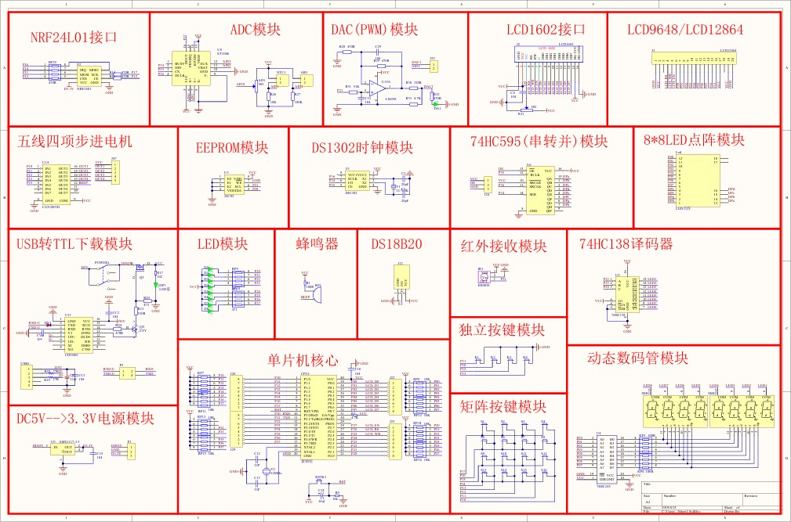
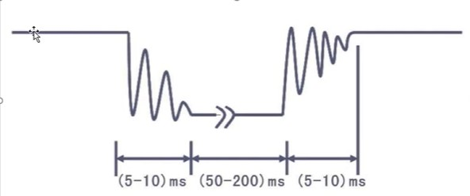
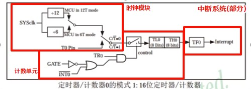
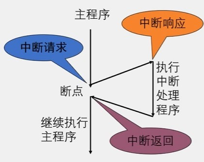

# 计算机的缩影：51 单片机

### 单片机的本质

单片机本质上是一个袖珍版的完整计算机系统，一个小小的芯片上集成了 CPU、内存、输入输出接口等计算机的核心部分。51 单片机是经典的 8 位单片机，它完美体现了冯·诺依曼计算机架构：

- **CPU**：用于执行指令和计算
- **存储器**：分为 RAM(512 字节)和 ROM(8K Flash)
- **输入/输出**：通过引脚与外部设备交互
- **总线系统**：连接各个部件



> 乱七八糟的我也不爱看，但它确实展示了计算机系统的基本组成部分

### 寄存器：软硬件交互的桥梁

寄存器是单片机（也是计算机）中最重要的概念之一，它们是连接软件和硬件的媒介：

- 从软件角度看：寄存器是 RAM 中的特殊区域，可以存储和读取数据
- 从硬件角度看：每个寄存器背后都有实际的电路连接，控制着硬件行为

例如，当我们在程序中写`P2 = 0xFE`时，实际上是在告诉单片机将 P2 端口的电平设置为特定状态，这就直接影响了连接在该端口的硬件设备。

# 计算机的输入输出系统

### LED：最简单的输出设备

LED 灯控制是理解计算机输出系统的基础。当我们控制 LED 灯亮灭时，其实是在模拟计算机如何控制所有输出设备：

```c
P2 = 0xFE; // 通过改变寄存器的值来控制LED亮灭
```

这种通过寄存器控制外部设备的模式，是所有计算机输出系统的基础，从简单的指示灯到复杂的显示器，原理相通。

### 按键：输入设备的原理

按键是最基本的输入设备，当按键按下时，硬件电路发生变化，这个变化通过 IO 口被 CPU 检测到：

```c
if(P2_0 == 0){ // 检测按键是否按下
    // 执行相应动作
}
```

这与我们使用的键盘、鼠标等输入设备原理相同，都是通过电路变化被计算机检测并处理。

### 按键抖动与输入设备的稳定性

按键的机械特性导致了"抖动"现象：



这启示我们，所有输入设备都需要"去抖"处理，才能获得稳定可靠的输入信号，这也是为什么计算机中有那么多输入处理相关的代码。

### 数码管：显示器的简化版

数码管是一种将数字信息可视化的设备，其工作原理体现了所有显示设备的基础：

1. **位选**：选择要显示的位置
2. **段选**：控制要显示的内容

这与现代显示器通过行列坐标控制每个像素的原理类似，只是复杂度不同。

# 计算机的时钟与中断系统

### 定时器：计算机的心跳

定时器是计算机中的"小闹钟"，它按照固定频率向 CPU 发送信号，这就像计算机的"心跳"：



现代计算机的所有时序操作都依赖于类似的时钟系统，从 CPU 的指令执行到网络通信的同步，都离不开精确的定时机制。

### 中断系统：计算机的反应机制

中断系统让计算机能够对外部事件做出实时响应：



这种机制在所有现代操作系统中都存在，当你点击鼠标或敲击键盘时，中断系统就会通知 CPU 暂停当前任务，处理你的输入请求。

```c
void Timer0_Routine() interrupt 1 {
    // 中断服务程序，当定时器溢出时自动执行
    // 类似于现代计算机中的事件处理函数
}
```

# 程序与硬件交互的艺术

### 模块化编程思想

在单片机编程中，我们可以把常用功能封装成独立模块：

```c
// delay.h
#ifndef __DELAY_H__
#define __DELAY_H__

void Delay(unsigned int xms);

#endif
```

```c
// delay.c
void Delay(unsigned int xms) {
    // 实现代码
}
```

这种模块化的编程思想与现代软件开发的组件化、模块化理念完全一致，只是应用场景不同。

### C 语言与硬件控制

C 语言作为"高级语言"与"低级语言"之间的桥梁，在单片机编程中展现了它的优势：既可以进行底层硬件控制，又能保持较好的可读性和结构化特性。

```c
// 位操作示例
TMOD = TMOD & 0x0F; // 保留低四位，清零高四位
TMOD = TMOD | 0x01; // 设置模式
```

这种位操作在计算机系统编程中非常常见，比如操作系统内核、驱动程序等，都大量使用这种技术。

# 结语

通过学习 51 单片机，我们实际上是在以一种简化的方式理解整个计算机系统的工作原理。从寄存器到中断，从输入输出到定时系统，单片机为我们打开了理解计算机内部运作的窗口。

虽然现代计算机系统比 51 单片机复杂得多，但基本原理是相通的。掌握这些基础知识，不仅对嵌入式开发有帮助，对理解所有计算机相关技术都有深远意义。就像搭建高楼需要先打好地基，了解计算机底层原理，能让我们在任何计算机相关领域都站得更稳、走得更远。
