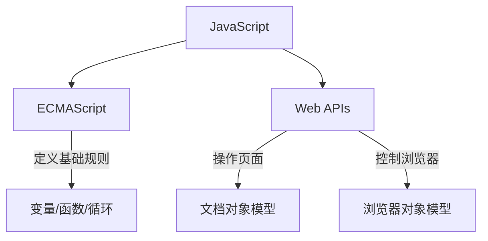

# JavaScript 介绍

**JavaScript 是网页的交互引擎**，让静态页面获得响应能力。这门脚本语言无需编译即可在浏览器中直接运行，既能操作网页元素实现点击反馈、内容刷新等动态效果，也能通过 Node.js 技术扩展到服务器开发领域。

#### 核心规范（ECMAScript）

**ECMAScript**  定义了语言的基本规则（如变量、函数、循环），相当于 JavaScript 的语法教科书。

#### 浏览器扩展（Web APIs）

**Web APIs**  则是浏览器赋予的特殊能力，包含**操控网页元素的 DOM 工具**和**管理浏览器窗口的 BOM 工具**。两者如同汽车的发动机与方向盘，共同驱动现代网页应用的运行。



**ECMAScript 与 JavaScript 是规范与实现的关系**，前者是后者的规格，后者是前者的一种实现。
前者定义语言标准（如 ES6 规范），后者在标准基础上扩展浏览器操作能力（DOM/BOM），两者共同构成完整的 Web 开发解决方案。

[[ECMAScript入门]]

### 书写位置

#### 内部书写

**直接写在 html 文件里。**

可以在网页的任意位置插入`<script>`标签编写 JS 代码，但通常建议放在`</body>`**结束标签之前**。  
这样网页内容会先加载出来，不会让用户长时间面对空白页面。

```HTML
<!DOCTYPE html>
<html>
<head>...</head>
<body>
  <!-- 网页内容 -->

  <!-- 建议将脚本放在页面底部 -->
  <script>
    alert('页面加载完成！')
  </script>
</body>
</html>
```

#### 外部书写

**将代码单独保存为.js 文件。**

像图片、CSS 文件一样，JS 代码也可以保存为独立文件（例如：`myScript.js`），通过链接引入网页。这种方式让代码更易维护，也方便多个页面重复使用。

```HTML
<!-- 在head或body底部引入，注意路径正确 -->
<script src="js/myScript.js"></script>
```

对应的`myScript.js`文件内容非常简单：

```JavaScript
// 记住文件里不用再写<script>标签！
alert('我是外部文件里的代码')
```

即可达到同样的效果.

> 虽然浏览器能自己猜出语句结束位置（分号`;`可省略），但保持统一更规范。

# JavaScript 基础语法

### 语言特性

✓ 严格区分大小写（`myVar` ≠ `myvar`）  
✓ 语句结尾分号推荐添加（避免意外错误）

### ## 信息交互方式

#### 输出语法

| 方法               | 作用场景       | 特点说明         |
| ------------------ | -------------- | ---------------- |
| `alert()`          | 弹窗提示       | 阻断页面操作     |
| `document.write()` | 向网页插入内容 | 可解析 HTML 标签 |
| `console.log()`    | 控制台调试输出 | 不影响页面展示   |

- **弹窗警告**

```Javascript
alert('紧急通知！')  // 完整写法 window.alert()
```

- **网页内容写入**

```Javascript
document.write('<span style="color:red">重要内容</span>')  // 支持HTML标签渲染
```

- **调试输出**

```Javascript
console.log('用户点击时间：', new Date())  // 可输出多个参数
```

### 用户输入

- **基础弹窗输入**

```Javascript
let userName = prompt('请输入您的名字')  // 返回字符串类型输入值
```

- 操作网页内容

```Javascript
// 访问
let titleElement = document.getElementById('mainTitle')  // 通过ID精准定位

// 更改
titleElement.innerHTML = '<i>新标题</i>'  // 可插入HTML标签
// 安全写法：titleElement.textContent = '纯文本内容'
```

## JavaScript 值

### 变量

**变量如同可重复使用的收纳盒**，用`let`声明后可以随时更换存放内容。JavaScript 采用灵活的类型系统，同一个变量可以先后存储数字、文本等不同类型的数据。

```Javascript
let messageBox = "欢迎登录";  // 初始存放文本（字面量）
messageBox = 2024;          // 更改为存放数字
```

- **现代写法**：`let`声明块级作用域变量，禁止重复声明
- **传统写法**：`var`存在变量提升、可重复声明等问题（建议新手优先使用`let`）

**命名基础规则**：

- 变量名需以字母、`$`或`_`开头，可包含数字但不可纯数字
- 严格区分大小写（如`user`与`User`视为不同变量）
- 禁止使用`class`、`function`等语言保留字

**命名核心规范**：

- 命名应直指用途，例如用`studentCount`而非模糊的`s1`
- 常规变量采用小驼峰格式如`firstName`，构造函数或类名使用大驼峰如`UserModel`
- 布尔变量建议添加`is`/`has`前缀增强可读性（如`isActive`）
- 常量则全大写加下划线（如`MAX_SIZE`）
- 函数命名以动词开头明确行为（如`calculateTotal()`），避免使用单字母或易混淆字符（如`l`、`O`），保持项目内命名风格统一

### 常量

**常量是带密码锁的保险箱**，用`const`声明后内容不可更改。常用于存储固定配置、重要参数等需要保护的数据。

```Javascript
const MAX_USERS = 100;       // 声明即赋值
const API_KEY = 'A1B2-C3D4'; // 重要凭证保护
```

# 数据类型

JavaScript 的数据分为两类：**独立值**（原始类型）和**组合结构**（引用类型）。两者的核心区别在于存储方式——原始类型直接存储值，引用类型存储内存地址。

## 基础单元：原始类型

### 数字型（Number）

- 包含整数、小数、科学计数法表示
- 特殊值：`NaN`（无效运算结果）、`Infinity`（无穷大）

```javascript
let price = 99.9       // 普通数字
let result = 10 / 'a'  // → NaN
let max = 1e500        // → Infinity
```

### 字符串型（String）

- 三种包裹方式：单引号、双引号、反引号
- 反引号支持换行和变量插入（模板字符串）

```javascript
let message = `用户${isLogin ? '已登录' : '未登录'}`
```

### 布尔型（Boolean）

- 仅两个值：`true`表示真，`false`表示假
- 自动类型转换：`0`、`""`、`null`等会被转为`false`

```javascript
let isLogin = false
if (isLogin) { /* 不会执行 */ }
```

### 特殊原始值

| 值          | 含义             | 典型场景           |
| ----------- | ---------------- | ------------------ |
| `undefined` | 未赋值的默认状态 | 声明变量未初始化时 |
| `null`      | 显式标记为空值   | 主动清空对象引用时 |

## 组合结构：引用类型

### 对象（Object）

对象如同一个存放相关信息的档案袋，每个信息项由「属性名+值」（键值对）组成。例如学生档案可以包含姓名、成绩、选修课程等相互关联的信息。

```javascript
let student = {
    name: '小明',
    score: 95,
    course: ['数学', '物理']
}
```

### 数组（Array）

**智能收纳盒**  
数组如同带编号的收纳格，每个格子自动获得位置编号（索引），从 0 开始计数。这种设计让批量管理相似数据变得高效。

```javascript
let colors = ['红', '绿', '蓝']
colors[1] = '黄'  // 修改第二个元素
```

### 函数（Function）

**可复用的工具包**  
函数是一组打包的操作指令，通过输入参数执行特定任务并返回结果。其特殊之处在于既能存储代码逻辑，又能像普通对象一样添加属性。

```javascript
function add(a, b) {
    return a + b
}
```

### 类型检测

**typeof 基础检测**

- 快速识别基础类型：  
  `typeof "text" → "string"`  
  `typeof 42 → "number"`  
  `typeof null → "object"`（特殊记忆点）

**精准类型判断**

- 数组检测：`Array.isArray([1,2])`
- 对象类型：`{} instanceof Object`
- NaN 识别：`Number.isNaN(NaN)`

**NaN 的处理**

```javascript
// 唯一不等于自身的值
NaN === NaN → false
// 正确检测方式
Number.isNaN(0/0) → true // 只有这种NaN参与的运算为true
```

### 显式类型转换

**数字转换**

```javascript
Number("123") → 123      // 纯数字字符串
Number("12px") → NaN     // 含非数字字符
+"3.14" → 3.14           // 快捷写法
parseInt("100cm") → 100  // 提取整数部分
```

想要从`"12px"`中提取纯数字：

```Javascript
let size = parseInt("100px", 10)  // → 100（自动忽略非数字部分）
let price = parseFloat("￥3.14")  // → 3.14
```

**字符串转换**

```javascript
String(2024) → "2024"    // 显式转换
123 + "" → "123"         // 隐式快捷写法
`价格：${99}元` → "价格：99元" // 模板字符串
```

**布尔转换**

- 六种假值：`0`、`""`、`null`、`undefined`、`NaN`、`false`
- 对象永远为真：`Boolean([]) → true`

### 隐式转换陷阱

**算术运算**

```javascript
"5" - 2 → 3      // 自动转数字
true + 1 → 2     // true转1
null * 10 → 0    // null转0
```

比较时，使用严格等 `===` 来避免意外转换：

```javascript
"5" === 5 → false // 若是 == 则会将两边强制转换，导致为 true
```

**加号双面性**

```javascript
3 + "2" → "32"   // 优先拼接字符串
5 + true → 6     // true转1后计算
```

**特殊等式**

```javascript
[] == 0 → true    // []→""→0
"" == false → true// 两边都转0
null == undefined → true // 特殊规则
```

因此还是用严格等来避免意外情况最好。

## 流程控制

- **条件语句**：`if/else`、`switch`
- **循环语句**：`for`、`while`、`do...while`
- **逻辑运算符**：`&&`、`||`、`!`

### 逻辑运算符

逻辑运算符不仅是条件判断工具，更是通过**短路运算**实现流程控制的关键。理解其特性可大幅提升代码简洁性：

- `&&` 逻辑与

当前项为真值时继续执行，否则停止。可以替代简单 if。

```javascript
// 用户存在时执行回调
user.isLogin && showUserMenu();

// 等效于
if (user.isLogin) {
  showUserMenu();
}
```

- `||`  逻辑或

遇到第一个真值立即返回，常用于设置默认值（存在潜在风险）。

```javascript
// 获取配置项，不存在时用默认值
const timeout = settings.timeout || 3000;
```

- `??`  空值合并运算符

仅当左侧为  `null/undefined`  时返回右侧值，常用于需要保留 0、false、空字符串等有效值。

```javascript
// 分页配置（允许 pageSize=0）
const pageSize = userSetting.pageSize ?? 10;

// 表单提交（空字符串视为有效输入）
const address = formData.address ?? '未填写';
```

### `switch`  的严格比较

Javascript 中的 switch 是使用  `===`  严格比较（不会自动类型转换）

```Javascript
let num = 5;
switch(num) {
    case "5": // 不会匹配（类型不同）
        break;
    case 5:   // 正确匹配
        break;
}
```

### `for` 遍历与循环

#### 基础 `for` 循环

按数字顺序循环，比如遍历数组（通过索引）

```javascript
for (初始化; 条件; 更新) {
  // 循环体
}
```

- 完全控制循环次数（比如可以 `i += 2` 跳着遍历）。
- 可以通过 `break` 提前终止，或 `continue` 跳过某次循环。

```javascript
// 例子：遍历数组
const fruits = ['苹果', '香蕉', '橙子'];
for (let i = 0; i < fruits.length; i++) {
  console.log(fruits[i]); // 依次输出：苹果、香蕉、橙子
}
```

#### `for...in` 遍历对象

遍历对象的 **属性名**（键名），适合处理对象。

```javascript
for (let key in 对象) {
  // 循环体
}
```

- 遍历数组时，`key` 是字符串类型的索引（如 `"0"`, `"1"`）。
- 会遍历对象原型链上的属性，通常用 `if (obj.hasOwnProperty(key))` 过滤。

```javascript
// 例子：遍历对象
const person = { name: '小明', age: 18 };
for (let key in person) {
  console.log(key + ': ' + person[key]);
  // 输出：name: 小明，age: 18
}
```

#### `for...of` 直接拿到数组的值

**用途**：遍历 **可迭代对象**（如数组、字符串、Map、Set），直接拿到值。

```javascript
for (let value of 可迭代对象) {
  // 循环体
}
```

- 简洁，不用写索引。
- 支持 `break` 和 `continue`。
- **不能直接遍历普通对象**（会报错）。

```javascript
// 例子：遍历数组
const fruits = ['苹果', '香蕉', '橙子'];
for (let fruit of fruits) {
  console.log(fruit); // 直接输出元素值：苹果、香蕉、橙子
}

// 例子：遍历字符串
const str = 'hello';
for (let char of str) {
  console.log(char); // 依次输出 h, e, l, l, o
}
```

#### `forEach` 数组专用

**用途**：对数组的每个元素执行一次函数（属于数组方法，不是 `for` 语句）。

```javascript
数组.forEach(function(元素, 索引, 原数组) {
  // 操作元素
});
```

- **无法用 `break` 或 `return` 终止循环**！
- 适用于简单的遍历操作（比如修改元素）。

```javascript
// 例子：
const nums = [1, 2, 3];
nums.forEach((num, index) => {
  console.log(index + ': ' + num); // 0:1, 1:2, 2:3
});
```

#### 总结：如何选择？

| 循环类型   | 适用场景                     | 是否支持 `break` |
| ---------- | ---------------------------- | ---------------- |
| `for`      | 需要索引或精确控制循环次数   | ✅               |
| `for...in` | 遍历对象的属性名             | ✅               |
| `for...of` | 遍历数组、字符串等可迭代对象 | ✅               |
| `forEach`  | 数组简单遍历，无需中断       | ❌               |

### 循环索引小技巧

**用取模运算 `%` 替代 `if` 边界判断**

```javascript
// 核心代码：天然防越界，循环切换索引
index = (index + 1) % arrayLength;      // 下一页
index = (index - 1 + arrayLength) % arrayLength; // 上一页
```

**三大优势**

1. **代码极简**：1 行替代多行`if`边界判断
2. **数学防越界**：自动将索引限制在 `0 ~ arrayLength-1`
3. **性能无损**：现代 JS 引擎优化后，性能与`if`判断几乎无差

#### **适用场景**

- 轮播图/无缝滚动
- 循环队列、环形缓冲区
- 游戏角色地图循环移动
- RGB 颜色渐变循环

### 真值判断

**六种假值**：`0`、`""`、`null`、`undefined`、`NaN`、`false`

```javascript
if ([]) { // → true（空数组是真值！）
    console.log('空数组会通过判断')
}

if ({}) { // → true（空对象也是真值）
    console.log('空对象会通过判断')
}
```

**安全写法**：

```javascript
// 判断数组/对象是否为空
if (arr.length > 0) { /* 执行 */ }
if (Object.keys(obj).length > 0) { /* 执行 */ }
```

## 数组

用中括号包裹所有元素，元素间用逗号隔开。

```javascript
let arr = [1,2,3,4,5];
```

Javascript 的数组可以动态调整索引：

```javascript
let arr = [];
arr[5] = 'a';  // 长度变为6，索引0-4为 empty:cite[2]:cite[4]
```

`.length` 可以获得数组的长度，`.length` 也可以被赋值，从而手动截断数组。

```javascript
arr.length = 2;  // 删除索引2之后的元素
```

以下是对数组操作的详细拓展说明，包含方法说明、使用场景和注意事项：

### 数组操作

#### 增（添加元素）

1. **`push()`**

在数组**末尾**添加一个或多个元素

有返回值：返回新数组长度

```javascript
let arr = [1, 2];
arr.push(3); // [1,2,3]
arr.push(4, 5); // [1,2,3,4,5]

console.log(arr.push(6)); // 返回数组总长度 6 [1,2,3,4,5,6]
```

2. **`unshift()`**

在数组**开头**添加一个或多个元素

有返回值：返回新数组长度
注意：大数据量时性能较低（需向后移动所有元素）

```javascript
let arr = [4,5];
arr.unshift(3); // [2,3,4]
arr.unshift(1,2); // [0,1,2,3,4]

console.log(arr.push(0)); // 返回数组总长度 6 [0,1,2,3,4,5]
```

#### 删（移除元素）

1. **`pop()`**

移除并返回数组**最后一个元素**

```javascript
let arr = [1,2,3];
arr.pop(); // 返回3，数组变为[1,2]
```

2. **`shift()`**

移除并返回数组**第一个元素**
注意：大数据量时性能较低

```javascript
let arr = [1,2,3];
arr.shift(); // 返回1，数组变为[2,3]
```

#### `splice()`

会直接修改原数组，在任意位置删除、替换或插入元素。

`splice(起始索引, 要删除的数量, 要添加的元素1, 元素2, ...)`

- **参数 1**：从哪里开始操作（索引从 0 开始）
- **参数 2**：要删除多少个元素（填 0 则不删除）
- **后续参数**：要插入的新元素（可选）

删除时返回被删除元素的数组。
如果未删除任何元素，则返回空数组。

##### 删除元素

```javascript
let fruits = ['苹果', '香蕉', '西瓜', '橘子'];

// 从索引1开始，删除2个元素
let removed = fruits.splice(1, 2);

console.log(fruits);   // ['苹果', '橘子']（原数组被修改）
console.log(removed);  // ['香蕉', '西瓜']（返回被删除的元素）
```

##### 替换元素（删除+插入）

```javascript
let colors = ['红', '绿', '蓝'];

// 从索引1开始，删除1个元素，插入2个新元素
colors.splice(1, 1, '黄', '紫');

console.log(colors); // ['红', '黄', '紫', '蓝']
```

##### 插入元素（不删除）

```javascript
let numbers = [1, 2, 5, 6];

// 从索引2开始，删除0个元素，插入3和4
numbers.splice(2, 0, 3, 4);

console.log(numbers); // [1, 2, 3, 4, 5, 6]
```

##### 避坑指南

1. **直接修改原数组**：和 `slice()` 不同，`splice()` 会改变原数组。

   ```javascript
   let arr = [10, 20, 30];
   arr.splice(0, 1);
   console.log(arr); // [20, 30]（原数组被修改）
   ```

2. **负索引**：支持从末尾倒数（类似 Python）

   ```javascript
   let arr = ['a', 'b', 'c'];
   arr.splice(-1, 1); // 删除最后一个元素 → ['a', 'b']
   ```

3. **不填参数 2 时，默认删到末尾**：
   ```javascript
   let arr = [1, 2, 3, 4];
   arr.splice(1); // 从索引1开始删到最后 → [1]
   ```

#### 改/查（修改/访问元素）

直接索引修改

```javascript
arr[2] = 'newValue';
```

直接索引访问

```javascript
let first = arr[0]; // 首元素
let last = arr[arr.length-1]; // 末元素
```

# JavaScript 函数

封装代码块，实现 **一次定义 → 重复调用**

函数能提升代码复用率、增强代码组织性。

```javascript
// 基础结构
function 函数名(参数) {
    // 执行逻辑
    return 返回值
}
```

## 函数定义与调用

### 命名函数

```javascript
// 声明式函数（存在函数提升）
function add(a, b) {
    return a + b
}
console.log(add(2,3)) // 调用的函数才会被执行 5

// 当形参与实参不对应
function demo(a, b) {
    console.log(a, b) // 传入(a b) 的参数分别为(10 undefined)
}
```

### 匿名函数（现代开发高频使用）

没有名称的函数，通过变量存储使用

```javascript
// 函数表达式
const multiply = function(a, b) {
    return a * b
}

// 箭头函数（简化版）
const divide = (a, b) => a / b


// 立即执行函数
(function() {
    console.log('自动执行!')
})()
// 立即执行函数会创建独立作用域，避免变量污染
```

筛选数组 filter 方法（重点）
filter()方法创建一个新的数组，新数组中的元素是通过检查指定数组中符合条件的所有元素
主要使用场景：筛选数组符合条件的元素，并返回筛选之后元素的新数组
语法：

# JavaScript 对象

对象是**无序**的键值对集合，用于存储复杂数据。

声明对象:

```javascript
let person = {
  name: "John", // 对象的静态数据
  age: 30,

  sayHi() { // 对象的动态行为
    console.log("Hi!");
  }
};
```

### 访问对象属性

1. 点号 `.`

属性名是合法标识符（如  `person.name`）

```javascript
console.log(person.name); // "John"
person.sayHi(); // 调用方法
```

2. 方括号 `[]`（动态属性名）

允许动态解析字符串形式的属性名，是遍历时的唯一选择。

```javascript
let key = "age";
console.log(person[key]); // 30
```

可随时添加对象的属性：

```javascript
person.job = "Developer"; // 若存在该属性就更改属性值, 不存在则添加属性
```

### 遍历对象

### `for...in` 循环

```javascript
for (let key in person) {
  console.log(key) // 输出为 "name"，而非标识符
  console.log(key, person[key]); // 因此必须用 [] 访问。
}
```

## 内置对象

内置对象是语言**预定义**的工具类对象，无需手动创建，可直接调用其属性和方法，用于处理常见任务（如数学计算、日期操作、数据转换等）。

### Math 数学工具

`Math`  是内置的数学工具集，无需创建实例即可直接使用其方法。

#### 常用方法速查

| 方法                | 作用                     | 示例                  |
| ------------------- | ------------------------ | --------------------- |
| `Math.random()`     | 生成 0~1 之间的随机小数  | `0.123456...`         |
| `Math.floor(x)`     | 向下取整（直接砍掉小数） | `Math.floor(3.9) → 3` |
| `Math.ceil(x)`      | 向上取整                 | `Math.ceil(2.1) → 3`  |
| `Math.round(x)`     | 四舍五入                 | `Math.round(3.4) → 3` |
| `Math.max(a,b,...)` | 返回多个数中的最大值     | `Math.max(5,9,3) → 9` |
| `Math.min(a,b,...)` | 返回多个数中的最小值     | `Math.min(5,9,3) → 3`