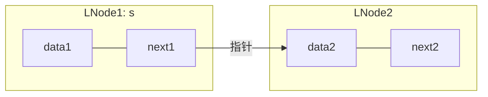

上课老师真的好无聊,还是上b站自学吧,听说这门课还挺难学习的?  
笔记源自于这套课程:  
[C语言《数据结构和算法》](https://www.bilibili.com/video/BV1Fv411H7jH/?share_source=copy_web&vd_source=663cc380bfc10fe6df62cd0cb979820d)

# 第零章 C语言基础

>补一补c语言有关指针和结构体的基础知识...  
>视频来源: [数据结构所需要的c语言基础](https://www.bilibili.com/video/BV1kV4y1C7z6/?spm_id_from=333.337.search-card.all.click&vd_source=b19220b8f372f3a81aa8463fde694a63)

### 指针

类似于 定义int能存放整数, 定义char能存放字符;   
指针能存放地址. 

地址 可以类比理解成 寝室号.   
" * " 可以类比为 寝室钥匙.

例如: " *a " 可以访问到a的值.

```C
int x = 12;//定义一个整型变量
int* p;//定义一个int类型的指针变量

int* p = &x;//将x的地址值赋给指针变量
```

知道地址后如何访问地址存的变量值?
有以下两种方法:

1. " * " + 地址 

```C
int y = 7;
int* q = &y;

printf("%d",*q);//通过地址访问y的值,然后打印y的值
```

2. 地址 + [  ]

```C
int a[3] = {1,2,3};
int* p = a;//将数组a第一个数的地址值给指针p

printf("%d", p[0])//通过地址值访问数组a[2]的值
printf("%d", p[2]);//访问数组a[2]的值
```

* 也可以试试第一种方法:

```C
printf("%d", *p);
printf("%d", *(p+2));
```

* 还有这几种方式,也能输出相同的结果:

```C
print("%d", a[0]);//知道a的地址(首地址),偏移[0]个位置的值.
print("%d", a[2]);//知道a的地址(首地址),偏移[2]个位置的值.
print("%d", *a);//知道a的地址(首地址),访问a的值.
print("%d", *(a+2));//知道a的地址(首地址),访问(a+2)的值.
```

* 同理的
```C
print("%d",(a+1)[0]);//知道首地址(a+1),偏移[0]个位置的值.
```

即a[1]的值

### 结构体

例如管理学生信息. 

若需求存储十个学生的: 姓名 学号 分数.  
如果没有使用结构体:

```C
char name[10];
char score[10];
float sno[10];
```

不能以学生为单位查看,较为凌乱.

试一试结构体定义:

* 定义方式一

```C
struct student{
    char son[20];
    char name[20];
    float score[3];
};

//若要访问第一个学生的学号:
s[0].son;
//同理,要访问第四个学生的成绩:
s[4].score;
```


* 定义方式二(更常用)

>typedef 约等于重命名  
>例如: typedef int a, 就是把int重新改名为a.  
>即: int x; 等价于 a x;  

```C
typedef struct student{
    char son[20];
    char name[20];
    float score[3];
} stu;
```
> 同理,此处是将 定义一中的 "struct student{...}" 重命名成 "stu".

尝试理解以下结构体定义:

```C
typedef struct LNode{
    int data;
    struct LNode* next;
} LNode,* Linklist;

```
逗号相当于分隔符,类似于: int a,b; 是int a; int b;两条语句.

因此可以这样拆分出两条语句:

>typedef struct LNode{...} LNode:  
>将"struct LNode{...}"重命名为 LNode.

>typedef struct LNode* linklist:  
>将"struct LNode"重命名为 * linklist.

不过用逗号像这样链接容易造成误解, 大家一般不这样写去为难自己.

```C
Lnode s;//创造一个LNode类型的空间叫做s.

Linklist p = &s;//取这个s空间的地址给p空间存放.
```




  
* #define 是一个预处理器指令，它在编译之前就对代码进行了文本替换;   
typedef 是一个关键字，它在编译时创建了一个新的类型别名。

* #define 可以用于定义常量、变量、函数或者代码片段的宏。  
typedef 可以用于定义结构体、枚举、联合或者指针等复杂的类型的别名。

* #define 的作用域是从定义处到文件末尾，除非用 #undef 取消。  
typedef 的作用域是从定义处到所在的代码块末尾。




### 结构体指针运算符

`->` 是一个结构体指针运算符，它用于通过结构体指针访问结构体的成员。  
它的一般形式是：

> **结构体指针->成员名**

例如，如果 L 是一个指向 SqList 类型的结构体的指针，那么 L->length 就表示访问该结构体的 length 成员，也就是线性表的当前长度。  
可以把 -> 理解为先解引用指针，再用 . 访问成员，即：

L->length 等价于 (*L).length

# 绪论

> 不得不说我们老师讲的是真不行,说的话总是有很多完全没必要的句子,得不到她要说的重点...
> 还有就是数据结构真的好难好抽象!!

### 基本概念和术语

1. 数据: 所有能输入到计算机中去能用来描述客观事物的符号

2. 数据元素: **数据的基本单位**, 也称为 结点 或 记录

3. 数据项: **数据最小单位**, 也称为 域

4. 数据对象: 是性质相同的数据**元素的集合**, 是数据的一个子级

5. 数据结构: 是相互之间存在一种或多种特定关系的数据元素的集合 

## 什么是数据结构

> **程序设计 = 数据结构 + 算法**  

就是数据与元素的**关系集合**

---
传统上,数据结构分为**逻辑结构**和**存储(物理)结构**。   

### 逻辑结构

是数据元素间抽象化的相互关系, 与数据的存储无关, 独立于计算机.    

逻辑结构又分为:  
* 集合
* 线性结构 (一对一)
* 树形结构 (一对多)
* 图形结构 (多对多)

### 存储(物理)结构

* 顺序存储
* 链式存储
* 索引存储
* 散列存储

## 算法的基本特征
  
### 五个重要特性
* 有穷性
* 确定性
* 可行性
* 0个或多个输入
* 一个或多个输出

### 评价优劣的标准  
* 正确性
* 可读性
* 健壮性
* 高效性
* 存储量低

### 时间复杂度

语句频度: 一条语句的重复执行次数.

算法的执行时间 == 该算法中所有语句的频度之和.
>$T(n) = O(f(n))$ 

例如:

```C
for( i=0; i<n; i++)
    for( j=0; j<n; j++)
        c[i][j]=a[i][j]+b[i][j]
```

是for循环的嵌套, 每个for循环的语句频度为n.  
因此, 整体为n*n

即:   $T(n) = O(n^2)$ 

### 空间复杂度

算法所需存储空间的度量, 记作

>$S(n) = O(f(n))$

通常,求"复杂度"是指时间复杂度

# 线性表

* 逻辑结构: 一对一
* 存储结构: 顺序存储(顺序表) 链式存储(链表)

### 线性表的顺序存储 (顺序表)

会预先分配存储空间, 可能会导致空间闲置或溢出现象.  
不用为表示结点的逻辑关系而增加额外的存储开销, 存储密度等于1.  

随机存取元素, 时间复杂度为 O(1)  
插入删除时平均移动约表中一半元素, 时间复杂度为 0(n)

适用于: 
* 表长变化不大, 且能事先确定变化的范围.
* 很少进行插入或删除操作, 经常按元素序号访问数据元素.

##### 定义线性表的存储结构

```C
#define MAXSIZE 100 //线性表的最大长度
typedef int ElemType; //假设线性表的元素类型为整型

typedef struct {
    ElemType data[MAXSIZE]; //用数组存储元素
    int length; //线性表的当前长度
} SqList; //顺序表类型
```

### 线性表的链式存储 (链表)

存储空间动态分配, 不会出现闲置或溢出的现象.  
需要借助指针来体现元素间的逻辑关系, 存储密度小于1.

顺序存取元素, 时间复杂度为 O(n)  
插入删除时不需要移动元素, 确定插入删除位置后, 时间复杂度为 O(1)  

适用于:
* 长度变化较大
* 频繁进行插入删除操作的

#### 单向链表的表示

```C
//定义单链表结点类型
typedef struct LNode {
    ElemType data; //数据域
    struct LNode *next; //指针域
} LNode, *LinkList; //LNode为结点类型，LinkList为指向结点的指针类型
```

头指针: 
* 是链表指向的**第一个节点**的指针 (若链表存在**头节点**,则指向头节点).
* 头指针具有**标识作用**,因此常用头指针冠以链表的名字.
* 无论链表是否为空,头指针**均不为空**.
* 头指针是链表**必要**元素

头节点:
* 是为了操作的统一和方便而设立. (统一了在第一元素节点前插入删除操作与其他节点)
* 头节点 **不一定** 是链表的必要元素.

#### 双向链表的表示

```C
typedef struct DNode{
    ElemType data;
    struct DNode *prior; // 指向前驱结点
    struct DNode *next; // 指向后继结点
} DLinkList;
```

# 栈

逻辑结构: 一对一
存储结构: 顺序存储(顺序栈) 链式存储(链栈)

**后进先出** 是受限制的线性表.

### 顺序栈

```C
#define MAXSIZE 100

typedef struct{
    SElemType *base;
    SElemType *top;
    int stacksize;
}SqStack;
```

栈空标志: base == top 
栈满标志: top-base == stacksize 


#### 基本操作

进栈

```C
Status Push(SqStack &S, SElemType e){
    if(S.top - S.base == S.stacksize)// 判断是否栈满
        return ERROR;

    *S.top ++ = e; //先获取栈顶元素 e ,然后栈顶指针减一
    return OK;
}
```

出栈 

```C
Status Pop(SaStack &S, SElemType &e){
    if(S.top == S.base) //判断栈空
        return ERROR;

    e = *--S.top;
    return OK;
}
```

### 链栈

```C
typedef struct StackNode{
    SElemType data;
    struct StackNode *next;
} StackNode, *LinkStack;
LinkStack S;
```

#### 基本操作

进栈 

```C
Status Push(LinkStack &S, SElemType e){
    p = new StackNode; //生成新结点p
    if (!p) 
        exit(OVERFLOW); // 如果结点申请失败, 就退出

    p -> data = e;
    p -> next = S;
    S = P;
    return OK;
}
```

出栈

```C
Status Pop(LinkStack &S, SElemType &e){
    if(S == NULL) // 判断是否为空
        return ERROR;

    e = S -> data;
    p = S;
    S = S -> next;
    delete p;
    return OK;
}
```

# 队列

逻辑结构: 一对一  
存储结构: 顺序存储 (循环队列) 链式存储 (链队)

### 顺序存储 (循环队列)

```C
typedef struct QNode{
    QElemType data;
    struct Qnode *next;
}Qnode, *QueuePtr;

typedef struct{
    QueuePtr front; // 队头指针
    QueuePtr rear; // 队尾指针
}LinkQueue;
```

#### 基本操作

入队
```C
Status EnQueue(LinkQueue &Q, QElemType e){
    p = new QNode;
    if(!p) 
        exit(OVERFLOW);

    p -> data = e; p -> next = NULL;
    Q.rear -> next = p;
    Q.rear = p;
    return OK;
}
```

出队
```C
Status DeQueue(LinkQueue &Q, QElemType &e){
    if(Q.front == Q.rear) // 判断队列是否为空
        return ERROR;

    p = Q.front -> next;
    e = p -> data;
    Q.front -> next = p -> next;

    if(Q.rear == p) // 出队为最后一个元素, 还原为初始队列状态
        Q.rear = Q.front;

    delete p;
    return OK;
}
```

### 链式存储(链栈)

```C
#define MAXSIZE 100

Typedef struct {
    QElemType *base;
    int front; // 队头下标
    int rear; // 队尾下标
} SqQueue;
```

#### 基本操作

循环队列入队
```C
Status EnQueue(SqQueue &Q,QElemType e){
    if((Q.rear+1)%MAXQSIZE == Q.front) return ERROR;
    Q.base[Q.rear = e];
    Q.rear = (Q.rear+1)%MAXQSIZE;
    return OK;
}
```

循环队列出队
```C
Status DeQueue(LinkQueue &Q,QElemType &e){
    if(Q.front == Q.rear) return ERROR;
    e = Q.base[Q.front];
    Q.front = (Q.front + 1)%MAXQSIZE;
    return OK;
}
```

## 串

逻辑结构: 一对一  
存储结构: 顺序存储(顺序串) 链式存储(链串)  

是受限制的线性表, 数据元素是字符.

### 顺序串

```C
typedef struct{
    char *ch;
    int length;
} HString;

#define MAXSTRLEN 255 // 用户可以在255以内定义最长串长
typedef char SString[MAXSTRLEN+1]; // 0号单元存放串的长度
```

## 数组

逻辑结构: 一对一  
存储结构: 顺序存储 顺序+链式存储

# 树

逻辑结构: 一对多  
存储结构: 顺序存储 链式存储

树是n个结点的有限集


### 基本术语

**结点的度:** 树中一个结点的孩子个数, 树中结点的最大度数称为树的度数.  
**分支结点:** 度数大于0的结点  
**叶子结点(终端结点):** 度为零 (没有子孙结点) 的结点 

**结点的层次:** 从树根开始定义, 根节点为第一层, 它的子结点为第二层, 以此类推.  
**结点的深度:** 从根节点开始自顶向下逐层累加的  
**结点的高度:** 从叶结点开始自底向上逐层累加的

**树的高度(或深度):** 树中结点的最大层数

**有序树和无序树:** 树中结点的各子树从左到右是有次序的, 不能互换, 称之为有序树, 否则称为无序树.  
**路径:** 两个节点之间的路径是由这两个结点之间所经过的 **结点序列** 构成
**路径长度:** 两个节点之间的路径长度是路径上所经过的 **边的个数** 构成

**森林:** 森林是n棵互不相交的树的集合

### 性质

* 树中的结点数等于所有结点的度数加1  
* 度为 $m$ 的树中, 第i层至多有 $m^{i-1}$ 个结点

* 高度为$h$的$m$叉树至少有 $h$ 个结点, 至多有 $m^h-1 \over m-1$ 个结点.
* 具有 $sum$ 个结点的 $m$ 叉树的最小高度为 $\log _m{n(m-1)+1}$
> $sum = {m^h-1 \over m-1}$
* 高度为 $h$ 的 $m$ 叉数至少有 $h+m-1$ 个结点

#### 区分 度为m的树\m叉树

1. m 叉树--每个结点最多只能有m个孩子的树
* 任意结点的度数 ≦ m
* 可以是空树

2. 度为m的树--至少有一个结点度 == m
* 任意结点的度数 ≦ m
* 一定为非空树

## 二叉树

二叉树有左右之分(有序树), 给结点编号时每一层从左往右依次编号.

### 满二叉树

高度为h的满二叉树, 含有 $2^h-1$ 个结点.

对于编号为 $i$ 的结点: 
* 双亲为 `i/2`
* 若有左孩子, 则其为2i
* 若有右孩子, 则其为2i

### 完全二叉树

不同于满二叉树, 完全二叉树最后一层的结点都靠右排列,且除最后一层, 其他层都是满的.

高度为 $h$ 的完全二叉树, 最多有 $2^h-1$ 个结点.

### 平衡二叉树

树上任意结点的左子树和右子树的深度差不超过1.

## 二叉树的遍历

1. 先序遍历: 根节点 -> 左子树 -> 右子树
2. 中序遍历: 左子树 -> 根节点 -> 右子树
3. 后续遍历: 左子树 -> 右子树 -> 根节点

以上三种其时间复杂度为O(n)

4. 层次遍历: 从上到下, 从左往右

### 哈夫曼树(最优树)

给定N个权值作为N个叶子结点，构造一棵二叉树，若该树的带权路径长度达到最小，为哈夫曼树.  
哈夫曼树是带权路径长度最短的树, 权值较大的结点离根较近.

#### 带权路径长度

结点的带权路径长度为: 从根结点到该结点之间的路径长度与该结点的权的乘积.

树的带权路径长度规定为所有叶子结点的带权路径长度之和, 记为WPL.

# 图

线性表可以是空表, 图不可以是空图.

### 邻接矩阵

适合于稠密图

### 邻接表

适合于稀疏图

### 图的遍历 

#### 深度优先 (前序遍历)

#### 广度优先 (层次遍历)


# 查找

用于查找的数据集合称为查找表, 他是由同一类型的数据元素 (或记录) 组成, 可以是一个数组或链表等数据类型.

**关键字:** 数据元素中唯一标识干元素的某个数据项的值, 使用基于关键字的查找, 结果应该是唯一的.

### 顺序查找

从表的一端开始, 按顺序从后往前查找, 没什么好说的.

#### 分析

* 算法简单, 对表结构无任何要求
* 平均查找长度较大, 当n较大时不推荐采用顺序查找

### 折半查找(二分查找)

通过三个指针(low, high, mid), low = 1, high = 表长, mid取low 和 high 的中间值.  

1. mid 与给定的 key 比较, 若相等则查找成功, 若不相等则将表分成前后两个子表.
2. 如果 key 比 mid 大, 则将 low 取为 `mid + 1`; 反之比 mid 小, 则将 high 取为 `mid - 1`

#### 分析

* 显然效率比顺序查找快
* 必须采用顺序存储结构


### 分块查找

建立一个索引表,然后在块中顺序查找.

#### 分析

* 效率在顺序查找和折半查找之间
* 适用于经常动态变化的线性表


# 排序

KCN: 关键字比较次数  
RMN: 记录移动次数

## 插入排序

### 直接插入排序

最简单的一种排序方式.

1. 一个一个取待排表中的关键字
2. 在新的表中顺序查找, 逐个后移元素, 直到找到插入位置

#### 分析

时间复杂度

最坏情况下:  
KCN ≈ ${n^2}\over {2}$  
RMN ≈ ${n^2}\over {2}$

空间复杂度

只需要一个用于记录的空间, 因此为: `O(1)`

#### 特点

* 简单, 稳定
* 适用于链式
* 不推荐用于n较大的情况

### 折半插入排序

使用折半查找的排序方法.

#### 特点

* 稳定
* 不适用于链式结构
* 适合初始记录无序, n较大的情况

### 希尔排序

先分组, 使数据 "基本有序" 后, 再进行 直接插入排序.

#### 特点

* 跳跃式移动, 不稳定
* 不适用于链式
* 适合初始记录无序, n较大的情况

## 交换排序

### 冒泡排序

### 快速排序

## 选择排序

1. 简单选择排序

2. 树形选择排序

3. 堆排序
