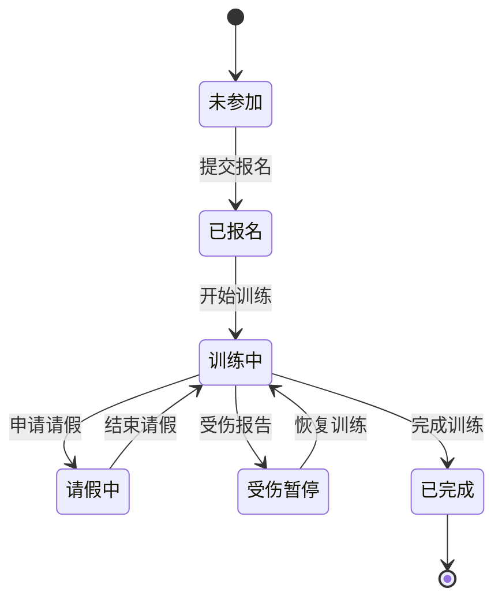

# BEGIN

月光从树冠的獠牙间漏下来，在烟雨垂落的黑发上碎成细小的光斑。她单手拎着羊皮卷轴抖了抖：
「能看穿幻象的宝石，应该比你那火蜥蜴尾巴值钱些？」

一旁的狼人正蜷着后腿蹲坐在树根处，尾巴有一搭没一搭地拍打地面。他弓着脊背调试弓弦的姿态，总让人想到铁匠铺里歪斜的招牌。
「至少够赔尝上个月烧穿的旅店屋顶。。」

少女突然气愤地把卷轴怼到狼人鼻尖，陈旧的鞣制气味混着他皮毛间的松脂味扑面而来。狼人云的左耳猛地后折成投降的弧度，陈年羊皮的气味让他打了个喷嚏。
「那是谁非要叼着活火蜥蜴乱蹦的？」

狼人从喉咙里滚出委屈的呜咽，看样子是拒绝回答这个问题。

她不耐烦地抖了抖羊皮卷轴边缘
「还有这地图，你确定这鬼画符指的是东南方？」

「这可是用三张雪貂皮换的......」
「瘴气在东北角——大小姐，你地图拿反了。」

""

为了寻找卷轴中所提到的那颗宝石, 一人一狼按照卷轴所指示的那样, 在这个满月之夜来到了迷雾森林.

「 就是这了, 云, 祭坛就在这迷雾深处. 」  
少女对着身后的狼说道, 声音中带着一丝不易察觉的期待.  
「 据卷轴记载, 掌管迷雾之力的宝石就在森林深处的祭坛之上. 」

「 听起来那宝石能值不少金币呢. 」  
狼轻晃尾巴.  
「没想到, 白天看起来平淡无奇的森林, 到了夜晚竟然是这个样子.」  
「说起来这应该是我和烟雨头一次真正意义上的探险吧, 之前都只是接接冒险者工会的委托而已.」

「 哼, 就工会那点委托, 根本不足以让本小姐出汗的. 」

「 行了行了, 大小姐, 知道你很强了. 要是没有那些委托, 我俩早就流落街头了... 」  
狼调侃道, 一边用指爪清点着箭袋中的羽毛箭矢.

「 流落街头吗... 」
少女眼中闪出一只落魄流浪狗的形象, 她想象着眼前这只狼那双原本锐利的野兽眼睛如今变得泛着水光. 可怜巴巴地缩在街边角落, 祈求着过往行人, 希望能得到一点点食物与怜悯.  
而那只总是自信满满的狼兽人, 此刻只能低着失落的尾巴, 用湿漉漉的鼻头去嗅探着地上每一块面包屑.

「 哦, 一只落魄的流浪狗, 也不赖嘛! 」  
少女嘴角上扬, 她知道这只会是一个幻想, 因为自打第一次见面, 她就决定与眼前这只狼患难与共了.

「 得了吧, 大小姐. 我可不会沦落到那种地步呢! 」  
狼一脸苦笑着摇摇头.  
挂好了箭袋, 随后他用长长的吻轻指面前的迷雾.

「 走吧. 」  
少女回应到.

就这样, 少女与狼并肩踏入了迷雾之中, 踏上了寻找神秘宝石的冒险之旅, 他们的身影渐渐消失在迷雾中.

# PLOT 1

随着少女烟雨和狼兽人云的脚步深入迷雾森林, 周围的景色越发朦胧, 仿佛整个世界都被一层轻纱所笼罩.  
月光透过树梢, 洒在蜿蜒的道路上, 为他们指引着方向.  
两人的心跳在这寂静的夜晚中回响, 伴随着他们前进的脚步, 一种难以言喻的紧张感在空气中弥漫开来.

两人走过一片灌木丛生的地带, 对于经验丰富的冒险者来说, 这里的每一个阴影都可能隐藏着危险.  
烟雨和云都深知这一点.

就在这时, 一只史莱姆悄无声息地从灌木丛中现身.

少女只需与狼一个对视, 无需多言.

一记准确狼爪挥击, 甚至不需动用弓箭.

然而, 预料之外的是史莱姆并没有像往常那样一招毙命.  
不过少女长刀在手, 她的身影快速优雅. 银色月华倾洒, 长刀如同划破夜空的流星，一闪即逝.  
史莱姆利落地溶解在地面上, 轻烟归于迷雾, 只留下地面上闪着微光的粘液.

「 真是轻松. 」  
暂时解除了危险, 她的身体放松, 倚靠在一旁长满苔藓的岩石上, 长发如墨般流淌.

「 月光强化了它们, 要多加小心了. 」  
狼舔了舔爪子, 敏锐地辨别出了处境的异样.  
随即他从背包中掏出小瓶子, 俯下身, 小心翼翼地将那特别的史莱姆粘液收集起来.  
「 不过这貌似是特别的怪物素材, 要是卖给素材商的话, 不知道这能比一般的凝胶贵多少金币呢? 」  
狼自言自语道.

「 月又提到金币了啊. 」
少女看着云, 心中难免感到不解.

烟雨从小与师傅在深山中长大, 习惯了自力更生的生活, 金币对她来说可有可无.  
她也明白金币的价值.  
毕竟自从她独自一人后, 少女也学着与他人交易和收集情报.

在她的认知中, 狼多以凶残狡诈描述, 很难与他们将 「贸易」 这个词相关联.  
真的不会吓跑交易对象吗?

少女随意的目光落在狼身上, 那只专心致志地收集着粘液的狼.

这只来自寒冷北方的灰狼兽人, 励志成为一只能独当一面的吟游诗人而远飘到这里, 因此远离了自己的族群.  
虽说在族群中他只是一只年轻的狼崽, 但要论体型, 还是比少女略大一些.

在烟雨看来, 云不过是一只看上去还算不太好惹的狗狗罢了. 对了, 还会自己打理自己的狗.  
他那灰白的毛发在满月下泛着银色的光泽, 尾巴随意摆动, 看上去稍微有点高兴的样子.

看来 「 人不可貌相 」 确实有道理.  
或者说, 「 **狼** 」不可貌相?  
烟雨心中暗想.

此时, 少女心生一计, 目光似笑非笑地盯着狼.  
随后轻手轻脚地走向云, 尽可能地不发出任何声响.  
她的手悄无声息地接近云的尾巴, 然后突然一把抓住.

云先是吃惊, 然后猛地一跳, 本能地想摆脱束缚, 手中的瓶子也因此翻倒在地.  
恶作剧得逞的少女嘴角勾起一抹得意的弧度, 肩膀因偷笑轻轻颤抖着.

「 你知道吗? 你的尾巴真的很好抓! 」  
她的声音轻快而充满戏虐.

得知是中了烟雨的计谋后, 狼嘴里发出低沉的抗议声.  
「 放开我, 粘液全撒啦! 」  
狼不满地吼道.

少女却毫无征兆地松手, 失去重心的灰狼一头扑倒在地.  
「 这可真是'狼'狈啊, 骸云. 」
她走向倒地的灰狼身边, 如往常那般, 戏虐灰狼.

灰狼抱怨着低吼, 明显是不满少女刚刚的举措.  
重获自由的狼要给少女一个教训, 立刻转身扑向少女.

而少女根本扛不住扑面而来的狼, 跌倒在泥土与草地中, 但她一点也不介意, 反手揉搓着面前这只灰狼的毛茸茸的脸.  
粗糙的皮毛下隐藏着温暖, 野兽的眼中全是对少女不满.

尽管迷雾森林中仍然涌动着危险, 两人依旧打闹着.  
不久, 两人收拾好心情, 向着迷雾的深处继续前行.

# PLOT 2

深入迷雾的心脏地带, 烟雨和云的步伐变得更加谨慎.  
森林深处的小径崎岖不平, 树木的轮廓在月光下若隐若现. 一人一狼小心地穿行在迷雾与灌木中, 树叶在夜风中沙沙作响.

烟雨感受着每一丝风的变化, 她黑色的长发随风飘动, 如同夜色中的流苏. 云的耳朵不时转动, 金黄的眼在黑暗中闪烁着狼的光芒.  
随着他们深入, 魔物的威胁也愈来棘手.  
好在烟雨还有余力应付战斗, 她的身姿灵活, 手中的长刀在月光下闪烁着寒光. 云也默契地配合着少女的战斗, 不时使用弓箭辅佑着少女.

经过一番跋涉, 他们最终顺利地来到了远古卷轴所指示的地点 ———— 一个由古老石碑围成的圆形空地.  
祭坛中的每个石碑刻满了复杂的纹路, 结构古老而庄严.  
而在中央的石质台座上, 正是迷雾森林所隐藏的宝石, 宝石散发出充满魔力的光辉, 周围空气扭曲着, 显然是一块拥有强大力量的宝石.

「 看! 烟雨, 那块宝石就是我们的战利品了! 」  
云兴奋地说道, 他手脚并用, 迫不及待地奔向那诱人的宝物.

「 小心, 没那么简单! 」 烟雨警觉地观察四周, 周围的空气湿润而寒冷, 她注意到一股不详的气流从背后袭来.  
只见一只幽灵狼蓄势待发, 它的眼睛是两团蓝色的火焰, 透露着饥渴和狡猾.

烟雨紧握长刀, 她敏锐的直觉告诉自己, 眼前这只生物并不如之前在迷雾中所遇到的那样简单, 不过现在也无退路可言, 只能走一步看一步了.

「 看来你的亲戚来迎接我们了! 」 危急时刻, 少女都不忘调侃一下狼.

「 哼, 我与这种野蛮的家伙可没什么关系! 」  
狼紧拉弓弦, 发出低沉的咆哮, 蓄势待发.

「 那么, 有教养的狼先生, 我们能尝试和它沟通吗? 」 烟雨戏谑地问道.

幽灵狼四肢紧贴地面, 肌肉紧绷. 意识到自身行动已经败露, 便发出一声愤怒的咆哮, 向两人扑来.

看来「谈判」破裂了, 战斗一触即发.

幽灵狼的攻击迅猛无比, 云的箭矢很难在迷雾中击中目标. 烟雨不甘示弱, 少女的身影月下穿梭, 她的长刀与幽灵狼的爪牙交错.  
刀锋一次次触及幽灵狼的身体, 少女的长刀虽然准确锋利, 但对这些半实体的生物来说, 似乎只能造成暂时的伤害.

「 挥砍对它毫无作用! 」 烟雨心中一紧.

狼吹奏长笛, 悦耳的笛声冲破迷雾, 淡蓝色的微光包裹了烟雨的长刀, 为烟雨的攻击附加魔力.  
「 那试试这样呢! 」

少女将剑舞动, 剑间划过幽灵狼. 瞬时, 一道光芒烙印留在了幽灵狼的腰部, 使其发出痛苦的嚎叫.  
「 起作用了! 」

少女接着发动一系列攻击, 节节败退的幽灵狼向后撤步, 随之对着月亮发出嚎叫.  
「 不好! 它这是在召集同伴! 烟雨, 快阻止它! 」 云很清楚, 他明白这声嚎叫的意义.  
少女迅速的一击挥砍, 将嚎叫的幽灵狼斩断, 使其归于迷雾之中.

「 结束了. 」  
两人喘息着.

# PLOT 3

「 ... 」

结束了...吗?  
由黑暗所编织的幻影生物如同梦魇般涌现, 它们那双可怖的眼在迷雾中散发出的邪恶蓝色火光.

狼压低身体, 后颈毛发悚立, 耳朵后撇, 发出低吼声警告着危险.  
「 更多的幽灵来了! 」

一道黑影快速接近少女, 没有丝毫犹豫地, 长刀破空的呼啸声伴随着锐利的笛声, 淡蓝的弧光, 暗影散化迷雾, 融入森林中.

「 现身吧! 」  
她的声音回荡在森林之中, 紧接着暗影生物如同潮水般汹涌而至, 长刀少女的眼神中没有丝毫恐惧.  
「 放马过来吧! 无论你们有多少, 我永远不会退缩! 」  
她挥舞着长刀, 干净利落, 刀光如银蛇般划过, 准备将暗影生物一一斩断.

一人一狼并肩站立, 准备迎接即将到来的挑战.

「 ... 」

战斗持续了一段时间, 激烈的程度超出了烟雨和云的预期.  
幽灵狼的数量似乎无穷无尽, 烟雨可以感觉到长刀上来自云的魔力正在逐渐减弱, 自己的额头上也布满了汗珠, 每一次呼吸都变得沉重.  
她后退了几步, 将长刀插入地面.

「 这样僵持下去, 不是办法... 」  
少女咬紧牙关, 如果不能找到突破口, 两人也许会沦陷于此.

刚准备再次迎战的少女, 忽然注意到手中长刀的异样.

长刀认出了迷雾, 刀刃映照着雾气, 闪烁着淡淡的月光.  
「 这是... 」  
烟雨心中涌起一股莫名的感觉, 仿佛长刀本身就是迷雾的一部分, 与这片森林息息相关.

迷雾如同有生命一般, 开始涌动, 缭绕在少女周围, 然后猛地冲向少女.

少女的意识被某种强大的力量吞噬, 身体失去了平衡, 摇摇欲坠.

「 烟雨! 」
云的呼喊划破了夜空, 他动作比思考的要快, 迅速冲上前去, 烟雨稳稳地落入狼的双臂中.

「 你怎么了! 」
云焦急询问少女情况, 但少女没有回应. 他的心中涌起一股前所未有的恐慌.  
狼知道, 单凭自己根本敌不过这群暗影生物.

冷静, 冷静...  
云深吸一口气, 试图平复自己急促的呼吸.  
在这危急时刻, 他的心中涌现出一丝决绝, 开始念动咒语.  
现在能做的就只有拖延时间.

**「 银月之光, 汇聚于此 -- Luminous Veil 光之护盾术! 」**

稀薄的魔力开始聚集, 一道光明结界将两人包裹.

幽灵狼先是感受到威胁, 它们开始围绕结界, 警惕地在寻找突破的方式.  
当第一只领头幽灵狼开始攻击结界时, 其他的幽灵狼也纷纷加入攻击.

光芒结界裂开些微缝隙.

这样下去撑不了多久! 只能使出那一招了, 狼心想, 将少女平稳地放在地上.  
又做了几次深呼吸, 狼的眼神变得专注, 唇边轻启, 吹响长笛.  
随着笛声的响起, 魔力汇聚速度加快, 但幽灵狼随之也发起了愈加猛烈的攻击.

「 烟雨! 快醒醒! 」  
云焦急地呼唤着烟雨.  
「 可恶, 现在可不是开玩笑的时候! 」

# PLOT 4

「 ... 」

「 这是... 」

这是年幼的烟雨.  
树木茂密, 这里是少女最久远的那部分记忆.  
年幼的她身处同样的森林, 同样的夜晚. 迷雾依旧不散, 她很难过, 踌躇不安.

一阵悠扬的笛声在记忆的森林中逐渐清晰, 烟雨便顺着那引导的旋律, 一步步走向前.

「 真美... 」

随着笛声越来越清晰，那些久远的回忆也逐渐清晰...

这片森林是烟雨曾经被遗弃的森林, 是谁将她遗弃? 为何将她遗弃?  
少女唯一明白的就是仍深深烙印在她的心中的那份痛苦和绝望.

「 ... 」

千钧一发之际, 烟雨的手指微微动了动, 她的意识开始逐渐回归.

回过神来, 眼前是奋力施展结界抵抗敌人的灰狼.  
狼的力量即将耗尽, 步伐沉重. 但他依旧弓起身体, 试图让自己看起来更加庞大, 强装着威慑.

抬手间, 长刀便回归少女手中, 新的力量在长刀中涌动.

「 你.. 烟雨, 你没事吧. 」 狼已经接近极限.

「 没事了, 已经没事了... 」

少女望着眼前数不尽的敌人, 只是轻蔑地一笑, 她已迫不及待地想尝试自己的新力量了.  
她感觉到了手中长刀的变化, 那把名为「静寂之风」的武器似乎与这片迷雾森林产生了某种神秘的联系, 它渴望着释放出自己的力量.

就在这时, 光芒结界终究还是支撑不住幽灵狼的猛烈攻击, 一声清脆的碎裂声.  
云的魔力枯竭, 陷入昏迷状态.

「 吾之长剑, 天命所归, 此刻, 就让我烟雨来终结这片混沌! 」

# FINAL

少女站起身来, 身姿优美而凌厉, 步伐稳健, 灵活而迅猛.  
击破结界的幽灵狼一拥而上, 她没有丝毫的畏惧. 长刀如同划破夜空的流星, 每一次挥舞都带着风与月光的印记, 将一只又一只的幽灵狼斩于刀下.

直奔少女喉咙的利齿, 被她侧身一闪, 顺势劈中其后颈, 风烙印于伤口上, 一击致命;  
另一只妄图近身扑咬, 但少女敏锐转身, 一记横劈, 将它的身体从头到尾切成两半, 不留一丝让其复原的机会.

一只又一只的幽灵狼哀嚎着倒地, 烟雨似乎还没尽兴.  
最后一只幽灵狼嘶吼着扑来, 但少女不退反进.

「 哼, 真是自不量力. 」

她将长刀直插入幽灵狼的胸膛, 光芒贯穿幽灵狼的身体, 随着其发出最后的嘶吼, 最后一只幽灵狼也归于烟尘.

「 结束了! 」  
少女伸伸懒腰, 长刀归鞘, 将祭坛上失去光泽的蓝色宝石放入背包中.  
「 话说, 迷雾宝石怎么看着跟一般宝石没区别呢? 」

看来, 宝石之能, 已悄然潜入长刀深处, 如宿命之轨轻启, 静待时光之轮缓缓旋转.

黑暗中的恶灵被击退, 森林的迷雾也随之退散. 满月西沉, 树木的轮廓渐渐清晰, 草地上的露珠闪烁, 如同坠到地上的星晨.

少女双手靠近刚刚搭建起的简易篝火, 稍事休息.  
她望向一旁熟睡的狼, 心中一丝慰藉.  
狼静静地蜷缩着, 他的呼吸平稳规律, 伴随着胸腔轻轻的起伏.

「 真是辛苦你了, 好好休息吧, 好梦. 」  
烟雨轻轻地凑近骸云的耳边.
「 我的狼. 」

篝火舒缓的噼啪声在夜空中回荡, 空气中弥漫着令人安心的泥土芬芳和木烟燃烧.  
黎明即将到来, 东方的天空渐渐泛起一丝淡淡的红色, 夜晚的黑暗渐渐被驱散.

